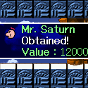
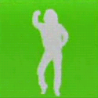


For as big as it was in Japan, it should come to no surprise that there have been little MOTHER/EarthBound easter eggs and cameos in a few different games besides the three we all know of.  Many of the same people that helped the series come to fruition loved it enough to hide surprises throughout their own games.  Here are the cameos we know of, whether graphical, musical, or fantastical!
   
<ul class="pics">
	<li>
		
		<h3>Kirby SuperStar (SNES - 1996)</h3>
		
While playing the Great Cave Offensive game, you collect several treasures as you explore a vast cave.  One of the treasures is a Mr. Saturn itself!
	
	</li>
	<li>
		
		<h3>Game Boy Camera (GB - 1998)</h3>
		
A fairly close musical similarity occurs in the innovation that was the Gameboy Camera.  Those who managed to finish the game 'Run! Run! Run!' in under 22 seconds were able to bypass a dancing man to access the game's credits.  If you listen, however, you can clearly hear the theme of MOTHER 1's Twinkle Elementary School.  Try <a href="http://starmen.net/mother1/music/19%20-%20MOTHER%20-%20Twinkle%20Elementary.mp3">listening to the song</a> and <a href="http://youtube.com/watch?v=4WNld6n0OTQ" target="_blank">watching the video itself</a> -- it's uncanny!
	
	</li>
</ul>

