
<b><u>Fan Series</u></b> - From a multitude of the site's great artists comes a variety of EarthBoundy tales guaranteed to awe you!  From serious stories of tragedy and duty to silly quips of hilarity and the bizarre, you'll always find something to get hooked on here!  Keep an eye out for new comics in the updates!





<a href="birdychimera/index.php">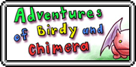</a>

<a href="fotpk/index.php">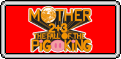</a>

<a href="m3pixel/index.php">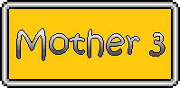</a>

<a href="sfpork/index.php">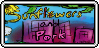</a>





<a href="weakdef/index.php">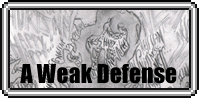</a>
<a href="ambience/index.php">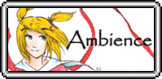</a>

<a href="cmp/index.php">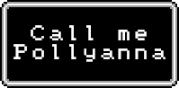</a>
<a href="comicbound/">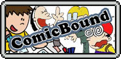</a>
<a href="cfm/index.php">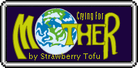</a>
<a href="ebcomic/">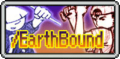</a>

<a href="ebz/">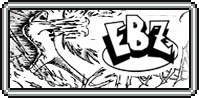</a>

<a href="fishkraken/index.php">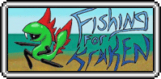</a>
<a href="forgiven/index.php">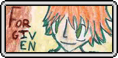</a>

<a href="harmony/index.php">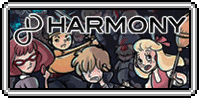</a>

<a href="kulekomas/index.php">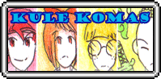</a>
<a href="lateshowlucas/index.php">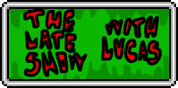</a>
<a href="love/index.php">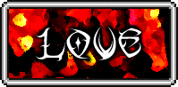</a>

<a href="mother/index.php">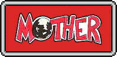</a>

<a href="m3awaken/index.php">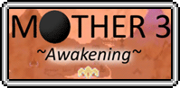</a>
<!--<a href="name/index.php">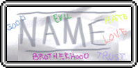</a>-->
<a href="nahaf/">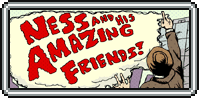</a>
<a href="newenemy/">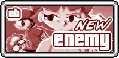</a>
<a href="ofpigs/index.php">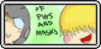</a>
<a href="power/index.php">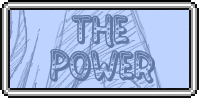</a>

<a href="son/index.php">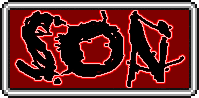</a>
<!---->
<a href="starmanfed/index.php">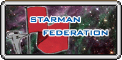</a>

<a href="unsolvedmyst/index.php">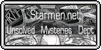</a>

<a href="sab/index.php">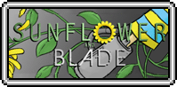</a>

<a href="trashadvent/index.php">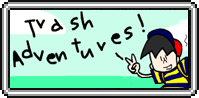</a>




Interested in seeing your own comic here?  It's no surprise that what sets the series apart from the rest is quantity.  If you have an idea for an ongoing comic series and plan to make several follow-ups to it (preferably around 12+ comics at least, over the span of a month), PM the comics staffer on the forums expressing your interest and go from there.  Remember, the best qualities you can have for you and your comic are:
<ul><li>A steady stream of updates</li>
<li>A good storyline</li>
<li>Artwork that shows some work put into it</li>
<li>Something to spice it up and set it apart from everything else</li></ul>

Remember, comics aren't supposed to be all work, either.  Have fun with what you make; that's the most important rule!


