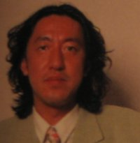



Hirokazu "Hip" Tanaka is a well-known musician due his many contributions to video game soundtracks. He worked for Nintendo from the early arcade days up until 1998 when he left Nintendo to work for Creatures, Inc. In 2000, when the president of Creatures resigned, Tanaka took over the position which he still holds today.  

<b>Game Credits</b>
<UL>
<LI><b>Space Firebird(ARC 1980)</b> 
Sound Effects</LI>
<LI><b>Donkey Kong(ARC 1980)</b> 
Sound Effects</LI>
<LI><b>Pac-Man Fever(ARC 1982)</b> 
Sound Effects</LI>
<LI><b>Donkey Kong 3(ARC 1983)</b> 
Music Composition</LI>
<LI><b>Urban Champion(NES 1984)</b> 
Music Composition</LI>
<LI><b>Balloon Fight(NES 1984)</b> 
Music Composition</LI>
<LI><b>Wild Gunman(NES 1984)</b> 
Music Composition</LI>
<LI><b>Duck Hunt(NES 1985)</b> 
Music Composition</LI>
<LI><b>Gyromite(NSE 1985)</b> 
Robot Sound</LI>
<LI><b>Stack Up(NES 1985)</b> 
Music Composition</LI>
<LI><b>Wrecking Crew(NES 1985)</b> 
Music Composition</LI>
<LI><b>Paltena no Kagami/Kid Icarus(NES 1986)</b> 
Music Composition</LI>
<LI><b>Metroid(NES 1986)</b> 
Music Composition</LI>
<LI><b>Super Mario Land(GB 1989)</b> 
Music</LI>
<LI><b>MOTHER/EarthBound(NES 1989) Japan Only</b> 
Musical Effects</LI>
<LI><b>Balloon Fight GB/Balloon Kid(GB 1990)</b> 
Music Composition</LI>
<LI><b>Dr. Mario(NES/GB 1990)</b> 
Music Composition</LI>
<LI><b>Hello Kitty World(NES 1992) Japan Only</b> 
Music Composition</LI>
<LI><b>Mario Paint(SNES 1992)</b> 
Music Composition</LI>
<LI><b>MOTHER 2/EarthBound(SNES 1994/1995)</b> 
Music Composition 
Sound Director</LI>
<LI><b>Mario's Tennis(VB 1995)</b> 
Music Composition</LI>
<LI><b>Teleroboxer(VB 1995)</b> 
Music Composition</LI>
<LI><b>Game & Watch Gallery(GB 1997)</b> 
Music Composition</LI>
<LI><b>Nintendo All-Star Dairantou Smash Brothers/Super Smash Bros(N64 1999)</b> 
Music Composition</LI>
<LI><b>Dairantou Smash Brothers DX/Super Smash Bros. Melee(GCN 2001)</b> 
Music Composition</LI>
<LI><b>Mother 1+2(GBA 2003) Japan Only</b> 
Music Composition</LI>
<LI><b>MOTHER 3(GBA 2006) Japan Only</b> 
Special Thanks</LI>
</UL>  
<b>Film Credits</b>
<UL>
<LI><b>Pocket Monsters/Pokemon (Japanese Animation TV 1998)</b> 
Music Composition</LI>
<LI><b>Pocket Monsters: Mewtwo Strikes Back!/Pokémon: Mewtwo Returns (Japanese Animation 1998)</b> 
Music Composition</LI>
<LI><b>Pokémon: Gotta Dance! (Japanese Animation 2004)</b> 
Music Composition</LI>
</UL>

