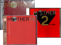


<b><a href="nes.php">8-Bit Classics</a></b> 

Credits for the two versions of the first MOTHER game, the unreleased Earthbound for the Nintendo Entertainment System(NES) and MOTHER for the Family Computer(Famicom)  
<b><a href="snes.php">16-Bit Masterpieces</a></b> 

Credits for the two versions of the second Mother game, known as EarthBound for the Super Nintendo Entertainment System(SNES) and MOTHER 2 for the Super Family Computer(Super Famicom)  
<b><a href="gba.php">32-Bit Revivals</a></b> 

Credits for the re-issue of the first two games known as MOTHER 1+2 for the Game Boy Advance as well as MOTHER 3  
<b><a href="n64.php">64-Bit Cancellations</a></b> 
Credits known about the canceled 3D take on the MOTHER series.  
<b><a href="ost.php">Music of Mother</a></b> 

Credits for the original soundtracks released for the MOTHER games in Japan  
<b><a href="about.php">About the Game Credits</a></b> 
A basic overview about how this section is set up  



<table1 />
 Section maintainer:
<table2 />
 <a href="http://forum.starmen.net/?t=usrinfo&id=2262">KingDarian</a>
<table3 />

