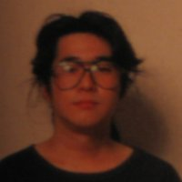



<b>Game Credits</b>
<UL>
<LI><b>MOTHER 2/EarthBound(SNES 1994/1995)</b> 
Programmer</LI>
<LI><b>Pokémon Stadium(N64 1999) Japan Only</b> 
Technical Support</LI>
<LI><b>Super Smash Bros.(N64 1999)</b> 
Special Thanks</LI>
<LI><b>Um Jammer Lammy(PSX 1999)</b> 
Music</LI>
<LI><b>Pokémon Stadium 2/Pokémon Stadium(N64 1999/2000)</b> 
Original Pokémon Stadium Staff</LI>
</UL>

