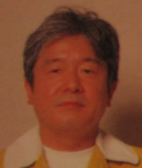



<b>Game Credits</b>
<UL>
<LI><b>Batman(NES 1989)</b> 
Programmer 
Director</LI>
<LI><b>MOTHER/EarthBound(NES 1989) Japan Only</b> 
Musical Effects</LI>
<LI><b>Gremlins 2: The New Batch(GB 1990)</b> 
Programmer 
Director</LI>
<LI><b>PUSSNBOOTS: Pero's Great Adventure(NES 1990)</b> 
Character Designer</LI>
<LI><b>MOTHER 2/EarthBound(SNES 1994/1995)</b> 
Music</LI>
<LI><b>Dairantou Smash Brothers DX/Super Smash Bros. Melee(GCN 2001)</b> 
Music</LI>
<LI><b>Mother 1+2(GBA 2003) Japan Only</b> 
Music
Musical Effects</LI>
<LI><b>MOTHER 3(GBA 2006) Japan Only</b> 
Special Thanks</LI>
</UL>  

