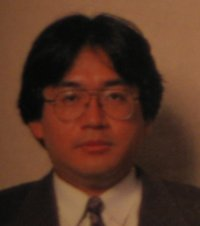



<b>Bio</b> 
Satoru Iwata is one of the most well-known individuals in the gaming industry. Iwata started his career in the gaming industry as a game designer. He created the game development company HAL(named after the supercomputer in <i>2001: A Space Odyssey</i>) with his friends from the Tokyo Institue of Technology. He has been a vital part in the creation of many Nintendo and Hal video games over the years. In 2001, when Hiroshi Yamauchi stepped down from his role as president of Nintendo, Iwata took over the position which he still holds today.  
<b>Game Credits</b>
<UL>
<LI><b>Pinball (NES 1983/1985)</b> 
Programmer</LI>
<LI><b>Famicom Grand Prix II: 3D Hot Rally(NES 1988) Japan Only</b> 
Main Programmer</LI>
<LI><b>NES Open Tournament Golf(NES 1991)</b> 
Main Programmer</LI>
<LI><b>Kirby's Dream Land(GB 1992)</b> 
Main Programmer</LI>
<LI><b>NCAA Basketball(SNES 1992)</b> 
Main Programmer 
Producer</LI>
<LI><b>Kirby's Adventure(NES 1993)</b> 
Producer</LI>
<LI><b>Vegas Stakes(SNES 1993)</b> 
Executive Producer</LI>
<LI><b>Kirby's Dream Course(SNES 1994)</b> 
Producer</LI>
<LI><b>MOTHER 2/EarthBound(SNES 1994/1995)</b> 
Co-Producer 
Program Director 
Programmer</LI>
<LI><b>Kirby's Dream Land 2(GB 1995)</b> 
Producer</LI>
<LI><b>Kirby Super Star(SNES 1996)</b> 
Producer</LI>
<LI><b>Kirby's Dream Land 3(SNES 1998)</b> 
Producer</LI>
<LI><b>Pokemon Stadium(N64 1998) Japan Only</b> 
Producer</LI>
<LI><b>Sim City 2000(N64 1998) Japan Only</b> 
Producer</LI>
<LI><b>Kyojin no Doshin/Doshin the Giant(N64 1999) Japan & Europe Only</b> 
Special Thanks</LI>
<LI><b>Pokemon Stadium 2/Pokemon Stadium (N64 1999/2000)</b> 
Producer</LI>
<LI><b>Super Smash Bros.(N64 1999)</b> 
Producer</LI>
<LI><b>Kirby 64: The Crystal Shards(N64 2000)</b> 
Supervisor</LI>
<LI><b>Kirby's Tilt n Tumble(GB 2000/2001)</b> 
Special Thanks</LI>
<LI><b>Pokémon Puzzle League(N64 2000)</b> 
Special Thanks</LI>
<LI><b>Pokemon Stadium Kingin Crystal/Pokemon Stadium 2(N64 2000/2001)</b> 
Producer</LI>
<LI><b>Super Smash Bros. Melee(GCN 2001)</b> 
Producer</LI>
<LI><b>Animal Crossing(GCN 2002)</b> 
Executive Producer</LI>
<LI><b>Balloon Fight-e Card Pack(ERD 2002)</b> 
Executive Producer</LI>
<LI><b>Eternal Darkness: Sanity's Requiem(GCN 2002)</b> 
Producer</LI>
<LI><b>Game & Watch Gallery 4(GBA 2002)</b> 
Executive Producer</LI>
<LI><b>Ice Climber-e Card Pack(ERD 2002)</b> 
Executive Producer</LI>
<LI><b>The Legend of Zelda: A Link to the Past/Four Swords(GBA 2002/2003)</b> 
Executive Producer</LI>
<LI><b>The Legend of Zelda: Collector's Edition (GCN 2002/2003)</b> 
Executive Producer</LI>
<LI><b>The Legend of Zelda: The Wind Waker(GCN 2002/2003)</b> 
Executive Producer</LI>
<LI><b>Mario Party 4(GCN 2002)</b> 
Executive Producer</LI>
<LI><b>Metroid Prime(GCN 2002/2003)</b> 
Executive Producer</LI>
<LI><b>Metroid Fusion(GBA 2002/2003)</b> 
Executive Producer</LI>
<LI><b>Pokémon Party Mini(PM 2002)</b> 
Producer</LI>
<LI><b>Pokémon Pinball Mini(PM 2002)</b> 
Producer</LI>
<LI><b>Pokémon Shock Tetris(PM 2002)</b> 
Executive Producer</LI>
<LI><b>Star Fox Adventures(GCN 2002)</b> 
Executive Producer</LI>
<LI><b>Super Mario Advance 3: Yoshi's Island(GBA 2002)</b> 
Executive Producer</LI>
<LI><b>Super Mario Sunshine(GCN 2002)</b> 
Executive Producer</LI>
<LI><b>1080° Avalanche(GCN 2003/2004)</b> 
Executive Producer</LI>
<LI><b>Advance Wars 2: Black Hole Rising(GBA 2003)</b> 
Executive Producer</LI>
<LI><b>Donkey Konga(GCN 2003/2004)</b> 
Executive Producer</LI>
<LI><b>F-Zero GP Legend(GBA 2003/2004)</b> 
Executive Producer</LI>
<LI><b>F-Zero GX(GCN 2003)</b> 
Executive Producer</LI>
<LI><b>Giftpia(GCN 2003) Japan Only</b> 
Executive Producer</LI>
<LI><b>Kirby Air Ride(GCN 2003)</b> 
Executive Producer</LI>
<LI><b>Mario Kart: Double Dash!!(GCN 2003)</b> 
Executive Producer</LI>
<LI><b>Mario Party-e Card Pak(ERD 2003)</b> 
Executive Producer</LI>
<LI><b>Mario Party 5 (GCN 2003)</b> 
Executive Producer</LI>
<LI><b>Nintendo Puzzle Collection(GCN 2003) Japan Only</b> 
Executive Producer</LI>
<LI><b>Pac-Man vs.(GCN 2003/2004) Japan/Europe Only</b> 
Executive Producer</LI>
<LI><b>Pokémon Box: Ruby & Sapphire(GCN 2003/2004)</b> 
Executive Producer</LI>
<LI><b>Pokémon Channel(GCN 2003)</b> 
Executive Producer</LI>
<LI><b>Pokémon Colosseum(GCN 2003/2004)</b> 
Executive Producer</LI>
<LI><b>Super Mario Advance 4: Super Mario Bros. 3(GBA 2003)</b> 
Executive Producer</LI>
<LI><b>Wario Ware, Inc.: Mega Microgame$(GBA 2003)</b> 
Executive Producer</LI>
<LI><b>Wario Ware Inc: Mega Party Game$(GCN 2003/2004)</b> 
Executive Producer</LI>
<LI><b>Wario World(GCN 2003)</b> 
Executive Producer</LI>
<LI><b>The Legend of Zelda: Four Swords Adventures(GCN 2004)</b> 
Executive Producer</LI>
<LI><b>The Legend of Zelda: The Minish Cap(GCN 2004/2005)</b> 
Executive Producer</LI>
<LI><b>Mario VS. Donkey Kong(GBA 2004)</b> 
Executive Producer</LI>
<LI><b>Mario Pinball Land(GBA 2004)</b> 
Executive Producer</LI>
<LI><b>Metroid: Zero Mission(GBA 2004)</b> 
Executive Producer</LI>
<LI><b>Paper Mario: The Thousand-Year Door(GCN 2004)</b> 
Executive Producer</LI>
<LI><b>Pikmin 2(GCN 2004)</b> 
Executive Producer</LI>
<LI><b>Super Mario 64 DS(NDS 2004)</b> 
Executive Producer</LI>
<LI><b>WarioWare Touched!(NDS 2004/2005)</b> 
Executive Producer</LI>
<LI><b>Wario Ware Twisted(GBA 2004/2005)</b> 
Executive Producer</LI>
<LI><b>Metroid Prime 2: Echoes(GCN 2004/2005)</b> 
Executive Producer</LI>
<LI><b>Yoshi Touch & Go(NDS 2005)</b> 
Executive Producer</LI>
<LI><b>Donkey Kong Jungle Beat(GCN 2005)</b> 
Executive Producer</LI>
<LI><b>Star Fox: Assault(GCN 2005)</b> 
Executive Producer</LI>
</UL>

