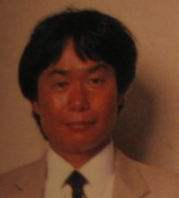



<b>Bio</b> 
Shigeru Miyamoto was born on November 16, 1952 in Sonebe, Japan. In his youth, Miyamoto enjoyed art, which eventually led him to enroll in Kanazawa College of Art in 1970. A few years after graduating from college, Miyamoto's father introduced him to Hiroshi Yamauchi when he couldn't find a job that interested him. He was hired as an artist for Nintendo's toy line in 1977.  

In 1980, Yamauchi was interested in expanding the types of toys that his company produced and he asked Miyamoto if he had any experience with them. Miyamoto had played video games while he was in college, so Yamauchi asked him to design games for Nintendo. His first creation was the smash hit Donkey Kong.  

Mr. Yamauchi called Miyamoto into his office in 1980 with an interesting proposal. Nintendo was considering expanding to video games and he wanted to know if Shigeru was familiar with them. He was in luck; Miyamoto had been an avid gamer in college. He began designing games for Nintendo; starting with a little arcade game he called Donkey Kong.  

From there Miyamoto has created many more memorable game series and titles for Nintendo. He is one of the most important figures in the modern video game industry. His creative spirit and ingenuity helps Nintendo to stand out from its competitors.  
<b>Game Credits</b>
<UL>
   <LI><b>Donkey Kong(ARC 1981)</b> 
   Director</LI>
   <LI><b>Donkey Kong Jr.(ARC 1982)</b> 
   Director</LI>
   <LI><b>Mario Bros.(ARC 1983)</b> 
   Director</LI>
   <LI><b>Super Mario Bros.(NES 1985)</b> 
   Producer 
   Director 
   Graphic Designer</LI>
   <LI><b>Zelda no Densetsu/The Legend of Zelda(NES 1986/1987)</b> 
   Producer 
   Director 
   Graphic Designer</LI>
   <LI><b>Zelda II: Riinku no Bouken/Zelda II: The Adventure of Link(NES 1987/1988)</b> 
   Producer</LI>
   <LI><b>Super Mario World(SNES 1990/1991)</b> 
   Producer</LI>
   <LI><b>Pilotwings(SNES 1990/1991)</b> 
   Producer</LI>
   <LI><b>F-Zero(SNES 1990/1991)</b> 
   Producer</LI>
   <LI><b>Zelda no Densetsu: Kamigami no Triforce/The Legend of Zelda: A Link to the Past(SNES 1991/1992)</b> 
   Producer</LI>
   <LI><b>Super Mario Kart(SNES 1992)</b> 
   Producer</LI>
   <LI><b>Wave Race(GB 1992) USA Only</b> 
   Producer</LI>
   <LI><b>Hoshi no Kirby/Kirby's Adventure(NES 1993)</b> 
   Producer</LI>
   <LI><b>Zelda no Densetsu: Yume o Miru Shima/The Legend of Zelda: Link's Awakening(GB 1993)</b> 
   Producer</LI>
   <LI><b>Star Fox(SNES 1993)</b> 
   Producer</LI>
   <LI><b>Donkey Kong(GB 1994)</b> 
   Producer</LI>
   <LI><b>Super Donkey Kong/Donkey Kong Country(SNES 1994)</b> 
   Original DK Creator</LI>
   <LI><b>MOTHER 2/EarthBound(SNES 1994/1995)</b> 
   Supervisor</LI>
   <LI><b>Wild Trax/Stunt Race FX(SNES 1994)</b> 
   Producer</LI>
   <LI><b>Super Donkey Kong 2: Dixie & Diddy/Donkey Kong Country 2: Diddy's Kong Quest(SNES 1995)</b> 
   Original DK Creator</LI>
   <LI><b>Super Donkey Kong GB/Donkey Kong Land(GB 1995)</b> 
   Original DK Creator</LI>
   <LI><b>Hoshi no Kirby 2/Kirby's Dream Land 2(GB 1995)</b> 
   Producer</LI>
   <LI><b>Super Mario: Yoshi's Island/Super Mario World 2: Yoshi's Island(SNES 1995)</b> 
   Producer</LI>
   <LI><b>Super Donkey Kong 3: Nazo no Krems Shima/Donkey Kong Country 3: Dixie's Double Trouble(SNES 1996)</b> 
   Original DK Creator</LI>
   <LI><b>Kirby's Block Ball(GB 1996) USA Only</b> 
   Producer</LI>
   <LI><b>Mario Kart 64(N64 1996/1997)</b> 
   Producer</LI>
   <LI><b>Pilotwings 64(N64 1996)</b> 
   Producer</LI>
   <LI><b>Pocket Monsters Aoi/Pokémon Blue(GB 1996/1998)</b> 
   Producer</LI>
   <LI><b>Pocket Monsters Akai/Pokémon Red(GB 1996/1998)</b> 
   Producer</LI>
   <LI><b>Star Wars: Teikoku no Kage/Star Wars: Shadows of the Empire(N64 1997/1996)</b> 
   Nintendo Staff</LI>
   <LI><b>Super Mario 64(N64 1996)</b> 
   Game Director 
   Producer</LI>
   <LI><b>Super Mario RPG/Super Mario RPG: Legend of the Seven Stars(SNES 1996)</b> 
   Producer</LI>
   <LI><b>Star Fox 64(N64 1997)</b> 
   Producer</LI>
   <LI><b>Yoshi's Story(N64 1997/1998)</b> 
   Supervisor</LI>
   <LI><b>1080° Snowboarding(N64 1998)</b> 
   Producer</LI>
   <LI><b>F-Zero X(N64 1998)</b> 
   Producer</LI>
   <LI><b>Zelda no Densetsu: Yume wo Miru Shima DX/The Legend of Zelda: Link's Awakening DX(GBC 1998)</b> 
   Producer</LI>
   <LI><b>Zelda no Densetsu: Toki no Ocarina/The Legend of Zelda: Ocarina of Time(N64 1998)</b> 
   Producer</LI>
   <LI><b>Mario Party(N64 1998/1999)</b> 
   Original Character Design 
   Supervisor</LI>
   <LI><b>Donkey Kong 64(N64 1999)</b> 
   Special Thanks</LI>
   <LI><b>Mario Golf 64/Mario Golf(N64 19999)</b> 
   Original Characters 
   Supervisor</LI>
   <LI><b>Mario Golf GB/Mario Golf(GBC 1999)</b> 
   Original Characters 
   Supervisor</LI>
   <LI><b>Mario Party 2(N64 1999/2000)</b> 
   Original Characters 
   Supervisor</LI>
   <LI><b>Pocket Monsters Stadium 2/Pokémon Stadium(N64 1999/2000)</b> 
   Producer</LI>
   <LI><b>Super Mario Bros. Deluxe(GBC 2000/1999)</b> 
   Supervisor</LI>
   <LI><b>Nintendo All-Star! Dai-Rantou Smash Brothers/Super Smash Bros.(N64 1999)</b> 
   Producer</LI>
   <LI><b>Excitebike 64(N64 2000)</b> 
   Advisor</LI>
   <LI><b>Zelda no Densetsu: Majora no Kamen/The Legend of Zelda: Majora's Mask(N64 2000)</b> 
   Original Concept 
   Project Leader 
   Writer</LI>
   <LI><b>Mario Party 3(N64 2000/2001)</b> 
   Original Characters 
   Supervisor</LI>
   <LI><b>Mario Tennis 64/Mario Tennis(N64 2000)</b> 
   Original Characters 
   Supervisor</LI>
   <LI><b>Mario Tennis GB/Mario Tennis(GBC 2000/2001)</b> 
   Character Designs 
   Supervisor</LI>
   <LI><b>Mario Story/Paper Mario(N64 2000/2002)</b> 
   Producer</LI>
   <LI><b>Pocket Monsters Stadium Kingin Crystal/Pokémon Stadium 2(N64 2000/2001)</b> 
   Producer</LI>
   <LI><b>Walt Disney's Alice in Wonderland(GBC 2000) USA Only</b> 
   Special Thanks</LI>
   <LI><b>Korokoro Kirby/Kirby Tilt'n' Tumble(GBC 2001)</b> 
   Special Thanks</LI>
   <LI><b>Zelda no Densetsu: Fushigi no Ki no Mi ~Jikuu no Shou~/The Legend of Zelda: Oracle of Ages(GBC 2001)</b> 
   Producer</LI>
   <LI><b>Zelda no Densetsu: Fushigi no Ki no Mi ~Daichi no Shou~/The Legend of Zelda: Oracle of Seasons(GBC 2001)</b> 
   Producer</LI>
   <LI><b>Luigi's Mansion(GCN 2001)</b> 
   Producer</LI>
   <LI><b>Mario Kart Advance/Mario Kart Super Circuit(GBA 2001)</b> 
   Producer</LI>
   <LI><b>Pikmin(GCN 2001)</b> 
   Producer</LI>
   <LI><b>Super Mario Advance(GBA 2001)</b> 
   Producer</LI>
   <LI><b>Dairantou Smash Brothers DX/Super Smash Bros. Melee(GCN 2001)</b> 
   Producer</LI>
   <LI><b>Wave Race: Blue Storm(GCN 2001)</b> 
   Producer</LI>
   <LI><b>Mickey Mouse no Fushigi no Kagami/Disney's Magical Mirror Starring Mickey Mouse(GCN 2002)</b> 
   Producer</LI>
   <LI><b>Kyojin no Doshin/Doshin the Giant(GCN 2002) Japan/Europe Only</b> 
   Producer</LI>
   <LI><b>Eternal Darkness: Mawa Kareta 13jin/Eternal Darkness: Sanity's Requiem(GCN 2002)</b> 
   Producer</LI>
   <LI><b>Tottoko Hamutarou 3: Rabu Rabu Daibouken Decho/Hamtaro: Ham Ham Heartbreak(GBA 2002/2003)</b> 
   Producer</LI>
   <LI><b>Hamtaro: Ham-Hams Unite!(GBC 2002) USA Only</b> 
   Producer</LI>
   <LI><b>Zelda no Densetsu: Kaze no Takuto/The Legend of Zelda: The Wind Waker(GCN 2002/2003)</b> 
   Producer</LI>
   <LI><b>Mario Party 4(GCN 2002)</b> 
   Original Characters 
   Supervisor</LI>
   <LI><b>Metroid Prime(GCN 2003/2002)</b> 
   Producer</LI>
   <LI><b>Star Fox Adventures(GCN 2002)</b> 
   Producer</LI>
   <LI><b>Super Mario Sunshine(GCN 2002)</b> 
   Producer</LI>
   <LI><b>1080° Silver Storm/1080° Avalanche(GCN 2004/2003)</b> 
   Producer</LI>
   <LI><b>F-Zero GX(GCN 2003)</b> 
   Producer</LI>
   <LI><b>Kirby no Air Ride/Kirby Air Ride(GCN 2003)</b> 
   Producer</LI>
   <LI><b>The Legend Of Zelda Collection/The Legend of Zelda Collector's Edition(GCN 2003)</b> 
   Producer</LI>
   <LI><b>Mario Golf: Family Tour/Mario Golf: Toadstool Tour(GCN 2003)</b> 
   Character Design 
   Supervisor</LI>
   <LI><b>Mario Kart: Double Dash(GCN 2003)</b> 
   Producer</LI>
   <LI><b>Mario & Luigi RPG/Mario & Luigi: Superstar Saga(GBA 2003)</b> 
   Producer</LI>
   <LI><b>Mario Party 5(GCN 2003)</b> 
   Character Design 
   Supervisor</LI>
   <LI><b>Mario Party-e(ERD 2003) USA Only</b> 
   Special Thanks</LI>
   <LI><b>Pokémon Colosseum(GCN 2003/2004)</b> 
   Producer</LI>
   <LI><b>Custom Robo: Battle Revolution/Custom Robo(GCN 2004)</b> 
   Producer</LI>
   <LI><b>Zelda no Densetsu: 4tsu no Tsurugi +/The Legend of Zelda: Four Swords Adventures(GCN 2004)</b> 
   Producer</LI>
   <LI><b>The Legend of Zelda: Fushigi no Boushi/The Legend of Zelda: The Minish Cap(GBA 2004/2005)</b> 
   General Producer</LI>
   <LI><b>Mario Party 6(GCN 2004)</b> 
   Character Designer 
   Supervisor</LI>
   <LI><b>Super Mario Ball/Mario Pinball Land(GBA 2004)</b> 
   Producer</LI>
   <LI><b>Mario Tennis GC/Mario Power Tennis(GCN 2004)</b> 
   Character Designer 
   Supervisor</LI>
   <LI><b>Mario vs. Donkey Kong(GBA 2004)</b> 
   Producer</LI>
   <LI><b>Metal Gear Solid: The Twin Snakes(GCN 2004)</b> 
   Very Special Thanks</LI>
   <LI><b>Paper Mario RPG/Paper Mario: The Thousand-Year Door(GCN 2004)</b> 
   Producer</LI>
   <LI><b>Pikmin 2(GCN 2004)</b> 
   Producer</LI>
   <LI><b>Geist(GCN 2005) USA Only</b> 
   Senior Producer</LI>
</UL>

