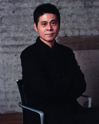



<b>Bio</b> 
Shigesato Itoi is a well-known celebrity in Japan.
  
<b>Game Credits</b>
 <UL>
    <LI><b>MOTHER/EarthBound(NES 1989) Japan Only</b> 
    Direction 
    Game Design</LI>
    <LI><b>MOTHER 2/EarthBound(SNES 1994/1995)</b> 
    Producer 
    Director 
    Writer 
    Font 
    Voice</LI>
    <LI><b>Shigesato Itoi's No. 1 Bass Fishing(SNES 1997) Japan Only</b> 
    Producer</LI>
    <LI><b>Nintendo All-Star Dairantou Smash Brothers/Super Smash Bros(N64 1999)</b> 
    Original Game Staff</LI>
    <LI><b>Shigesato Itoi's No. 1 Bass Fishing Ketteihan!(N64 2000) Japan Only</b> 
    Producer</LI>
    <LI><b>Dairantou Smash Brothers DX/Super Smash Bros. Melee(GCN 2001)</b> 
     Original Game Staff</LI>
    <LI><b>Mother 1+2(GBA 2003) Japan Only</b> 
    Game Design 
    Producer 
    Director 
    Writer 
    Font 
    Voice</LI>
    <LI><b>MOTHER 3(GBA 2006) Japan Only</b> 
    Story, Scenario, & Message</LI>
 </UL>  
<b>Shigesato Itoi's website:</b>
<UL><LI>
<a href="http://www.1101.com/">www.1101.com</a>
</LI></UL>

