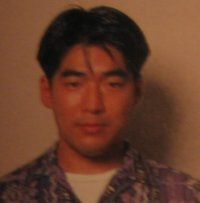



<b>Game Credits</b>
<UL>
<LI><b>Kirby's Dream Land(GB 1992)</b> 
Main Programmer</LI>
<LI><b>Vegas Stakes(SNES 1993)</b> 
Special Thanks</LI>
<LI><b>MOTHER 2/EarthBound(SNES 1994/1995)</b> 
Graphic Artist</LI>
<LI><b>Kirby's Dream Land 3(SNES 1998)</b> 
Illustrator</LI>
<LI><b>Super Smash Bros.(N64 1999)</b> 
Special Thanks</LI>
<LI><b>Kirby 64: The Crystal Shards(N64 2000)</b> 
Special Thanks</LI>
<LI><b>Kirby's Tilt n Tumble(GB 2000/2001)</b> 
Illustrator</LI>
<LI><b>Super Smash Bros. Melee(GCN 2001)</b> 
Special Thanks</LI>
</UL>

