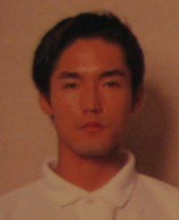



<b>Game Credits</b>
<UL>
<LI><b>Kirby's Adventure(NES 1993)</b> 
Programmer</LI>
<LI><b>MOTHER 2/EarthBound(SNES 1994/1995)</b> 
Programmer</LI>
<LI><b>Kirby's Dream Land 2(GB 1995)</b> 
Programmer</LI>
<LI><b>Super Smash Bros.(N64 1999)</b> 
Lead Programmer</LI>
<LI><b>Kirby 64: The Crystal Shards(N64 2000)</b> 
Assistant Manager</LI>
<LI><b>Super Smash Bros.Melee(GCN 2001)</b> 
Programming Director</LI>
</UL>

