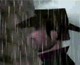
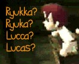
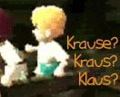
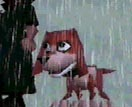
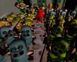


<table1 />Subtitles: 
 
 
Publisher: 
Developer: 
Current State: 
Players: 
Cart Size: 
Rumble Pak: 
Japanese Release: 
US Release: 
<table2 />
Fall/Death of the Pig King 
The Pig King's Final Days/Moments 
The Pig King's Fate/Death 
Nintendo 
HAL Laboratories 
Cancelled 
1 
256 Megabit 
Yes 
N/A 
N/A 
<table3 />



Z -- Speak, Check, Spin attack 
 R -- Inventory, Menus 
 C -- Navigation 
 B -- Cancel, Jump attack, Accelerate vehicle 
 A -- Select, Jump, Brake vehicle, Flying attack



  <LI>Fight</LI>
  <LI>Speak </LI>
  <LI>Magic </LI>
  <LI>Call </LI>
  <LI>Stand </LI>
  <LI>Check </LI>
  <LI>Goods </LI>
  <LI>Strength</LI> 



<b><u>Flint</u>:</b>

 

Flint appears to be the star of the show. The star of the beginning of the game, anyway. Flint is the father of two twins; he and his family live out in the boondocks.
  
<b><u>Twin #1</u>:</b>

 

Information on Twin #1 is still scarce. He could be either Ryukka or Lucca, one of the two. His name is interchangable with Twin #2, since no one is sure which is which. He appears to play a role less important than Flint's. Is in the front of the cart during the mine cart ride.  
Itoi stated in an interview that he came up with the idea of the twins from reading a book "Le Grand Cahier", also known as "The Notebook, The Proof, and the Third Lie."
    
<b><u>Twin #2</u>:</b>

 

A little more is known about Twin #2. We're sure of his name, but not
the spelling. Krause? Klaus? Kraus? Those are just a few of the
spellings we've seen. Is in the back of the cart (he's the one who hits his head...heheh) during the mine cart ride.  
Itoi stated in an interview that he came up with the idea of the twins from reading a book "Le Grand Cahier", also known as "The Notebook, The Proof, and the Third Lie."
    
<b><u>Boney</u>:</b>

Just Flint's dog. Don't think he plays any huge role. Stranger things have happened, though... 
    
<b><u>Pig Army</u>:</b>

 
 

The antagonists in the game. Various battle scenes show Flint
(sometimes his blonde-haired son tags along too) battling the pig
soldiers.




 

After the announcement of Mother 3's cancellation, Itoi posted up pictures and music that would have
been used in Mother 3. These pictures showed a direct relation to Mother 2; If you check the <A HREF="/eb64/images/">Screenshots page</A>, you will notice some screenshots, upon close examination, which link to Earthbound. There is a burger sign and Onett sign from Earthbound in one scene. You can also barely read "Monotoly" on one of the buildings, and one of the images is VERY similar to how Ness's house would look in 3D.



Flint and his boys are sleeping when something crashes in the forest. Apparently, its making a lot of noise, so Flint goes to investigate with Boney tagging along. They see something, but all we know is that its some UFO or alien. Flint heads into town to talk to the villagers. Apparently thats when things get even more strange...

