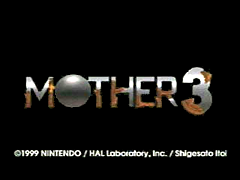
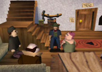
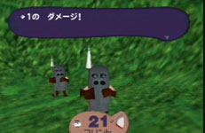
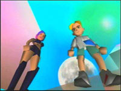



	
	<table>
		<tr>
			<td class="label">Title:</td>
			<td>EarthBound 64 (US) Mother 3 (JP)</td>
		</tr>
		<tr>
			<td class="label">System:</td>
			<td>Nintendo 64 / 64DD</td>
		</tr>
		<tr>
			<td class="label">Genre:</td>
			<td>RPG</td>
		</tr>
		<tr>
			<td class="label">Release:</td>
			<td>Cancelled in August 2000</td>
		</tr>
		<tr>
			<td class="label">Publisher:</td>
			<td>Nintendo</td>
		</tr>
		<tr>
			<td class="label">Developer:</td>
			<td>HAL Laboratories / APE</td>
		</tr>
	</table>

EarthBound / Mother 2 had two major events which pointed to the possibility of a sequel: first off was a sign in front of a building that said "<a href="/mother2/images/screenshots/foursideMeeting.png" title="EarthBound 2 Planning Meeting Screenshot">Planning Meeting for EarthBound 2</a>". The second was the final scene of the game, in which you are reminded that one of the villains escaped. The screen fades to black and you're presented with the words "The End...?" 
 
Mother 3's story, however, appears at first glance to be completely unrelated. The characters involve a small, seemingly old-west family living in a small, very rural setting. The main character is a cowboy named Flint who has two twin sons, named "Ryuka" and "Kraus" (later revealed to be "Lucas" and "Claus"). Flint also has a dog, Boney, who accompanies him. 
  
The playable demo at <a href="spaceworld">Spaceworld 1999</a> featured a wide variety of scenes and characters, including desert canyons, battles with masked pigs, underground dungeons, a rock and roll concert, a runaway mine-cart chase, and a scene where a giant green dragon runs alongside a futuristic bullet train. This unusual blend of disparate elements is something players have come to expect from the Mother series. 
 
However, while the storyline was coming along nicely, the development team was having issues with the game's translation to 3D graphics. Further complications arose from the game's use of the 64DD, a complicated N64 add-on which would have provided a real-time clock and disk storage, opening up an entire world of features never before seen on a console game. 
 
The 64DD, however, was quickly canned, and Mother 3 was shifted to the normal Nintendo 64 lineup. The game suffered further delays following Spaceworld, and seemed to be losing interest as Nintendo's next-generation Gamecube system prepared to dethrone the Nintendo 64. Rumors of the game's troubles spread, and fans went on the offensive, organizing a <a href="/petition/eb64">petition</a> to indicate their continued interest in the game despite the many delays. In spite of this, the game was <a href="cancellation">cancelled</a> late in the summer of 2000. 
 
In September 2002, <a href="http://starmen.net/siteinfo/image/smnetinegm3.jpg">EGM rumored that the game was being resurrected</a>. In the following months and years, the game's creator, Shigesato Itoi, began dropping hints on his personal website that he had indeed resumed work on the game, and in early 2006 he announced that the game, <a href="/mother3">Mother 3 on the Game Boy Advance</a>, had been completed.





Even in 2019, new content is still being found frequently and primarily due to the efforts of the EarthBound 64 Discord community. They have been a very big help in providing new content, better images, and brand new discoveries to the discontinued game, and they certainly deserve their due.
  
So many thank yous to OkeijiDragon, DaEgg123, Sam the Salmon, Echoes, Andrew_Christoper_Horne, katie, NOKOLO, and many more for their help and their contributions to uncovering new items and research! Also, a personal thank you to those who helped work with me!
  
They have a Discord server to discuss and share all that is EarthBound 64 as well, so if you're interested, consider <a href="https://discord.gg/mx6b7YG" >checking it out! </a>




<b>Updated October 30, 2019:</b>
<ul>
<li>Added new screenshots and magazine scans found only a week ago.
 --CerealQueen</li>
</ul>

<b>Updated September 25, 2019:</b>
<ul>
<li>Screenshots, publications added and pages redone. Changing formats to many pages. Made new News page and a Detailed Game Info page. Adding more content.
 --CerealQueen</li>
</ul>

<b>Updated June 12, 2019:</b>
<ul>
<li>Updated screenshots/images and reorganized page. 
 --CerealQueen</li>
</ul>

<b>Updated November 7, 2006:</b>
<ul>
	<li>Rewrote the main page content and HTML, got some different screenshots in there too. --reidman</li>
</ul>

<b>Updated March 20, 2006:</b>
<ul>
	<li>Updated <a href="refresher.php">EB64 Info Refresher</a> with lots of character information and pictures!</li>

	<li>Organized and updated the <a href="images/">Screenshots &amp; Images page</a> with lots of lots of stuff! Even some magazine scans and lots of better-quality pictures of old pictures and pictures we never had on the site before! Thanks to everyone on the forum who helped gather all this stuff!</li>

	<li>Updated the <a href="images/translated.php">Translated Screenshots page</a> with better translations for the text.</li>
</ul> 
<b>Updated February 28, 2006:</b>
<ul>
	<li>Updated with <a href="refresher.php">EB64 Info Refresher</a>.</li>
</ul>




<table1 />
 Section maintainer:
<table2 />
 <a href="https://forum.starmen.net/members/CerealQueen">CerealQueen</a>
<table3 />

