

	<table>
		<tbody>            
<tr><th colspan="2">MOTHER 3 Stickers  <a href="64sticker_mother.jpg" class="fancybox" title="MOTHER 3 Stickers">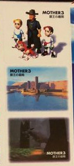</a></th></tr></tbody></table>
<table>

		<tbody>
            <tr class="odd"><td valign="top"><b>Release Region:</b></td><td valign="top">Japan</td></tr>
<tr class="even"><td valign="top"><b>Release Date:</b></td><td valign="top">November 1999</td></tr>
<tr class="even"><td valign="top"><b>Retail Price:</b></td><td valign="top">￥490</td></tr>
<tr class="odd"><td valign="top"><b>Released By:</b></td><td valign="top">Nintendo</td></tr>
	</tbody></table>

      

         	 
These MOTHER 3 Stickers were released in Japan in November of 1999. The stickers were included in Japan's 64 Dream magazine. They were one of the only pieces of official merchandise released for the canceled MOTHER 64.
 

<b>Item Details:</b>
	
It was common for 64 Dream to include sticker sheets of popular games they featured in their magazine and in 1999, MOTHER 3 was no exception. Included were three stickers, one of Flint, Lucas, Claus, and Boney, one of Osohe Castle, and another of a Drago. Along with other Nintendo IP's, these were available inside Issue 38 of 64 Dream.

 
<b>Item Contents:</b>
<ul>
<li>Magazine</li>
<li>Sticker Sheet</li>
</ul>
 

<b>Images:</b>  
<a rel="lightbox[1]" href="64dream.jpg" class="thumbnail">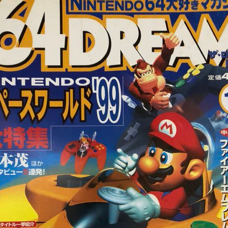</a>&nbsp;&nbsp;&nbsp;
<a rel="lightbox[1]" href="64stickersheet.jpg" class="thumbnail">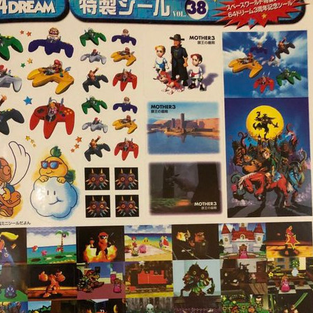</a>

     




	<table>
		<tbody>            
<tr><th colspan="2">D.C.M.C. Shirt  </th></tr></tbody></table>
<table>

		<tbody>
            <tr class="odd"><td valign="top"><b>Release Region:</b></td><td valign="top">Japan</td></tr>
<tr class="even"><td valign="top"><b>Release Date:</b></td><td valign="top">1997</td></tr>
<tr class="odd"><td valign="top"><b>Released By:</b></td><td valign="top">Nintendo</td></tr>
	</tbody></table>

  

      

         	 
The D.C.M.C. Shirt was released in Japan in 1997. The was the only apparel to be released as official merchandise released for the canceled MOTHER 64.
 

<b>Item Details:</b>
	
These double-sided shirts were made for staff who worked the MOTHER 64 booth at the Spaceworld even in Japan in 1997. In addition, one was offered as in a giveaway from the magazine, Dengeki 64. These pieces of apparel were intended to promote the game with a design featuring the in-game band, D.C.M.C. The band had been used to advertise the game on several occasions. 
  
The front side reads:  
<i>Desperado 
Crash 
Mambo 
Combo</i>  and  

<i>Hot is Cool Cool is Hot</i>
  
The backside reads: 
<i>D.C.M.C 
Hot is Cool Cool is Hot 
Mother 3 World Tour Staff</i>

 
<b>Item Contents:</b>
<ul>
<li>Shirt</li>
</ul>
 

<b>Images:</b>  
<a rel="lightbox[2]" href="DCMC_Shirt_2.jpg" class="thumbnail">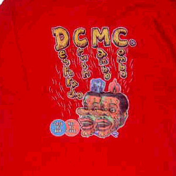</a>&nbsp;&nbsp;&nbsp;
<a rel="lightbox[2]" href="DCMC_Shirt_3.jpg" class="thumbnail">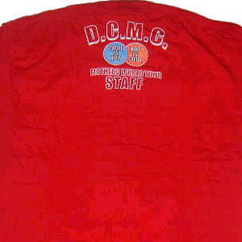</a>&nbsp;&nbsp;&nbsp;
<a rel="lightbox[2]" href="DCMC_Shirt_4.jpg" class="thumbnail">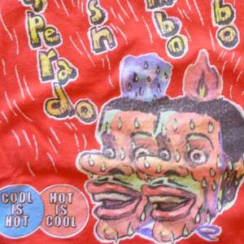</a>&nbsp;&nbsp;&nbsp;
<a rel="lightbox[2]" href="DCMC_Shirt_5.jpg" class="thumbnail">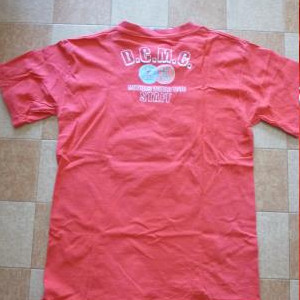</a>&nbsp;&nbsp;&nbsp;
<a rel="lightbox[2]" href="DCMC_Shirt_6.jpg" class="thumbnail">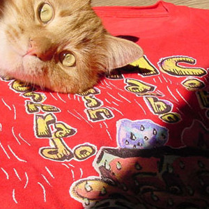</a>&nbsp;&nbsp;&nbsp;
<a rel="lightbox[2]" href="DCMC_Shirt_7.jpg" class="thumbnail">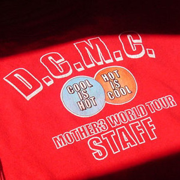</a> 
<a rel="lightbox[2]" href="DCMC_Shirt_8.jpg" class="thumbnail">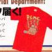</a>&nbsp;&nbsp;&nbsp;
<a rel="lightbox[2]" href="DCMC_Shirt_9.jpg" class="thumbnail">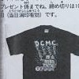</a>



<li><a href="https - //starmen.net/eb64/publications/Dengeki_Nintendo_64_Issue_19_December_1997_PG94.png" >Replica of Lucas' shoes as seen in game</a></li>

