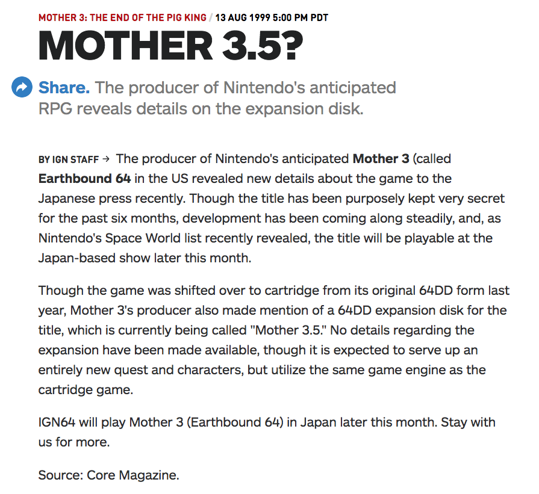


<ul class="pics"><li>

  
<b>Ness is in EB64, whether it be as a flashback or he's returning as a character. </b>

   
In an early trailer of the game, a character bearing a resemblance to Ness was seen and due to the screenshots of a <a src="https://starmen.net/eb64/images/2000/n_World_Doomed_2.JPG" >ruined Eagleland</a> and a <a src="https://starmen.net/eb64/images/2000/n_Tazmily_Transformed.JPG" >speculated Threed,</a> fans widely believed this character was, in fact, Ness. However, what is not so widely spread is this was actually an early design of Claus.
  
 
 

</li></ul>




<ul class="pics"><li>

  
<b>EarthBound 64 was nothing more than a demo </b>

   
Surprisingly, there was actually a rumor that stated EB64 was nothing but a demo to show off either what would be Mother 3 or to show the capabilities of the Nintendo 64 Disk Drive. It was reasoned that other series had videos to show off a console's capabilities, so why not this?   There is little substance in this rumor and it was stated to be a game. After development was moved to just the 64 console and the amount of man hours put in to this game should have put it to rest, but the rumor somehow lingers to this day.
  
 
 

</li></ul>




<ul class="pics"><li>

  
<b>There was a cutscene showing Porky kill the main cast from EarthBound. </b>

   
There are many rumors that spark from simple lies and this if in fact one of those. Not terribly long ago, a user on Reddit claimed to own an EB64 proto-type and said they witnessed a cutscene showing Porky murdering The Chosen Four from EarthBound. Of course, this was not backed up with evidence and there is nothing pointing to this being legitimate. However, there are those who believed this word-of-mouth info to be fact.
  
 
 

</li></ul>




<ul class="pics"><li>

<b>Giygas will be present in Mother 3. </b>

  

When EB64 was still in development, not a whole lot was known about it and that left many to speculate. Due to the villain of both Mother 1 & 2 being the same entity, a number of those thought Giygas would make a return. Articles from the game pointing out unidentified flying objects led to an increase hype in this rumors. Of course, these would later be identified as ships operated by the Pigmask army.   Another source of media also led to this conclusion. Unused Claus battle animation and <a src="m3_790_scary.mp3" >audio</a> led some to believe Claus had been fused with or corrupted by Giygas. Because this was present in the GBA version of the game, some people swear this to be the case, but it's nothing but speculation.
  
 
 

</li></ul>




<ul class="pics"><li>

  
<b>EB64 would have an expansion on the Disk Drive dubbed Mother 3.5. </b>

   
In 1999, after the 64DD was a commercial flop, Mother 3 moved development to the regular 64 system. When this happened, IGN reported that despite this, there would still an an expansion on the Disk Drive dubbed Mother 3.5. Because of the site's popularity, this rumor blew up and is still believed by fans today, but this of course, was not true.
  
 
 

</li></ul>


