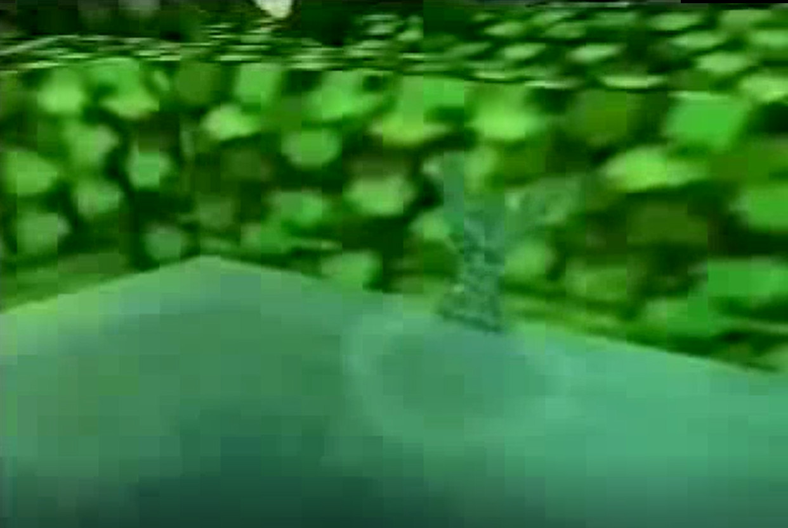
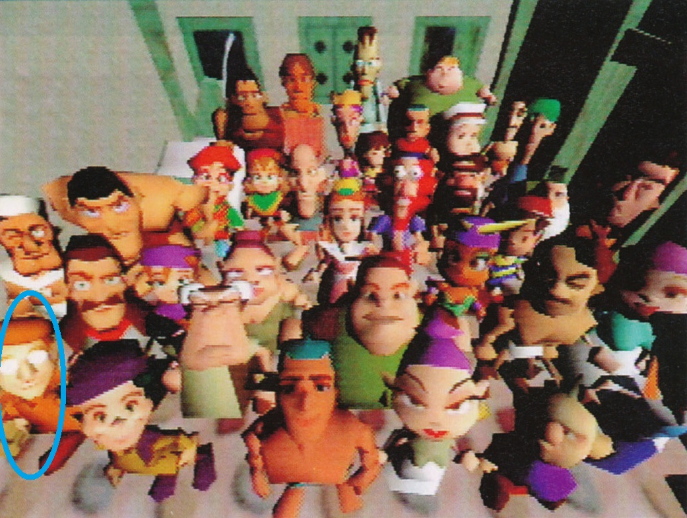


<ul class="pics"><li>

  
<b>The New Age Retro Hippie was originally took the role of Item Guy. </b>

   
There are a couple screenshots showing an NPC, dubbed "Hippie" by fans, in a mobile cart with various goods inside. It's believed that he would take the role of selling and purchasing items from the party as you traversed the game.
  
 
 

</li></ul>




<ul class="pics"><li>

 
<b>Wess and Duster were originally intended to fight the Fierce Pork Trooper as mini-boss in Chapter 2, rather than a Clayman, like in the final GBA game. </b>

   
The screenshot to the left shows both Wess and Duster in the HUD boxes battling with a Pork Trooper. In GBA version of MOTHER 3, the Sound Test, the Fierce Pork Trooper's battle song, Smashing Song of Praise, is in a chronological order where the Clayman fight falls. Due to this and the fact Wess is in the party during the battle, it seems like a battle with a Clayman replaced the fight with the Fierce Pork Trooper.
  
 

</li></ul>

<ul class="pics"><li>

<b>New Pork City was originally called New Pork Island. </b>

   
The main source backing this theory up is unused text found in the finalized GBA version of MOTHER 3, where an NPC had dialogue referring to the city as "New Pork Island." Given how much from the 64 version was carried over, it can be assumed this name originally used EB64.
 
 

</li></ul>

<ul class="pics"><li>

  
<b>The Clayman Factory was located underwater. </b>

   
There are a few visuals of the Claymen we have and one can be spotted emerging from the water and scaling the wall in the Spaceworld '99 trailer. A piece of text was found describing this scene, roughly translating to <i>"he had been working hard his whole life".</i> It seems this Clayman escaped from a lab of some sort and it's theorized that due to where the Clayman was encountered, it was underwater.
  
 

</li></ul>




<ul class="pics"><li>

  
<b>Orange Kid was in EarthBound 64. </b>

   
This theory doesn't have a lot of backing, but there is a similarity between one of the characters featured in the cast line-up and Orange Kid. It's within the realm of possibility, but has no real evidence backing it.

   
 

</li></ul>

<ul class="pics"><li>

  

<b>Magypsy house designs were designed like lily pads. </b>

   
The idea of this theory comes from the image pictured to the left. Due to the similarity between the shell/lily pad, the color, and size, it was speculated it might be a Magypsy home, but there is no evidence to back this.
   
 

</li></ul>



<li>The songs on the jukebox in the highway cafe from the GBA version of Mother 3 were all initially in EB64 and is a reference to the cancelled game.</li>
<li>Like the other main cast, Boney's model may have changed sometime during the switch from the 64DD and the 64.</li>

