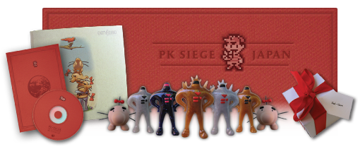
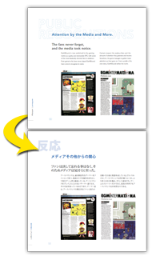
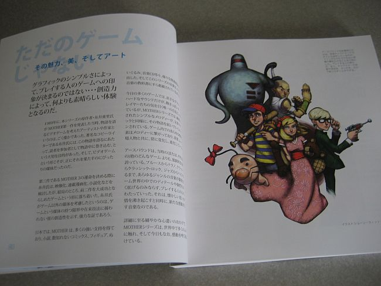
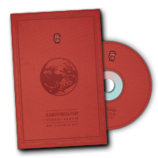
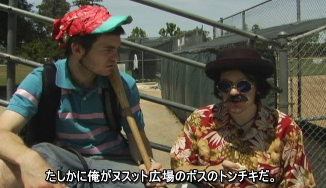
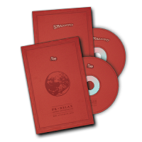
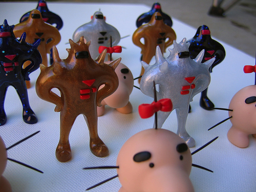
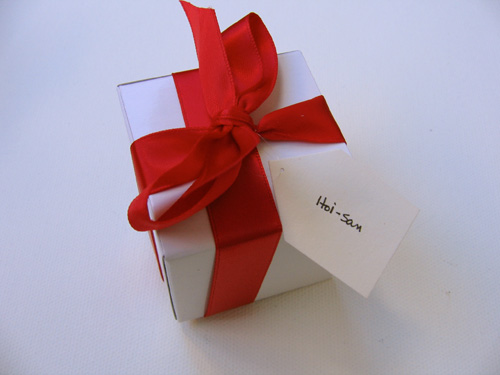
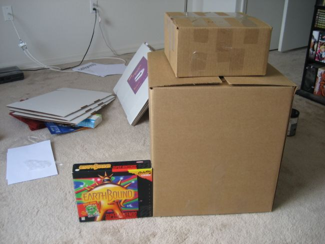



After many weeks/months of work, another big part of Starmen.Net's <a href="/ebsiege">EB Siege</a> has been completed! This time, we sent tons of stuff to Japan, and more specifically, to many of the people behind the making of the MOTHER series.

After completing the <a href="http://starmen.net/ebanthology/">EarthBound Anthology</a> in July 2007 and sending it and other materials to people throughout America (and other western countries), we immediately got to work on putting together materials to send to people in Japan. This time, though, it wasn't necessarily to get a point across, but more of a "thank you" gesture to some of the main MOTHER / EarthBound series creators. Even so, the message that we'd like to have more MOTHERly love here was still emphasized somewhat.




<h2>The Japanese Anthology</h2>

There's a good 20-40 pages of text at the beginning of the EarthBound Anthology which discusses the plight of non-Japanese fans, explaining the history of the series, its performance during and after the release of EarthBound, and its potential future outside Japan. This text is, of course, in English, which presents a pretty serious barrier to any Japanese viewer. And, as any fan will tell you, we don't consider Shigesato Itoi to be just 'any' Japanese viewer.

Tomato resolved to get the Anthology translated. Before you ask 'why didnt he just do it himself', keep in mind that translating from English to Japanese is completely different from Japanese to English. Writing Japanese prose is a much more complicated task than reading it, and knowing that many professional translation companies are actually pretty horrible in terms of quality,  Tomato consulted a translator co-worker of his who is a native Japanese speaker and avid gamer.

She and her small team of translators worked extra-hard to get every little nuance translated correctly. They even played through MOTHER 1+2 beforehand to be sure they understood everything. They were <i>that</i> dedicated... and, incidentally, they wound up becoming new fans of the series. The final Japanese translation of the book turned out phenomenally, a document we could proudly present to Mr. Itoi and our other Japanese friends. With the translation completed, Jonk worked many more late nights re-inserting the text and double-checking with Tomato to make sure everything was as it should be.




<h2>EarthBound Video Album</h2>

In addition to the Anthology, we wanted to send a DVD of videos made by fans, with Japanese subtitles where possible/necessary. We contacted many people at this site and elsewhere to get permission and to get better quality versions of their videos, since YouTube and the like aren't very great quality. The <a href="http://www.ubseymovies.com/">UbseyMovies guys</a> (the <a href="http://www.youtube.com/watch?v=r_RfpecI10I">EarthBound Saga crew</a>) were really helpful, as were Unlimited Lumpia, Libra, and xfis. Many thanks go out to everyone who helped contribute to this DVD!

Tomato started to subtitle videos, but it soon became clear that there wouldn't be enough time, so only a handful of the videos were fully subtitled. But the enthusiasm is clear from most of the videos anyway, and speaks almost as loudly as words in some cases.

There were roughly seven categories of videos included:

<ul>
<li>Live-action videos</li>
<li>Animation videos (flash animation, 3D computer graphics stuff, etc.)</li>
<li>Game videos (like EarthBound Supremacy and such)</li>
<li>Documentaries (a couple of those Beatles/MOTHER videos for example)</li>
<li>Fan game videos</li>
<li>Fan hack videos</li>
<li>Music videos (people playing MOTHER music on instruments)</li>
</ul>

At the very last minute, Jonk used his graphic design powers to create professional-looking labels, inserts, and covers for these DVDs. In addition, all the discs sent to Itoi were in really high quality jewel cases.




<h2>Fan Music CDs</h2>

Along with the video DVD, we wanted to send some fan music too. But... there's just so much. So the plan was to make 2 separate CDs, one called PK Kiai (which is the MOTHER 2 name for PK Rockin') which had upbeat, rockin' music, and a CD called PK Relax, which naturally had more relaxing and soothing music. The tracks were selected with Mr. Itoi and his contemporaries specifically in mind.

Each disc has about 70 minutes of audio, and about 23-25 tracks. Jonk created labels, covers, and inserts for these discs to match the design of the EarthBound Video Album DVDs. Very nice stuff.




<h2>Resin Figurines</h2>

Meeellla (aka <a href="http://camilleart.com">Camille Young</a>), professional artist and cookie lady extraordinaire who has been making EarthBound art for almost a decade now, made some of the coolest stuff ever: a set of Starman and Mr. Saturn figurines. She'd done this many times before (<a href="http://flickr.com/photos/meeellla/sets/72157594516593660/">example 1</a>, <a href="http://youtube.com/watch?v=Zzlk_KSUr4w">example 2</a>), but this time she created every Starman in the game, and even a special one that <em>wasn't</em> in the game (which she gave to Tomato)!

<a href="http://flickr.com/photos/meeellla/sets/72157602376240908/"> More pics here!</a>

In all, Camille ended up making a couple dozen figurines (about 14 of which were packaged and sent to various recipients) in just a few days. Once they were done, she and reid wrapped each one up in its own little white gift box with red ribbon, just like the gift boxes found in EarthBound, thereby increasing the coolness factor of these 100-fold. (Hey, you guys! Stop drooling on the keyboard!)




<h2>Thank Itoi Book</h2>

In July of 2007, we announced the Japan side of the EB Siege and the fact that we were making <a href="http://starmen.net/ebsiege/itoi/">a "Thank You" book for Mr. Itoi</a>, creator of the MOTHER / EarthBound series. People could thank him with personal messages. When we ended submissions about a month and a half later, we had over 750 messages from fans around the world. It was actually quite a shock; we (or at least Tomato) expected maybe just 200 or 300. So that was a pleasant surprise. The end result was about 60 or 70 pages long.

Organizing the messages and putting them together in a single document hit a couple snags along the way, but a copy of everything was printed out at the last second and placed in a nice folder, along with some other special messages from some of the site staffers, a picture reid made of everyone who worked on the Anthology, and a short message from Tomato about MOTHER 3.

On the outside, it wasn't the fanciest thing ever, but once you opened it up, it burst forth with the love of hundreds of fans. There's no doubt Mr. Itoi will be awed by this.




<h2>Letter from Tomato</h2>

To go with all of this, Tomato wrote a letter in Japanese addressed to Shigesato Itoi, Satoru Iwata, Shigeru Miyamoto, and Hirokazu Tanaka. It was a short but sweet letter explaining what these gifts are, why we sent them, the fact that the series has a following over here even today, the fact that the series has helped shape some people's lives, and other such stuff. The letter also made it clear that we're doing this not to show off or say, "Hey, look at us! Look! Look!" but to instead say, "Thank you," and let them know more about the fanbase outside of Japan.

Hopefully they'll like the letter, and hopefully we'll at the very least get a snail mail reply from one or more of these people :)




<h2>Sending it Off</h2>

Sometime in September, we learned that Mr. Itoi and some others on our list of recipients might be attending a certain event in October, which is being hosted by someone we know (trying not to give too much detail, sorry). We had managed to dig up Mr. Itoi's business address, which wasn't an easy feat, but this was a <em>much</em> better way to get stuff to him and other recipients. So mid-October became the deadline for shipping everything out.

Getting everything together in time was a grueling task to be sure, but everyone's hard work and teamwork prevailed, and on Oct. 15, 2007, a gigantic box of everything listed above was sent to Japan. The main box weighed 22 pounds and cost many hundreds of dollars to ship to Japan in time. Inside this box were five smaller boxes, meant for five different recipients:

<ul>
<li>Shigesato Itoi, creator of the MOTHER series</li>
<li>Hirokazu Tanaka, musician for MOTHER 1 and MOTHER 2 / EarthBound and current president of Creatures, Inc.</li>
<li>Satoru Iwata, president of Nintendo and main programmer of MOTHER 2 / EarthBound</li>
<li>Shigeru Miyamoto, no explanation needed</li>
<li>Our contact and event host guy</li>
</ul>

In addition, a smaller, individual package was sent to Captain Apollo, the webmaster of <a href="http://mother-jp.net">MOTHER Party</a>, the largest Japanese MOTHER fan site and good friend of Starmen.Net. See his impressions <a href="http://www.mother-jp.net/times/20071019-2.html">here</a>!

Here is a picture of the final boxes, with the full-sized EarthBound box next to them for comparison. I don't think any of us imagined we'd be sending this much stuff!

 <a href="jpn06.jpg">+ Bonus Pic</a>

Mr. Itoi's box was literally bursting at the seams, so we had to go with a bigger box than originally planned, and even then it was really hard to keep the box closed. Here's what he got:

<ul>
<li>Japanese Anthology</li>
<li>EarthBound Video Album DVD + Fan Music CDs</li>
<li>Too many figurines to remember, probably 6 to 8 total</li>
<li>Thank Itoi book with all the extra stuff in it</li>
<li>Nintendo Power with EB/SM.Net stuff in it</li>
<li>2007 Starmen.Net calendar we had lying around</li>
<li>A refrigerator magnet with a picture of reid, Meeellla, and Plo waving hello from the Dusty Dunes Desert (???)</li>
<li>The letter</li>
<li>Probably other stuff we've forgotten about already</li>
</ul>

Itoi's box was white and tied with red ribbon.

Other recipients received most of the same stuff, but just in smaller quantities. As you can see above, the final package was <em>huge</em>. Hopefully everyone will love their stuff :)




<h2>Reception</h2>

Oct. 26, 2007: As of right now (Oct. 26), a couple people have gotten their packages, as well as some people not on the main list above but who were still intended recipients. A lot of cool and exciting stuff has happened, and everyone in Japan who's seen the Anthology, the figures, the DVD, etc. has been extremely impressed and excited. So much that they're asking for lots more copies of everything. It's crazy.

Jan. 10, 2008: A big update of the latest stuff can be seen in <a href="http://starmen.net/forum/?t=msg&th=42206">this news post</a>.

Jan. 22, 2008: Thanks to some really cool and nice people, if things go well, Itoi should be getting his stuff when he returns from his trip to Canada. Hopefully things will go well ;)

Feb. 26, 2008: It appears that Itoi's package has arrived safe and sound. (<a href="http://starmen.net/forum/?t=msg&th=43787">see here</a>)

As things develop, we'll update things here!





There are so many people who helped make this all a possibility, so if you're not listed here, we apologize. Thanks to:

<ul>
<li>Jonk</li>
<li>Meeellla</li>
<li>Anthology translation team</li>
<li>Plo</li>
<li>reidman</li>
<li>ShadowX</li>
<li>Jason-san</li>
<li>KingDarian</li>
<li>The Ubsey Movies guys</li>
<li>xfis</li>
<li>Libra</li>
<li>Unlimited Lumpia</li>
<li>PoeTrader</li>
<li>lewahi</li>
<li>ROFISH</li>
<li>Everyone who's ever made fan art, fan music, fan videos, fan hacks, or pretty much fan anything! Keep the EarthBound spirit alive!</li>
<li>Everyone who's participated in the EarthBound Siege in one way or another!</li>
</ul>

And most of all:

<ul>
<li><b>EVERYONE WHO DONATED!!!</b> Thank you so much! Absolutely none of this would've been possible had we not raised so much!</li>
</ul>

