




<ul class="thumblinks mailn">
	<li><a href="ebgameartcards/"> EB - Game Art</a></li>
	<li><a href="ebartcards/">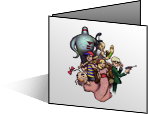 EB - Fan Art</a></li>
	<li><a href="m3gameartcards/">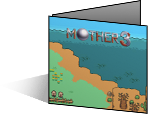 Mother 3 - Game Art</a></li>
	<li><a href="m3artcards/">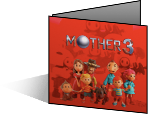 Mother 3 - Fan Art</a></li>
	<li><a href="gameboxcards/">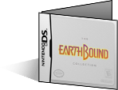 Game Box Cards</a></li>
	<li class="all"><a href="allcards/">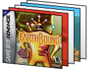 ALL CARDS!</a></li>
</ul>




<ul class="instructions">
	<li><a href="allcards/">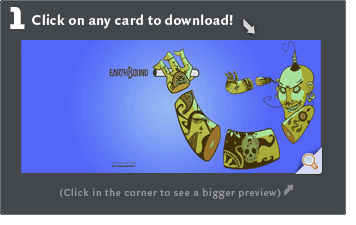</a></li>
	<li>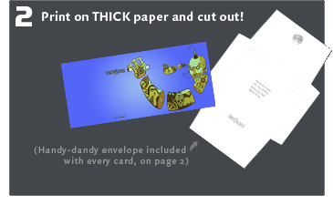</li>
	<li>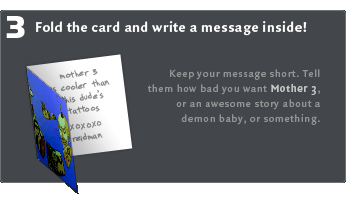</li>
	<li>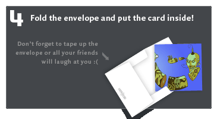</li>
	<li>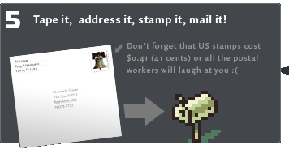</li>
	<li>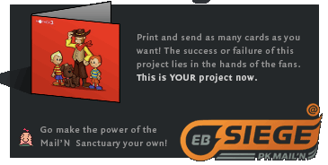</li>
</ul>





There is no duedate, just keep mailing them to Nintendo to have your voices heard.

PK Mail'N is a chance for <em>every</em> fan to get involved with the EB Siege -- even if you can't draw ;) The Mail'N requires no more than a few minutes of your time - just print it out, write a quick note, and stick it in the mail.

You'll need a printer, 2 sheets of paper (thick paper, like card stock, is best), and a stamp. <a href="allcards/">Browse through over 100 (count 'em!) different cards</a>, find one that suits your taste, print it, and let Nintendo Power (or whoever you want to mail it to) know how much you love EarthBound!





Do you want to mail it to someone besides the Nintendo Power staff? Way ahead of you -- you can use our handy blank envelope template:

<ul class="thumblinks">
<li><a href="envelopes/pkmailn_envelope_np.pdf">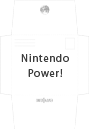 NP Envelope</a></li>
<li><a href="envelopes/pkmailn_envelope_noa.pdf">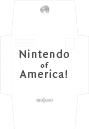 NoA Envelope</a></li>
<li><a href="envelopes/pkmailn_envelope_blank.pdf">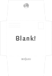 Blank Envelope</a></li>
</ul>

And here are the addresses on those envelopes, in case you want to hand-write yours:

	<b>Nintendo Power</b> 
	P.O. Box 97033 
	Redmond, WA 98073-9733

	<b>Andy Myers (NP)</b> 
	Nintendo Power 
	4820 150th Avenue NE 
	Redmond, WA 98052-5111

	<b>Nintendo of America</b> 
	PO Box 957 
	Redmond, WA 98073





<youtube src="jwmW4-Gqu08" />




<ul class="thumblinks mailn">
	<li><a href="ebgameartcards/"> EB - Game Art</a></li>
	<li><a href="ebartcards/"> EB - Fan Art</a></li>
	<li><a href="m3gameartcards/"> Mother 3 - Game Art</a></li>
	<li><a href="m3artcards/"> Mother 3 - Fan Art</a></li>
	<li><a href="gameboxcards/"> Game Box Cards</a></li>
	<li class="all"><a href="allcards/"> ALL CARDS!</a></li>
</ul>


