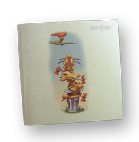
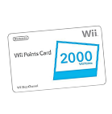
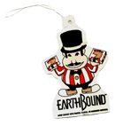
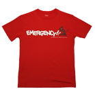







<a href="http://starmen.net/forum/?t=msg&th=45866">PK Tube'N Contest Announcement!</a> <youtube src="Q7hCNq85afY" />
  <a href="http://starmen.net/forum/?t=msg&th=46666">Tube'N Contest Update, Deadline Extension!</a> 
<youtube src="9DWoGJZALGk" />  <a href="http://starmen.net/forum/?t=msg&th=47180">Tube'N Contest Results and Prizes!</a> <youtube src="06R8sAo82n8" />




<h3>EarthBound...NOT on Virtual Console?</h3>

As mentioned in the video, things aren't looking good for EB on VC. Nintendo of America pulled the EarthBound demo from the Masterpiece section of Smash Bros Brawl. Why would they do that? Nobody knows for sure, but one thing is obvious: it's not good news. We've been expecting the VC release of EarthBound for nearly a year now, <s>but it doesn't look like it's going to happen.</s><ins>(Update: <a href="http://starmen.net/forum/?t=msg&th=46159">EB rated by the ESRB</a> a week after the Tube'N started! This isn't a guarantee that the game will be released on the VC, but it's a good sign!)</ins>

So not only are we not getting MOTHER 3, but Nintendo of America is taking away our only chance to prove how well MOTHER 3 could perform outside Japan. <em>Lame</em>, right? But it's not like we haven't dealt with this kind of crap before, so we're doing what we do best -- kicking up a creative dust cloud.

<h3>The General Rules:</h3>
<ul><li>Make a video which references EarthBound, MOTHER, Starmen.Net, Lucas in Smash Bros, whatever. Something to help bring attention to the EarthBound/MOTHER series.</li>
<li>Post your video as a video response to <a href="http://youtube.com/watch?v=Q7hCNq85afY">our Youtube Video Contest Announcement</a>. You can also post the link on the <a href="http://starmen.net/forum/?t=thread&frm_id=94">PK Tube'N Forum</a>, but it must be a video response to count as a part of the contest!</li>
<li>Get people to watch your video! The videos with the most awesomeness/views at 11:59 PM Eastern on May 23, 2008 will win prizes (listed below)!</li>
<li>If any of the winning videos suck really bad but have more views than a much better video, we reserve the right to bump the better video up. So while views will be the major factor, the contest won't be <em>strictly</em> based on views. You should strive for a good mix of content and hype ;D</li>
</ul>



As stated in the video, 6 videos will be chosen at the end of the contest. The winners will choose from the following prizes (1st place gets first pick, etc):

<ul class="thumblinks">
<li><a href="http://starmen.net/ebanthology/"> EB Anthology</a></li>
<li><a href="http://flickr.com/photos/meeellla/501019624/"> Starman Figurine</a></li>
<li><a href="http://flickr.com/photos/meeellla/2301807953/"> Fobby Figurine</a></li>
<li> 2000 Wii Points</li>
<li> <a href="http://starmen.net/merchandise/misc/airfreshener.php">  Mach Pizza Air Freshener</a></li>
<li><a href="http://www.the-king-of-games.com/english/shop/index.php?mode=catalog_list&type=series&series_id=24"> KoG Red Emergency! Shirt</a></li>
</ul>



<h3>Video Suggestions</h3>
<ul><li>Adopt an EarthBound theme for a non-EarthBound video! Remember, we want to reach people who haven't heard of EarthBound but might be interested. Some dorky examples:<ul><li>Channel a topical EB character. For example, submit a reply to <a href="http://www.youtube.com/watch?v=muMcWMKPEWQ">David Bowie's Starman</a> by wrapping yourself and several small children in tinfoil and dancing in a properly-cooled environment.</li>
<li>Jump in on a video meme if you've got an EB-related answer. For example, <a href="http://youtube.com/watch?v=8OvI11mQFiI">this guy asks what fictional character you relate to</a>. Who can't relate to a boy named Poo? (If you caught that Johnny Cash reference, that would also be a hilarious video.)</li>
<li>Post a video recipe for Peanut Cheese Bars. Don't forget to mention what game they came from!</li>
<li>Enter a separate <a href="http://youtube.com/contests_main">YouTube Contest</a> with some EB content. For example, you could enter <a href="http://www.youtube.com/mytalkingstain">Tide's "My Talking Stain" contest</a> with Ness meeting Apple Kid for the first time.</li></ul></li>
<li>Hop on the Smash Bros bandwagon by recording yourself breaking a record or doing something similarly awesome with Lucas or Ness. Don't forget to plug M3 or EB on VC.</li>
<li>Re-enact a scene from EB a la <a href="http://youtube.com/watch?v=wBrJVlFrvUw">EB Saga</a>. If you can't do it well, then at least make it funny ;)</li>
<li>Find real-life parallels to EarthBound (regardless of how tenuous!) and exploit them like an opportunistic documentary creator. For example, if your mayor has ever condemned a building, he's pretty much on the path to Pirkledom. Confront him on camera! Or at least film yourself shouting something about roadblocks as the guards carry you away from City Hall.</li>
<li>If you're lazy but have a good eye and a sharp ear, get permission from some of your favorite EB/MOTHER artists to set their artwork to music. <em>If you do something like this, you have to get permission first!</em> If you don't, karma will be like "oh no you di-int".</li>
</ul>




<h3>Suggestions for Getting Views</h3>
<ul><li>First off, make something really awesome/unique/weird. If you don't do this then no one will care about your video enough to pass it on. Example of what NOT to make: a video of you playing the game. BORING.</li>
<li>Get a good mix of quality and speed -- if you take too long to make your video, you won't stand a chance. But if you throw together something lame, you won't get very far (or even if you do, you might get bumped at the end).</li>
<li>Link to your video in your signature/profile on other sites and forums. Don't spam it unless it's welcome, though (for example, you're welcome to post it on <a href="http://starmen.net/forum/?t=msg&th=45291">the Fan Forum's video topic</a>, but not on any other forum).</li>
<li>Submit your video to social linking sites like <a href="http://stumbleupon.com">StumbleUpon</a>, <a href="http://digg.com">Digg</a>, <a href="http://reddit.com">Reddit</a>, etc.</li>
<li>Submit your video to <em>relevant</em> YouTube groups/channels. Remember, don't push your videos in places where they're not wanted.</li>
<li>Make some friends on YouTube and send them your video.</li>
<li>Make friends with a blogger (there are about <a href="http://www.destructoid.com/elephant/users.phtml">a million at Destructoid</a>)</li>
<li>Check out <a href="http://www.youtube.com/browse?s=md&c=0&l=&b=0">the 'most discussed' videos</a> and find a video you can reply to with EB-related content. EarthBound and MOTHER 3 both cover politics, sociology, religion, war, gender, mind-altering substances, and music pretty thoroughly, so there's plenty of source material to work with ;D</li></ul>



The vast majority of EarthBound fans are awesome. But people will sometimes go crazy in order to win a prize, so I wrote up these 'extended' rules. Everything here is common sense, but just in case...

<ul>
<li>No artificial view inflation via lame spamming or tricks!<ul>
<li>Your video's icon shouldn't be deceptive -- don't go flashing unrelated pictures in the middle of your video to get your icon changed.</li>
<li>Your keywords should match the content of your video (i.e. no 'boobs sex girls lol')</li>
<li>No rickrolling or other lame tactics to trick people into viewing your video. This will result in your video being given up and let down.</li></ul></li>
<li>Be good/kind. You're representing your fellow fans, so be excellent!</li>
<li>Your video needs to be strongly EarthBound-related, or at least should provide a good reference to the series. For example, you can't just tack on 'oh btw ness is awesome' to an otherwise unrelated video. Find an appropriate way to work it into your video.</li>
<li>Stolen/<strong>pre</strong>posted videos will be shot on sight! We're trying to get <em>new</em> people to see these videos, so make something new and post it. Reposting a video you already made is fine, but the 'uploaded on' date must be April 25, 2008 or later.</li>
<li>If some lamewad video with no effort beats an awesome video with tons of sweat/tears, we reserve the right to bump it up a spot. Or several spots, if its warranted.</li>
</ul>

One more time: <strong>the 'most views wins' thing is not a strict rule</strong>, so if you just recorded yourself playing MOTHER 3 for 10 minutes, don't cry when we give your prize to someone who put some thought into their entry ;)

