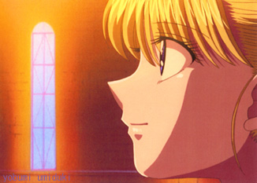
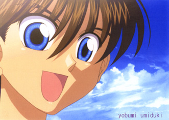
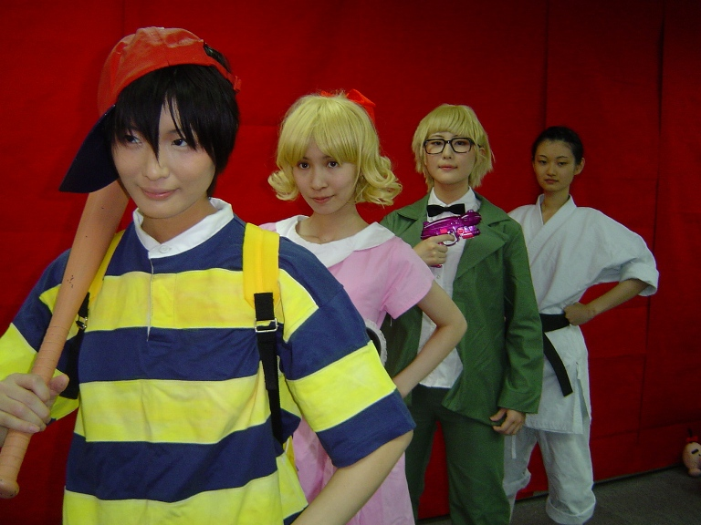


Web site: <a href="http://magicant-lab.com">http://magicant-lab.com</a>

  
3 2 1 MOTHER was an unofficial, fan-organized event held on Saturday, September 23, 2006 in Tokyo.

  

Short anime clips were shown at the event. These were fan-made, but by a professional animator. 
 

  
(more details to come)



Luckily for us, our good friend (and former staff member) Kyosuke lives and works in Japan, so he was able to attend! And he came back with a report that would make any EarthBound fan drool with envy!

  

  
Accompanying me to the event were two sisters (Chiaki and Narumi) who I had only met once before, but I invited them to come with me because we all had one thing in common. We loved Mother. They had another sister too who also loved Mother, but I guess she couldn’t make it.
  
We arrived at the building marked on the map I had taken off the internet. We were about 20 minutes early. We saw a girl wearing the red Mother shirt recently sold on Itoi’s site, and another girl holding a sign for the event. We were told that we couldn’t get in until 11:00, so we were told to come back then. After a quick drink at the nearest café, we came back only to find a huge line. If only the lady from before had told us about lining up in the first place!
  
But it was no real problem as the line moved quite fast as people were ushered into the building in groups by the event staff lady. It was really interesting standing in the line with all kinds of other Mother fans. I had wondered about what kind of people would show up. Everyone was totally normal. It was like it wasn’t even the line for that kind of event. I noticed too that there seemed to be more female event goers than male. It seemed to be about a 75% to 25% ratio. Another thing I noticed was hardly anyone was wearing a Mother t-shirt! Only the staff seemed to be. Other than that, I saw maybe 5 other people the whole time wearing the t-shirts that were sold on Itoi’s site (mostly franklin badge shirts). I had debated on whether to wear mine or not before I left, and decided against it thinking that it would be nothing but people wearing the same shirts.
  
As we stepped off of the elevator on the 4th floor, we were met with Paula! She would be one of the 5 or so other Paula’s this day. She was running around like crazy trying to keep the flood of Mother fans in order as we lined up again inside the building to get in. Finally, we enter and buy the pamphlet, which was actually like a book with lots of Mother doujinshi inside. The whole event covered 2 floors. On the 4th floor, there was a long main table, where all of the staff (who were mostly all cosplaying) did their business. On the table lay all of the goods that were to be given away in the raffle. All the good stuff; Mr. Saturn straps, key chains, Mr. Saturn T-shirts, Love+ t-shirts, a Famicom alarm clock, the Mother 3 deluxe set, Franklin badges, and the Mr. Saturn book! That book was huge. Wow. I drooled much.
  
The rest of the area consisted of long tables where tons of doujinshi were being sold by their individual writers. They had their areas set up all nice, most with really awesome drawings set up and their books laid out. One little area had tables for people to sit and read their newly purchased books. Right beside that was the cosplay zone that unfortunately, was the only place pictures could be taken. To take pictures, you had to register your camera by paying 300 yen and putting a sticker on your camera. No one was allowed to take pictures of anything on those two floors, except for the cosplay red screen area. I was quite bummed to say the least.
  
The main focus of the event seemed to be the selling of doujinshi. There was even Jeff on Tony doujinshi. When I happened upon it, the lady selling her books smiled at me and said, “Please have a look!” So I flipped through a book, smiled back and politely walked on to the next stand.
  
But there were also all kinds of other Mother goods the artist had on display for sale. Incredibly cute memo pads, pins, postcards, and stickers were some of those things. There was also a couple guys who had Mother club mix CDs set up for sale for 1000 yen. You could even listen to the music on an ipod before buying. I took a listen, but it really wasn’t what I was looking for. I guess I’m not much of a club music person.
  
As we walked around, the mood was set as Mother remixes played over the sound system during the whole event. As I listened more, something seemed familiar. It was then that I realized what I was hearing was our friend Bill Eager’s version of Pollyanna (I Believe in You). I was freaking out and so excited to hear his song. The song played about 5 or 6 times that whole day, since the same 20 or 30 songs repeated. Not long after I heard the song, I registered my camera, and as I started to walk away from the staff table, a staff Paula (different from the one before) approached me. She asked me, “Are you Mark?” I was like, “What!? Yeah, how do you know me?” Then she asked, “You’re friends with Bill, right?” I was blown away! Bill was like a celebrity to all the staff! He had even told them that I was going to be there. Of course I knew nothing about this. But wow, was it an awesome surprise. The staff Paula’s name was Metro (nickname of course), and she told me that she was friends with the girl, Natsu, who had corresponded with Bill. Because of Bill, I was like the guest of honor it seemed. One after another, staff would run into me and say something like, “Oh my god, you’re Bill’s friend, right? Wow!” They treated me almost as if I was the almighty Bill himself! One staff girl, after hearing who I was, was even so moved as to start bowing like crazy and treating me like a celebrity. Thank you Bill, you made my event going experience that much more awesome. Next time, come yourself and claim all that glory!
  
Around 1pm, they announced the start of the showing of the original Mother animation. Right as the announcement was made, everyone started rushing like mad cows towards the TV in the reading area. There was one roughly 30 inch TV on a stand, and about 150 or more crazed Mother fans. We all moved in and scrunched together close sitting on the floor around the TV. About this time, Chiaki had to leave because she had something else going on that day. But Narumi and I got in soon enough to be fairly close to the TV. The video consisted of three parts; Mother animation, Mother 2 and then Mother 3 animation. Each segment was about 3 min. long except for the Mother 3 segment which was about a minute. We all “oohh”ed and “ahh”ed at the first Mother segment. But once 2 and 3 hit, everyone went into crazed fan mode. Since there was no sound to the animation (unfortunate, but no big deal, since some background Mother music was provided), everyone could scream and swoon over the cuteness of Ness and friends without worry. Scenes like Paula at the preschool or tender moments like when Jeff left Tony and the orphanage. At the end of the Mother 2 segment, we all shared a knowing laugh when Pokey appeared on screen, his back to us, then slowly turning around to flash a sinister smile. No one held back their emotions, and neither could I. What a rush it was to join in the cheering with close to probably 200 other Mother fans. The Mother 3 segment basically only showed a few scenes of Flint, his wife and the two twins, being happy and cheerful. When it was over, applause followed. Each segment had a different style of animation, and it was great. After the viewing, the TV was left on with the animation on repeat for everyone to see for the rest of the event.
  
After an hour break for lunch, we returned in time for the tea party/raffle time. Seats were all prepared for us, and doujinshi tables were all cleaned off to make room for the bags of candy, cups and 2 liter bottles of coke, Mitsuya cider, and tea. In each of our bags, was a number. I had the number 8 and Narumi had 7. The numbers went into the 200s however, making us realize how lucky of us it would be to win anything. They started the first prizes off with IchigoDoufu (Strawberry Tofu), a food item in the series. It was just food, and no real prize to me. I wanted the real stuff! I was looking forward to the Mr. Saturn straps and Mr. Saturn shirts. As they went through the prizes, we gradually lost all hope for winning something as more and more people’s numbers that weren’t ours were called. I even actually said to myself that I most likely wasn’t going to win, and to just enjoy myself. About this time, I noticed that the nametag of the girl showing off the goods read “Natsu”, the girl who Bill had been in correspondence with! Then finally, it was time for the Mr. Saturn straps. They had about 10 laid out on the table. Towards the end of the announcement of winning numbers for the straps, I heard my number. It happened so fast I didn’t even realize it at first. I sat there in a daze as Narumi repeatedly told me that my number had been called. I was so shocked as I walked up to the main table where all the staff was, giving out the prizes. When they saw that it was me that had won, they all gave me a big applause all together. It was such a great feeling. I had won the strap I had wanted AND got to soak up fame in Bill’s shadow! Before I went back to my seat, Natsu came up to me to introduce herself and to say hi to Bill for her.
  
The raffle ended with the Mother deluxe set, and all that was left was more cosplay picture taking and general mingling before it was all over. As I was about to start taking more pictures, I ran into Natsu again, and talked for a little more. Then I asked if I could take her picture with me so Bill could see, and she was all about it. After that, I ended up in a conversation with a nice lady who was also taking pictures. She asked me if I had started playing Mother in Japan, and I told her I had started in the US. We then shared our mutual love for the game in talking about how we had both been playing since Mother 2 came out. About waiting for Mother 3 and how amazingly great a feeling it was to be there with so many others who felt the same as we did about these beautiful games. I swear, she even started to get a little teary eyed! She made it a point to express to me how much she was happy to talk about it with me. It was… awesome.
  
Before we left, the staff ladies stopped me one last time. They had something they wanted me to give to Bill. It was one of the thick comic filled pamphlet books plus a bookmark thing that represented the event. It was a special thing that people had to fight over for at the end. The staff didn’t have that many left. So they must have had saved one. Bill, even though you weren’t there, you were definitely there in spirit.
  
The time I spent with those people today reminded me even more just how much I love these games. It also opened up my world to the Mother fandom here in Japan. Something I had no real understanding of until now. Cheering the characters on together, humming and bobbing our heads to the music we love together, and all the rest combined to make a very memorable experience.
  
(end report)
  
-Kyosuke




<table1 />
<a href="ebcos01.jpg">Cosplay #1</a> 
<a href="ebcos02.jpg">Cosplay #2</a> 
<a href="ebcos03.jpg">Cosplay #3</a> 
<a href="ebcos04.jpg">Cosplay #4</a> 
<a href="ebcos05.jpg">Cosplay #5</a> 
<a href="ebcos06.jpg">Cosplay #6</a> 
<a href="ebcos07.jpg">Cosplay #7</a> 
<a href="ebcos08.jpg">Cosplay #8</a> 
<a href="ebcos09.jpg">Cosplay #9</a> 
<a href="ebcos10.jpg">Cosplay #10</a> 
<table2 />
<a href="ebcos11.jpg">Cosplay #11</a> 
<a href="ebcos12.jpg">Cosplay #12</a> 
<a href="ebcos13.jpg">Cosplay #13</a> 
<a href="ebcos14.jpg">Cosplay #14</a> 
<a href="ebcos15.jpg">Cosplay #15</a> 
<a href="ebcos16.jpg">Cosplay #16</a> 
<a href="ebcos17.jpg">Cosplay #17</a> 
<a href="ebcos18.jpg">Cosplay #18</a> 
<a href="line.jpg">Line</a> 
<a href="natsume.jpg">"Natsume" & Kyosuke</a> 
<table3 />

