
Starmen.Net has been having site conventions since probably about 2000 or 2001. Because of logistical reasons, only so many people can come, and usually the details of each one are decided last-minute by site staffers, moderators, and other such people.

  
The conventions are full of sweaty video game fans. You don't wanna go to one. They get in trouble and hotel managers yell, "Hey, you guys!" at them on an hourly basis. SM.Netters have also discovered they are fond of this thing called "fire". They are dangerous people and can erupt in fireballs at any moment.

  

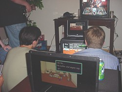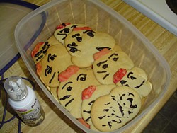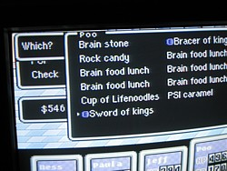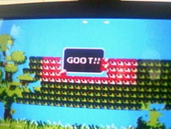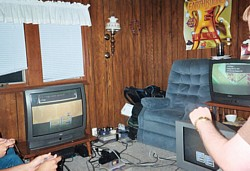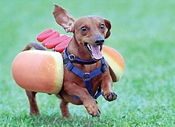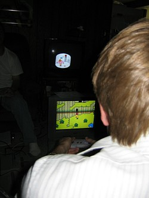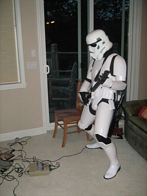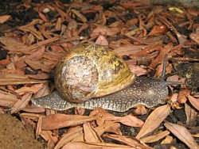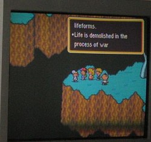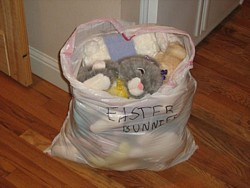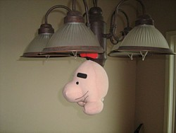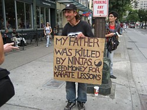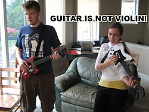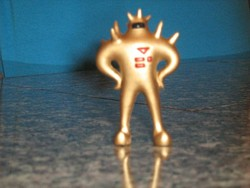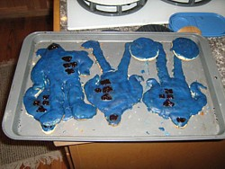

  

<a href="accident.gif">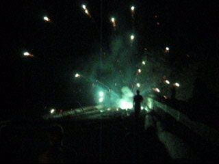</a>


