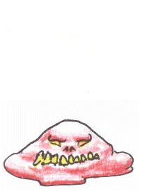
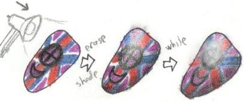


Ah, so you've the skills and practice to get this far?  Good, good - This is the final school of Arty's skills collected thus far.  As always, you won't instantly gain the control over these different mathods.  Practice brings them to their full potential.  I myself am constantly learning and applying new means of color myself, so the limits are infinite!  However, I should get to the more advanced stuff before I bore you with all this.  ;D    

<u>Color Synth</u>
 
So, you've got some of the good stuff down now.  With limited pencils, your color choice may seem limited, but that's where color synth comes in handy!  Simply put, it involves mixing different amounts of hardness of one color with another.  This may require thought and experience in mixing colors, though.  Look around the net for info on making some of the more complex colors or try mixing paint.  Messing around with pencils could help as well!  
Anyway, once you've got your composition down, apply the different amounts needed of each color together and mix the two together.  If done to make a light- or medium-darkness color, use a light color (like white) or the lighter of the two base colors to smooth them out.  If it's darker, Choose the darker of the two colors to smooth it out.  <u>Be careful, though!</u>  If you use a color with a lot of pressure, it may be hard to overcome and will ultimately change the color permanently.  Remember to practice color synth on spare paper before actually applying to the final art piece!  You might also use different colors in the smoothing process, but there's more on that in the Advanced color synth section.  It's just good to know a little now about the mixing of colors to get more shades of a color than the 3-4 that the colored pencil companies give you.  
For example, the above right picture shows mixing 4 examples:
<ul><li>Upper left - Red to Yellow fade.  The red was slowly tapered back until it looked like it faded into white.  Yellow was applied hard to make the nice orange fade.</li>
<li>Middle-top - Eggplant.  This was made by applying an average coat of both red and blue (as seen in the two bodies of color intersecting) to make a faded purple color (also seen, to the right of the eggplant triangle).  Then, blue was used hard to smooth out the mix.  Some red was added hard afterward to stress the purple more.  Compare the color made with the closest colored pencil hues, blue and maroon.</li>
<li>Middle-bottom - Cloudy Amethyst.  The mix of general red and blue mentioned earlier was smoothed with white.</li>
<li>Bottom right - Crimson Brick.  The same process as was used to make Eggplant, but with Red first, then blue.  Compare to Red and Mahogany.</li>
</ul>
So, the color choice is limitless!  Also, the new color names are up to you, as I have taken the liberty to show you with my own names.  ;D  Note, however, that though color synth sometimes works good, it may also procure odd textures or color speckles, as seen in Eggplant.  These may be able to be bypassed, but it would require you figuring out a cleaner way to make that color via synth methods.  Don't give up!  Only by experimentation can you become much more awesome!</img></img>   

<u>Eraser Use</u>
 I'm sure you've noted the almost uncanny resemblance between colored pencils and normal pencils, right?  So, you figure you can just erase if you mess up, right?  Not always, sadly.  Oftentimes, hard pencilling leaves behind color when erased, making mistakes deadly.  However, once you have enough skill with pencils, mistakes don't happen all too often, which leaves your eraser colored pencil-less.  Until now.  
Yes, this skill is worthy of an incomplete sentence!  This tactic utilizes that very observation of left color and uses it as a method to get a new texture and look.  When mixed with a waxy white, it can make things look shiny and lustrous while retaining patterns and the like.  This is very useful for things like armor as you can decorate it and keep the metallic look at the same time.  Control is an issue, however.  
In any case, as you probably derived from the explanation, you first color what you want as you would normally, using hard pencil strokes and shading techniques.  It's often a good idea to keep the pencilling hard until you get to the spot that's going to have the bright white/yellow/whatever color light reflection.  Shading isn't always necessary since you can taper the eraser use just as easy.  

Get a good eraser and find the sharpest corner you have for maximum control.  Now comes the directional difficulty.  The best way to retain your white spot is to work from the inside of the light reflected place outward so you retain the pure color from the light in the main shine spot.  I didn't do a very good job myself above, but the point is strokes outwards from the center.  Erasing does spread color around if you're not precise, so take great care.  Remember to create the shaded effect by erasing a lot near the light spot and lessening it outward.  After you're done, you'll see the tell-tale spots in the paper from erasing a colored pencil.  
Now, pick a white you want to use.  Waxy usually gives a better gleam look.  Again, you want to make sure the white is pure by getting rid of the past colors on the tip, then start from the light spot and work outward so you don't mix color into the pure light spot.  When done correctly, it makes a really impressive looking pattern on shiny or reflective material.  I takes some getting used to, but ultimately makes the armor or whatever you're working on look much more realistic.

</img></img>

I'm sure there are many more tips in books, but

 



So have you gotten a good grasp of some of the awesomeness that is colored pencils?  My hope was to open up a new medium for you through my own devices to create a new flow of colored pencil works.  I don't know everything about them, obviously, so for extended use, try getting an art book or something.  Personal experimentation gets you far as well; try looking at things in a different light and develop a method out of it.  I'm also learning new techniques as I go, so check now and then to see if something new has been added!  
Anyway, it was a blast writing this, and the thing that would make it more rewarding is seeing people set aside Photoshop and Paint Shop Pro and to give the fun medium that is colored pencils a try!



<ul>
<li><a href="http://starmen.net/fanart/tutorials/artemis251/begin.php">Woah, woah! Maybe I meant the Beginner section! </a></li>
<li><a href="http://starmen.net/fanart/tutorials/artemis251/inter.php">Alright, I think I'll backtrack to the Intermediate section</a></li>
<li><a href="http://starmen.net/fanart/tutorials/artemis251/">Go back home</a></li>
</ul>

