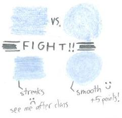
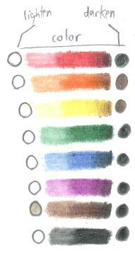
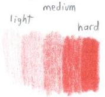
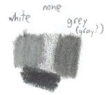
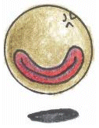
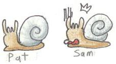


Some artists take colored pencils for granted -- they can be a much more complicated medium than you'd think!  There are a few tricks that aren't implimented by some when they should be.  Simple actions might be the whole difference between an awesome pic and a fair one.  So, shall we start with the basics, so as to provide a good base to build off of.  :D  

   
<u>BASICS</u>
 Anyone can pick up a pencil and start coloring with it, that's true...but there are some integral techniques.  For instance, a basic one is the direction of coloring.  The ideal is to make circles to fill in color.  If you go left-to-right or up-to-down, the art onlooker see the direction and it takes away from the picture.  It becomes even more visible with a base color added, as you can see on the left.</img>      

 Another thing you have to familiarize yourself with is shading.  Without it, you lose a lot of depth and your art becomes 2-D instead of giving the 3-D feeling.  Where do you start?  Practice a bit shading simple geometric figures or the like.  Whatever you plan to practice on, define the light source in a direction and adjust from there.  You can't have one thing shaded with light from the left and another with light from the left in the same pic without different light sources, it looks bad!  Control is the issue with shading.  Try using different pressures to get different effects.  It can help you out if you make little shading walls like the one on the right, going from light to dark or vice-versa.  More practice never hurts!  ;D  
To help you out, I made a little example of what colors are most commonly used to lighten and darken the base colors (left).  Black is a common darkening agent, but keep in mind that sometimes it may be too overwhelming.  Note that yellow and orange are shaded with brown.  If you're making something really light it color, it's usually best to pick a color closer to the base color than black.  Black can overpower colors easily, so be careful!</img></img>
    

 
<u>Black Use</u>
 Black, as I've said, is overpowering if used overly.  While it does grant the mood to darker pieces, it often takes away from the detail of the pic to make things that are black pure black.  To make it look more discernable, try making a light/medium hardness run through the area with black first.  Apply more black to where the shading is going to go, and fill the rest in with gray or white.  You get to retain all the work you gave on your lineart and you also give the a more realistic coloring job.  Pure black is very hard to find in real life, and oftentimes, it reflects at least a little bit of light to give it the grayish hue that you're giving to your work.</img></img>     

<u>White Use</u>
 

Ah, white.  The completely underrated colored pencil.  Few ever use it in their works.  Why?  "The paper's already white!  It's useless then!"  
WRONG.  One of the biggest tips I can tell you is to <u>USE WHITE</u>.  A <i>lot</i>.  Not only is it superb in lightening colors, it smooths out anything and makes it look more like a professional coloring job.
<ul>
<li>Have colors that need to be lighter?  Apply a medium coat and go over it with white.</li>
<li>Want something to shine?  Shade it a bit and use white.  Start from the center (where it's supposed to be white) and work outward so you don't contaminate the white shine part with color.</li>
<li>Need some colors to have a nice transition into each other?  White can work for lighter transitions, but oftentimes, a lighter color close to it may work better.  For example, for browns, tan or sand.  More on color transitions is in the Advanced section.</li></ul>
As an important note, be sure to clean your white pencil after use.  Why?  Next time you use it, it might transfer old color from past blendings onto the new color.  Look on the pencil to find the spots with color clinging to it and draw them off on a separate piece of paper to retain white's pure color.  This is important to do each time you finish using white!  
So, what's the difference?  Take a look at the above left picture.  See the two Pearl Slugs?  Pat looks cool and collected sporting a nice, shiny, and smooth shell.  Sam, however, just realized that his/her shell looks grainy!  The finished product can vary the quality a lot depending on what you do.  More care and detail almost always leads to a more awesome picture, so keep that in mind while you're working!</img></img>   



<ul>
<li><a href="/fanart/tutorials/artemis251/inter.php">Go on to the Intermediate section</a></li>
<li><a href="/fanart/tutorials/artemis251/advan.php">I think I'm ready for the Advanced section!</a></li>
<li><a href="/fanart/tutorials/artemis251/advan.php">Go back home</a></li>
</ul>


