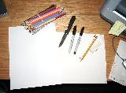



  To start, you'll need the essentials - paper, your pencils, pens, whatever other media types you plan to use, and a good imagination. Think up what you want to draw and plan it all out. This stuff fairly, obvious, sure, but stick with me until you get far enough for the techniques -- you may learn a thing or two.    

<b>Planning</b> - It often helps to first make an outline, whether in pencil or pen. Though freestyle pics are fine by themselves, they can lack the depth and composure of a planned piece of art. I'm going to go along with the fairly standard choice of inking the outline first. 
Now's the time to choose what paper you'll be using, too.  Colored pencils require pressure to get a solid, fluid color on the paper, so a smoother paper makes your job easier.  Most sketch pads I've seen or had aren't the best choices.  Printer paper works great, however, and is very cheap.  It's your choice, though - you may want that extra texture or something.  

<b>Drawing</b> - Be careful here. It may seem second nature to just go about drawing whatever's planned, but you must concentrate on making your marks light. A heavy pencil mark isn't guaranteed to erase completely after inking, and it can leave an ugly streak someplace it shouldn't be. Only if you're completely satisfied with your art should you make darker lines. This goes with contour lines for shapes. I myself don't use them, but be careful if you do.  

<b>Inking</b> - Again, you must tread lightly here. This isn't Photoshop, so a mistake here is permanent. A steady hand and a good pen work harmoniously here. Depending on what you want the outline to look like, choose a pen that matches. Do you want it to be thick? Go for a Sharpie. Do you want something that won't bleed through the paper? Use a ball-point. The choice is yours alone.
In most cases, I myself use a normal ball-point pen. Since the ink flow isn't something that leaks out, I find the control must easier to get ahold of. Other pens bleed dots if you pause momentarily sometimes. It may take a few extra strokes to coax the ink out into a thick line that won't fade when you erase the pencil scaffolding, but the extra control is worth it in my opinion.  

<b>Erasing</b> - A fairly easy step. However, you must pay attention to your eraser. A standard pink eraser will get the job done, but it won't always come out clean. The eraser I use myself transends all that I've used before in terms of life and erasing quality. It's a pretty standard vinyl eraser. They're only $0.60 (American, sorry SimonBob ;D) or so at Staples or any other office store, and they two I've had for about 3-4 years have lasted until now. Usually, pink eraser harden and become unusable. It's always a good idea to <u>check erasers</u> for that reason -- make sure they don't leave ugly pink streaks or anything when erasing!  Also, don't take huge strokes with the eraser. The paper is brittle and can crinkle. Make sure you hold the paper down nice and tough while erasing so it doesn't get the chance. Doing it in sections helps here. 
Before you start coloring, make sure all pencil's erased. Even a little bit of lead can screw up the coloring and make some grey streaks in your pic. You may also have to reapply some ink to places if you didn't get a thick enough coat of ink on the first time.  

<b>Coloring</b> - So, you though there wouldn't be any more choices past that, eh? Well, I've got some bad news for you. ;D Colored pencils come in many types, so possibly the hardest pick thus far is what to use. You can go for the expensive ones, but does value make them neccessarily better? Here's my look at a few brands of colored pencils (more to come as I try them!):
<ul>
<li>Crayola - My brand of choice. The colors are bold and leave the paper viewably aesthetic from all angles and lights. They might not seem to fill the paper's gaps much (leaving little white dots here and there), but that's not a problem when you use a base color to harden it all out. The key here is to compress the paper with the pencils so the gaps disappear. not too much force is needed. ;)</li> 

<li>Prismacolor - These pencils tend to be more pricey. They're also more waxy, so the color comes off smooth, but oftentimes reflects light in an odd way. They tend to reflect light, so a view of them at another angle may leave you with a picture much like a TV with sunlight hitting it -- not very viewable. Scanned, however, they're alright. They not too bold, though, in my own opinion. (NOTE: The waxy properties do have a use, though...look in the Intermediate section below)  Also of note is their effects of overlay -- they have more power to stand over colors underneath, unlike Crayola.  Use this to add highlights and correct some small errors if you make them.</li></ul>
 
Now, onto the sections! The basics are covered in the Beginner section, as well as a few tips for people dabbling with them. The Intermediate gives tips mostly dealing with shading techniques, and the Advanced deals with some color creations and odd tricks. I hope these help you out and show you the joy of colored pencils! (and no, I won't be showing you how to make happy trees. Territorial Oaks, maybe. ;D)
<ul>
<li><a href="/fanart/tutorials/artemis251/begin.php">Beginner</a></li>
<li><a href="/fanart/tutorials/artemis251/inter.php">Intermediate</a></li>
<li><a href="/fanart/tutorials/artemis251/advan.php">Advanced</a></li></ul>

