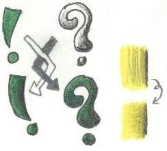
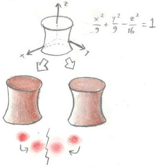
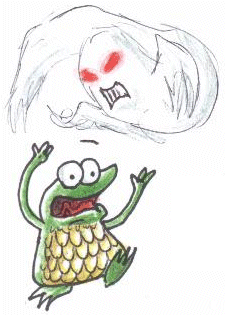
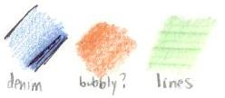


So, you've got the basics down and you're ready for some more?  Good, good; there's much more to learn!   

<u>Shading Techs</u>
 
So, you've got a basic grasp on shading now, undoubtedly.  Easy enough, eh?  As always, there's more.  :D  Shading can be done in different ways, and the aftereffects may be altered depending on it.  
The usual way to shade thus far has been to put the base color down first, then shade with the darker color.  However, this isn't always the best option.  That method does do the job well, true, but for more control, try putting the shading down first, then applying the base color.  You don't have to worry about getting the darker color in places it's not supposed to be as is sometimes the case if the darker shade doesn't quite agree with the base color and requires more pressure to shade.  Also, it allows for multiple colors to go over one space at once.  this method, however, isn't used that much.  It is an extra option for you, though.  If you favor less pressure use, then try the new method.  As you can see, the ! above is base/shade and the ? is shade/base.  The end result is very similar -- it's all a matter of preference.  

I've another tip for you involving shading, though.  You see the yellow squares above?  The above one looks a lot more sloppy, right?  The black look ununiform and unprofessional.  The only difference between the two is the re-use of the base color, however.  With just a bit more yellow applied hard to the shaded region, you spread the shading around better and make it more fluent.  It makes your transitions peaceful and smooth.  Direction change can spread the color around more as well so it doesn't look streaky.</img></img>    

<u>White Difference</u>
 
Different colored pencil brands are, well, different when used.  Some are bold, some waxy.  The difference can be used in coloring to give some neat effects.  As always, it's a good idea to test this out before use to pick the best option, and remember to clean off your white pencil(s) before use!  
Typically, you'll use a plain white pencil for giving things a lighter tone and for smoothing out colors here and there.  This is the base choice for textured, non-reflective surfaces.  Cloth, terrain, and plastics all look great with just a normal, non-waxy white choice. 
In the other corner, we have the waxy white.  It's good for metallics/gleaming things and colors that fade away.  Thus, it's the ideal choice for an Armored (Armoured?) Frog and a Zombie Possessor's eyes.  It provides the haziness and shininess for both to look more realistic.  

For example, above, you can see a hyperboloid of one sheet.  When colored brown and gaining the administration of two separate whites (none wax on the left, wax on the right), the waxy looks lighter and shinier.  It may not be very apparent, but that's because plentiful white wasn't used - waxy pencils seem to have the ability to to override non-waxy and put more "oomph!" into your color at the price of paper shininess (which may effect scanning).  However, this is good for white sometimes, for the point might be to make it look shiny!  
In any case, the difference is very apparent with the red orbs below the hyperboloid.  Again, left is non-wax, right is wax.  The overall distribution of the color makes the waxy orb look like it glows and radiates more.  However, both are great for effects, so it's all preference.</img></img>      

<u>Textures</u>
 
A rather simple installment.  There's two basic methods of making realistic or interesting textures - hand-made and against the texture.  Each has uses, though hand-made's are usually more practical.   
<ul>
<li /><u>Hand-made</u> - Exactly as it sounds - made just as you'd normally use a pencil.  Control is the main influence, but this differs depending on what you're going for.  As seen in the example, a basic denim or lined look can come from coloring in the direction you want to go (and only in the direction).  Yeah, this violates the circular coloring rule, but it's what you're going for, so do it!  Note that white may also deter the effect, so as always, practice beforehand to make sure it's the look you want!  Leather/shiny material requires a little extra thought, but it can be made by leaving an uncolored streak across where the light source would be and following up with waxy white.  Try it out for yourself!
<li /><u>Against the Texture</u> - An easier method.  Find a flat, hard surface that has the texture you want.  Color as normal.  Though it's harder to control, it can be used to make some neat abstract pieces and may be halpful in creating a new style of coloring large things like beaches or sky.  Test any texture you can think of to see what it might look like!  Be caresul not to rip the paper on some of the more rough textures, though.  I used an art book cover and a row of twisty-ties above to make the bubbly and lines textures, respectively.
</ul>
</img>




<ul>
<li /><a href="/fanart/tutorials/artemis251/begin.php">Oh, wait - I meant beginner...I think.</a>
<li /><a href="/fanart/tutorials/artemis251/advan.php">I'm ready to confront the advanced section!</a>
<li /><a href="/fanart/tutorials/artemis251/advan.php">Go back home</a>
</ul>

