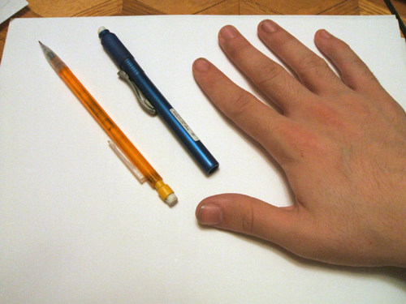
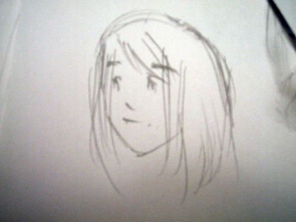
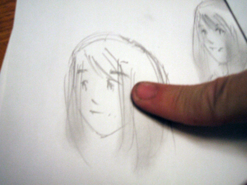


I've been asked a few times how I do the method of shading I do with my pencil pictures. I find it's a fairly simple style that generates some pretty nice results. Though the super-ultra-top-secret-kung fu smudge combo technique is supposed to remain a mystery to the outside world, I thought, 'what the heck.' First off, you'll want to read through these here tips: 

<ul>
<li>1) Before you start smudging, WASH YOUR HANDS. Even if they look perfectly clean, wash them anyways. The last thing you want to do is get something on your drawing.</li>
<li>2) Tape your picture down with some scotch tape on the four corners so it doesn't crinkle when you rub the pencil lead. That's not fun. : (</li>
<li>3) Rub your hands together a little, so that they have a little moisture on them. This is the key to getting your lead to smudge smoothly and cleanly.</li>
<li>4) Your fingers each serve a different role in smudge shading. Your pointer finger should be for things like clothing, furniture, and things like that. Your middle finger serves a similar purpose. Your thumb is the best finger to use for backgrounds, but also seems to have the most power,so be careful. The pinky is for details, but there are certain parts of a pic that are too small even for a pinky to smudge. I'll talk more about that later.</li>
<li>5) Finally, make sure you have an eraser handy. This is essential. You'll be using it a lot.</li>
<li>6) When you're smudging a particularly dark shade, be very careful not to let your finger stay in one place for too long, or it will become darker than the rest of the piece.</li></ul>

I would HIGHLY suggest you experiment with this technique on some doodles before you do a serious picture. You'll get the hang of it quick, but it does take some practice to fully control.




<ul><li>The most important instrument is, obviously, the pencil. I personally use a normal Bic .07 mechanical pencil. You can use any pencil you want really ( besides colored ), but having a pencil that's too thick will cause you to smudge more than is fixable.</li> 

<li>Almost as important as the pencil is a nice eraser. I'd suggest a white click eraser, since they're pretty cheap and easy to use.</li> 

<li>Finally, you'll need some paper. Computer paper is fine.</li> 

<li>Optional would be some tape to hold down your paper while you smudge, as not to wrinkle it. You might want to do this the first few times, but after a while, you should be able to control your fingers enough to not need it.</li></ul>




A good place to start is shading hair. Let's take ol' P. Dog here.  ( Sorry for the blurry pics. X.x )
  

<table>
<tr>
<td></td><td>
Paula has blond hair, so we don't need to add any new pencil marks. If a character has light hair like Paula, you need not smudge it and create a shade like you will for darker hair colors. (But that's another lesson.) Simply start your smudge from the tips of her hair and move upward, tapering off gradually.</td></tr>

<tr><td></td><td>

You can do the same thing with the top of her hair, ending the smudge near the center. Leave some white near the center of her head, which will serve as a sort of highlight.</td></tr></table>  

Expect more things explained once I get a spare moment! Until then, practice practice practice.




<table1 />
Author
<table2 />
<a href="http://forum.starmen.net/?t=usrinfo&id=6642">matilda_caboose</a>
<table3 />

