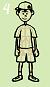
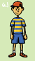


A general tutorial for any art program with layers (note that when I "add a layer" it is added ON TOP of the last layer being worked on unless otherwise indicated):  

This tutorial includes guiding images.  Click on the thumbnails of the images to open their full size in a new window.  

1.Start a new image, selecting the desired size. Go for a high colour-count image. Once your image window appears, fill the space with a solid colour -- something not too dark, not too light, and that you'll probably not be using in your drawing. This layer of colour will (hopefully) help you pick up on small areas that you either coloured by mistake or forgot to colour at all.   

2. Create a new layer. If you're the type who does so, make some sort of framework for your drawing (I'm generally not the framwork type, but it is good practice and a good habit to get into). Here, I've decided that I'll draw Ness (as I look at it now, I realize that the legs could probably have been longer. Oh well.). I did the face with the eye line lower than normal here, for no real good reason other than making the hat more prominent. NOTE: When drawing the ears, notice that at their top, they come out of the head right along the eye line -- an easy guide to follow if you have trouble placing ears. Check your own head and you'll find this to be pretty accurate.  

3. So it's not too distracting, lower the opacity of the framework layer. Create a new layer and start to make your actual lineart drawing on it. I chose to make the lineart black here, for the sake of simplicity. You COULD make your lineart in colour if you wanted, however, there are better ways to make it coloured later on.    

4. Duplicate your lineart layer (a copy will appear as a new layer) and hide the original lineart layer. Now fix the duplicate up to your liking, erasing unwanted parts or line thincknesses and adding other parts you deem necessarry. (If you botch something majorly, you can always delete the duplicate and make another from the original.)   

5. Create a new layer. You should have some sort of window in your program that indicated all of your layers and which one you're currently working on. Drag this new layer UNDERNEATH your top, lineart layer. On this new layer, start laying flat blocks of colour. You'll notice that you can't colour over the linart -- this is because you're now working UNDERNEATH it. (also, since you don't really need your framework layer anymore, you can turn it off).  

6. Yup. Create a new layer (you COULD do this on the same layer, I guess, but for the sake of not ruining anything you've already done, you may as well use another layer). This layer will be used for shading and highlighting. For shading, I pick the flat colours that are already there, then click on the displayed colour I've selected and (there ought to be some sort of pallete type window open that probably has two selected colours on it -- you'll be wanting to select the top one). This should bring up some sort of colour map -- on that map, select a colour for your shaded area. Here, I chose ones that are slightly darker than the ones I started with. Keeping a light source in mind, shade (colour in) the areas that need shading -- remember that you can always erase bits that you don't need, and the flat colour layer underneath will show through). What I've done in this example was, on the whole, very simplistic -- shading following the lineart. Repeat the same process for each of the flat blocks of colour. Once you're done with the shades, apply your highlights, doing much the same as with shading, only with colours lighter than your flat blocks of colour. Of course, if you wanted to build up your highlighted and shaded areas with more levels of lightness/darkness, this could easily be done with more layers. While I was on this layer, I also made Ness's cheeks rosy by picking the skin tone and changing the colour to one that was slightly redder. (NOTE THAT ON THIS LAYER, I ONLY HIGHLIGHTED THE HAT, SHOES AND SKIN. See 6.1 for the shirt's highlights.)  

6.1. There are, of course, many ways of doing things. Shading Ness's striped shirt the way I did in step 6 led to some uneven ends to the stripes. This might have been avoided by a shading method such as this one: In this step, I first added another layer. I then reduced its opacity (I arbitrarily chose 14% opacity). I then selected pure WHITE as my colour, and drew in my highlight areas along this shirt. Another layer could have been added, of course, with another level of opacity, and shading could have been done with pure BLACK much the same way. (The methods presented here and in step 6, of course, are a mere two of DOZENS of possibly ways to shade something.)  

7. In your layer window, click on your lineart layer (in should still be the top one). Now create a new layer, which will, as usual, appear above it. This layer, now the top, can be used for some little touch-ups (only ones where stuff is ADDED, of course, since using the eraser on any layer will not have an effect on layers underneath... to erase parts, you must erase them from the layer on which they exist). I decided to fix up the colour areas on the shirt a bit, and more importantly, I added in dabs of white on the eyes (which works because I'm now working on a layer ABOVE the lineart).  

8. Shadows can sometimes be a nice touch, so I decided I wanted Ness to have one. Select the layer you stated with (in this case, the flat layer of light greem) and add a new layer. Reduce the layer's opacity (I arbitrarily chose 37%). Pick BLACK for your colour and draw in your shadow.    

9. Remember back in step 3 when I said that we could change the colour of the lineart? For the heck of it, let's do that. Select your top lineart layer again and make a duplicate layer of it. What you'll want to do with this duplicate layer is LOCK ITS TRANSPARENCY. (If you're using Photoshop, in your layers window there will be a "Preserve Transparency" checkbox or radio button that you'll check. If you're using Paint Shop Pro, double click the layer in your layer window to bring up its properties -- in there, there should be a "Lock Transparency" checkbox that you should check.) Once THAT'S done, you can re-colour your new lineart to your liking without having to worry about colouring the surrounding transparent areas. I chose colours darker than the shaded colour areas for my outline.  

10. You may want to add in some sort of background, too. I'm not going to bother here because really, it's a lot of more or the same, only you do it on layers that are UNDERNEATH the shadow layer that was made in step 8. Rather than do an actual background, I selected my bottom layer, added a layer, and just jayed on some random bright colours (I used a brush with low hadness for a somewhat "blurry" effect). While I was at it, I also selected the "shadow" layer and upped its opacity to 48%.  

11. Taking a second glance at this picture, I'm finding that Ness's skin is a bit on the yellowish side. So do I need to go back and change it? NO! (you could, of course, but why work more if you don't really need to?) What we can do is use something called an "Adjustment Layer" (they are found in PhotoShop and Paint Shop Pro, for sure, but I don't know about any other other programs). So, to do this, first select your top layer in your layer window. Now go to your top bar's "Layer" option and dig around in there to find an option that will say something like "Add Adjustment Layer". There are several types that you'll be able to select, and all have different functions (you'll want to play around with these from time to time). The one you'll want in this case is COLOUR BALANCE. To make Ness's skin pinker and less yellow, I added some magenta and took away some yellow until I thought it looked better. (and in this last picture I also did some minor touch-ups and fixed the collar area, where I realized I'd made a mistake)  

So provided you have the tools now YOU TOO can work with layers!
(Note that The Gimp is a free graphics program that has layer capabilities. Though I've never used it personally, it does seem to be quite good).



There's a site called art.com that has this artpad thing built in where you can paint little pictures and show them off to your friends. ozwalled drew a bunch of things on the artpad a while ago and it's a good way to see his shading in action (though he says that these drawings may seem a bit primitive due mostly to the program's clunkiness on his computer). Check 'em out for even deeper insight into his techniques. 

<ul>
<li /><a href="http://artpad.art.com/gallery/?igbxqnmnqz4" target="_new">A bald man</a>
<li /><a href="http://artpad.art.com/gallery/?ign5biuf9mo" target="_new">Another man, staring you DOWN</a>
<li /><a href="http://artpad.art.com/gallery/?igcconyaei4" target="_new">The Atomic Power Bot</a>
<li /><a href="http://artpad.art.com/gallery/?igdsr2sq22w" target="_new">A cowboy riding on a nasty-looking larva</a>
<li /><a href="http://artpad.art.com/gallery/?igdqxn5cf30" target="_new">Urban Zombie</a>
<li /><a href="http://artpad.art.com/gallery/?igpwsgzs1d8" target="_new">Sponge Bob</a>
<li /><a href="http://artpad.art.com/gallery/?ihbyw618kdeo" target="_new">Jack Skellington</a>
</ul>



<table1 />
Author
<table2 />
<a href="http://forum.starmen.net/?t=usrinfo&id=1959">ozwalled</a>
<table3 />

