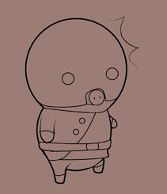
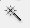
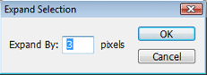
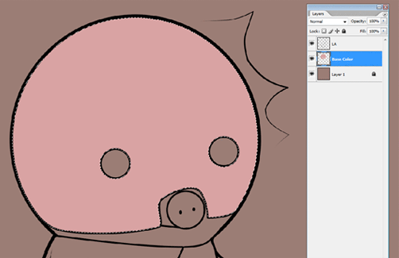
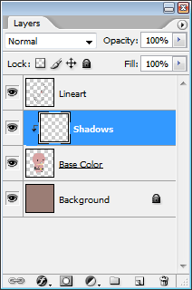
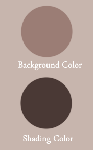
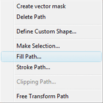
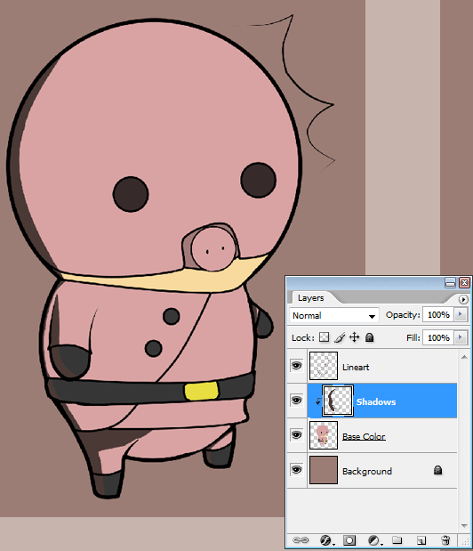
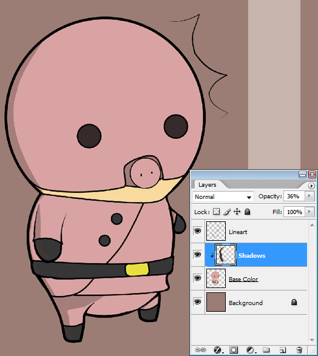
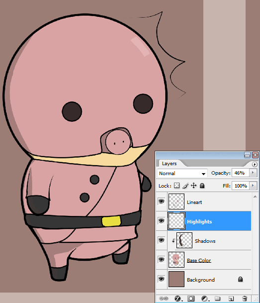


Hello, and welcome to Phones's cel shading tutorial! In this tutorial you will learn how to create a nice smooth cel shading.
  
For this tutorial, you will need:
 <ul><li>A version of Photoshop. I'm using CS2.</li>
<li>A mouse or tablet</li>
<li>Some big lineart</li>
<li>A basic knowledge of Photoshop</li></ul>

<h2>Base Color</h2>

<table><tr><td halign="center">
</td><td halign="center">
Ok, now that we have everything that's on the checklist, let's begin. Open the document with your lineart on it. For me, I chose this quick little Pigmask guy. The lineart should be clean as well as pretty big. My Pigmask guy is about 3000 x 3000 pixels. The reason for this is when you shrink it, it becomes cleaner and removes any imperfections or mistakes. However, be aware that this is no excuse for it not being clean.</td></tr></table>
  
<table><tr><td halign="center">
Time to start coloring! Select the magic wand tool  from your tool box. With it, choose the place where a base color will go. I seected the helmet. Once you have the selection chosen, go to Select: Modify: Expand. In the box, type about 2-3 pixels depending ont he size of your area. Now create a new layer and name it Base Color.</td><td halign="center">
</td></tr></table>
  
<table><tr><td halign="center">
</td><td halign="center">
Go to the color picker for the background color and pick the color that you want to fill your selected area with. Make sure you have your Base Color layer selected and press Ctrl and Backspace simultaneously, filling the selection with your background color. Repeat this until you have all of the basic colors down.</td></tr></table>
  
<table><tr><td halign="center">
And now base colors are DONE! Looking good if I do say so myself. A few things to check, however, before moving on:
<ul><li>Make sure your color is on the Base Color layer</li>
<li>Check to make sure you haven't missed filling in anything, particularly around the corners</li></ul>
</td><td halign="center">
</td></tr></table>
  
<h2>Shading</h2>
  
<table><tr><td halign="center">
</td><td halign="center"></td><td halign="center">
It's time to start shading - Cel Shading, of course! The first thing we have to do is create a new layer above the Base Color layer. Name this one something to the effect of 'Shadows'. This is where our shadows will go. Now right-click on the Shadows layer and select 'Create Clipping Mask'. This means that what is on the top layer will only be shown if there is something below it on the next layer down. It's very useful!</td></tr></table>
  
<table><tr><td halign="center">
What colors should we shade with? You may think that it'd be good to go with matching colors such as a slightly darker pink for the mask, and a little black for the boots. Well, not this time. We're only going to use one color. I'm going with a very dark version of the background color, as you should normally do. A sample of it can be seen tot he side of here.
</td><td halign="center">
</td></tr></table>
  
<table><tr><td halign="center">
</td><td halign="center">
Let's get some actual work done now. Click the brush tool  and start laying down the shadow. Don't worry if the shading looks bad right now. This will be fixed. If you don't have a tablet, use the Pen Tool  with the Fill Path feature, which fills your selected pen tool area with either your foreground or background color!
</td></tr></table>
  

<h2>The Result</h2>
  

  
Now lower the opacity until it looks good...
 
  
...and add some highlights. 

  
Now merge the layers by selecting them all and pressing Ctrl+E. Shrink the image down, save it, and you're done! All that's left to do is enjoy it! Thanks for reading the tutorial! If you have any questions, just PM them to me on the forums and I'll help you out! I hope this was helpful!


