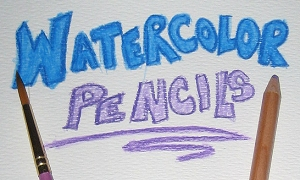
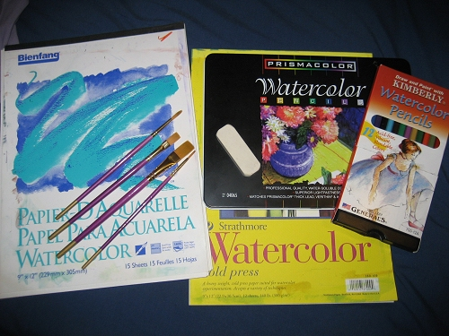



  

When I show people my watercolor paintings, some have expressed an interest in creating something with this medium, but they don't know where or how to start. There are many techniques to watercolor pencils, and here I will demonstrate the method that works best for me. I developed this method by trial and error and many hours of practice. It's not much harder than creating something with normal colored pencils, you just need the right tools for the job.




<b><ul><li>Watercolor pencils</li>
<li>Watercolor paper</li>
<li>White eraser</li>
<li>Brushes of various sizes</li>
<li>Cup of water</li>
</ul></b> 

For the pencils, the cheap 12-pack that you can find in the Wal-Mart craft department will do just fine, but if you can afford it, spring for the Prismacolors. You get a larger color selection and the colors are more vibrant. Any kind of Watecolor paper will work and they usually come in a pad. I just tear the sheets out when I need them. A big white eraser is what I prefer, but the white click erasers work fine as well. For the brushes, use whatever brand you prefer, just make sure you at least have large, medium, and small sizes at your disposal.




<b><a href="step1.php">Step One - Drawing and Coloring</a></b>  

<b><a href="step2.php">Step Two - Adding Water</a></b>


