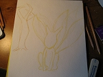
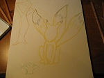
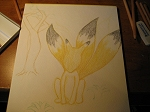
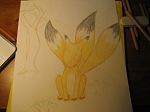
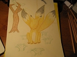
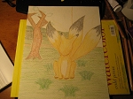
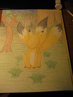
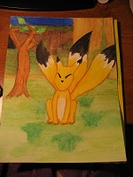


The first, and probably most important step is the drawing and coloring. You might already have your own techniques for this one since it's not that different from coloring with regular colored pencils, but here are a few tips:  

<ul><li><b>Don't press too hard when doing the initial drawing.</b> It's harder to erase watercolor pencils, that's why you want to use a very light color or just a very light touch when you first draw out your subject. If you mess up, erase as much as you can and continue. You can cover up your mistakes when you color it all in or add a background.</li> 

<li><b>Avoid outlining in black.</b> Black will often accidentally get on your brush at the most inopportune times when adding water to your painting. More often than not, you'll drag it somewhere that you wish you hadn't and won't be able to fix it since it's the darkest color. Black outlines may also take the focus away from the actual subject of the painting because it's so dark compared to the other colors.</li> 

<li><b>For defined outlines:</b> use a darker shade of the color you're already using for the subject. This can be achieved by either using a pencil of a darker shade, or by just pressing a little harder with the color you're using.</li> 

<li><b>Do all of your coloring and shading now.</b> With the technique I'm teaching, you'll want to color and shade everything before you add water. The colors will blend easier and will have a much nicer effect than if you wait to add darker colors after you've already added water.</li> 

<li><b>Wait to add black eyes or other darker details.</b> If your subject has black eyes or if there are small black or dark details that you intend to have in your painting, wait until you've already added water to the entire thing and let it dry. Then you can color in the eyes and whatnot and add water to those. If you put in the dark details before you do the initial adding of the water, the same mess-ups that can happen with the black outlines can occur here.</li>
</ul>



I took photos of the latest painting I worked on during various steps in the process (sorry it's not EarthBound-related). They help to illustrate the tips listed above. Click the thumbnails to see a bigger version of the picture.  

  This was my initial drawing. I used yellow because it's a light color and Keaton is yellow anyway. You can see how many times I had to erase and change the way his tails look. That's fine, since a background will cover up the mistakes. I also used a light brown for the tree.     

  Darkening the yellow outline of Keaton and adding in some details. It's okay to use black here since it's part of the main subject, and not an outline or a small detail.     

  At this point, I decided that light brown was a better color to use as an outline color since all of the yellow blended in too much. I'm starting to color in the main subject and am already adding some shading.     

  Keaton is now completely colored and shaded to my liking. Now it's time to turn my attention to the background to cover up those mistakes I made with the tails, and to also make the painting more interesting. Backgrounds are always good for any work of art.     

  The trunk of the tree is now colored and shaded (note that I used a darker brown for the outline) and I've started to consider what to do with the tufts of grass around Keaton. You can see quite a few eraser marks there, so we'll need to cover those up with a background.     

  I've got the grass all colored in and am starting to work out what I want to do with the town wall in the background. Remember to use darker colors toward the back of the painting and lighter ones in the foreground.     

    Here is the finished product before adding the water. The subject and background are completely done. Note again that the wall closer to Keaton is lighter than the wall in the background. Be aware that the colors may not be exactly how you want them, but adding water will usually deepen or lighten them, depending on which colors you use. To get used to which colors do what, there's no harm in practicing.        

    Here is how everything looks after adding the water (there are no lighting changes). You'll note that the eyes and nose were not present in the previous picture; that's because I waited for the water to dry before adding in the eyes and nose, and then added water to that. You'll want to leave little details like that 'til the very end so that the dark colors don't bleed into your lighter ones.

