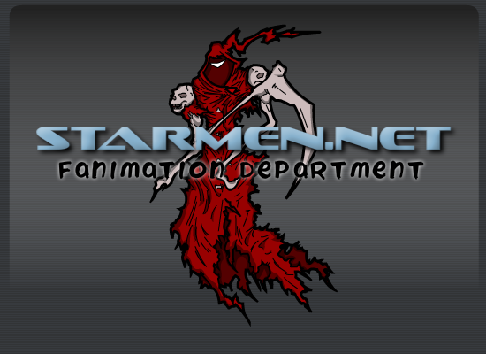



What you see before you is the Fanimation Department, where you can view animations made by the EarthBound community, or even create and submit your own.  The focus is primarily on Flash, a web animation standard from the folks at Macromedia.  If you're unfamiliar with the Flash authoring environment but would like to try your hand at making movies of your own, you can start by reading our many tutorials.  To view the gallery of Fanimations, just click below!




<a href="/fanimation/flash/">Click here</a> to see the Flash Movies gallery.



Want to get right in to making EarthBound movies?  You can start with these helpful tutorials.

