
If you take a picture with a digital camera that has the default factory settings in place, you'll more often than not have to resize your picture before you submit it here. Why? Because most computer screen resolutions are 1024 pixels wide, and most cameras produce pictures that are much wider. If you don't resize anything, nobody can see the whole picture at once.   

I would advise against resizing your picture with a program that came installed on your computer (like MS Paint), but if you can't afford the big boys like Photoshop and Paint Shop Pro, the best alternative is a free program called GIMP. This tutorial will show you exactly how to resize your photos in that program.  

<a href="http://www.gimp.org/">Download GIMP here.</a>




If you want to be super sure you need to resize your picture, here's how you can check its resolution. Open the folder that contains the photo you want to submit and hover your cursor over it. A little box of information should appear below it that shows you some details about your photo, including the dimensions, which in this case is 3264 pixels wide and 2448 pixels tall:  

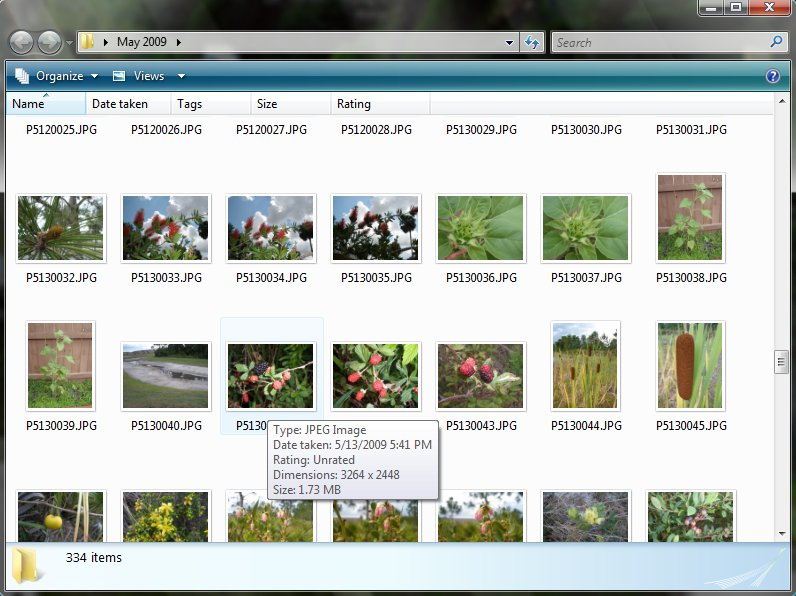
 

If your operating system does not put that handy information box up for you, right-click on the picture and hit "Properties" at the very bottom. Click the "Details" tab at the top and it will show you the dimensions there:  

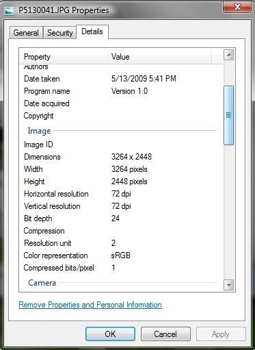
 

Remember that most computer screens have a resolution of only 1024 pixels wide and 768 pixels tall, so you can see why this would be unacceptable. The only way to fix this problem would be to resize your photo. 



Open your photo in GIMP. Things look fine here because GIMP automatically zooms out so you can see the whole picture at once, but the true size is much larger. First go to "Image > Scale Image..."  

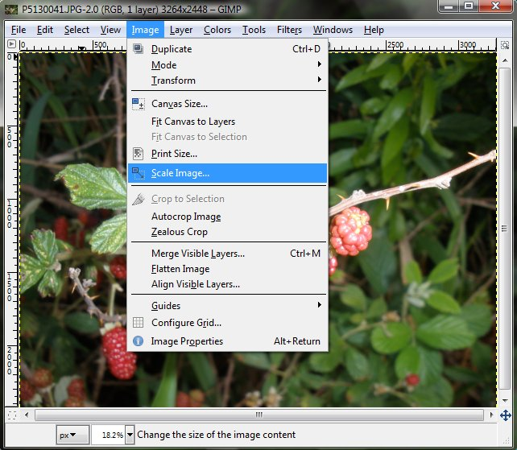
 

A box will pop up showing the current size:  

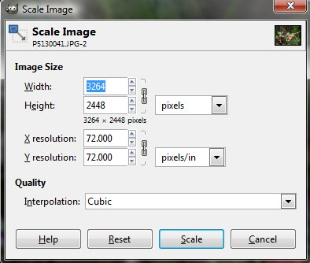
 

Type in the width you want to change it to (make it 1024 or less) and hit the tab key. The height will fix itself so that the picture is properly proportioned:  

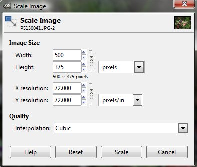
 

Then hit "Scale". Your picture will look way too small at first:  

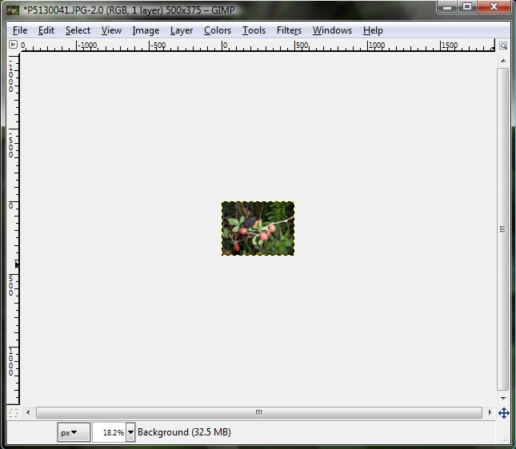
 

But that's because the zoom is still set to something very low. To see the true size of your picture, click "View > Zoom > 100%":  

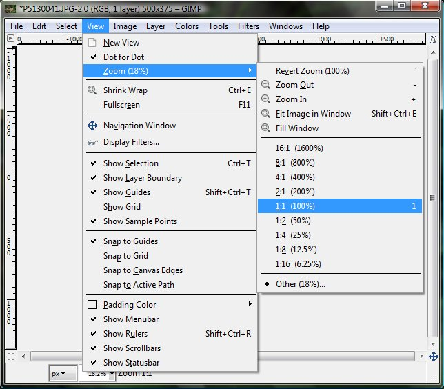
 

The result is this:  

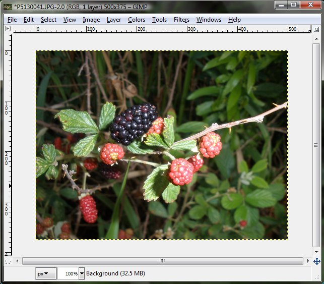
 



The only drawback to resizing an image is that it gets a little blurry in the process. You can fix this by sharpening the image. This step is purely optional, but I always like to give my resized images a good sharpening before I upload them anywhere. Go to "Filters > Enhance > Sharpen..."  

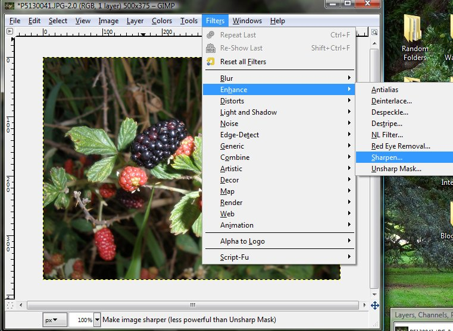
 

Here you can play around will the level of sharpness until you find a number that makes it look the most like the original image:  

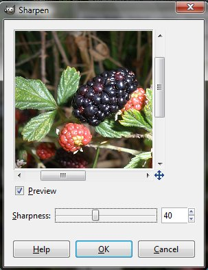
 

Then hit "OK" and your picture will be sharp and crisp.



It's always good to keep the original picture as an archive so you don't want to save it outright. Instead, go to "File > Save As..."  

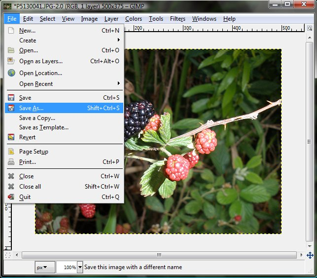
 

Then you can give it a new filename and everything while still keeping the original, huge picture unedited. Now you're ready to submit it!




You've reached the end of this page. <a href="http://starmen.net/fantography/index.php">Go back to the Fantography homepage?</a>


