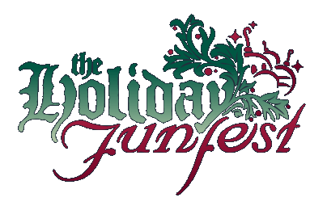
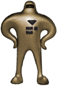
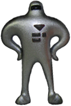
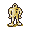
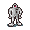



	
	<b>What is it?</b>  The Funfest is a relatively ancient Starmen.Net tradition dating back to 1999. It's pretty much just a submission-fest -- people send holiday-themed EarthBound stuff into the site, we post it, sometimes there's dancing -- good times are had. 
	 
	<b>What's the point?</b>  The goal here is...to have some fun. Without doing anything at all, you can enjoy checking out some of the great stuff that the creative minds of EarthBound fans come up with. If you want to flex some creative/artistic muscle, then enter something! You can spend 5 minutes on it, or you can spend a month on it. 
	 
	<b>What kind of stuff should we submit?</b>  Since this is Starmen.Net's Holiday funfest, there are only two requirements - it has to have something to do with EarthBound, and it should have some kind of holiday connection --  Christmas, New Year's, Yom Kippur, whatever. If you need some ideas, you can check out the <a href="/funfest05">2005 Holiday Funfest</a>. 
	 
	We get pretty much everything - tons of <a href="/fanart">Fanart</a>, too many <a href="/flukes">Flukes</a>, not nearly enough <a href="/fanimations">Fanimations</a>, and once in a while even a <a href="/fanprograms">Fan Game</a>.





	Here's the plan: I (reidman) will be the only judge. I think. If I decide to change this later I'll be sure to make an announcement, but for now I think I can handle it. I hope. Please don't submit really really long fanfics / games :(




<ul class="categories">
	<li><strong>Writing</strong> (fanfics, articles, <em><strong>comics</strong></em>, poems...)</li>
	<li><strong>Handart</strong> (pencils, pens, markers, paints, sculptures...)</li>
	<li><strong>Compart</strong> (photoshopped stuff, vector/raster art, flukes...)</li>
	<li><strong>Audioviz</strong> (music, fantography, video, animations, games...)</li>
</ul>




<h4>Overall Awards</h4>

Only one winner and one runner-up for each of the following will be presented. Each winner will receive a <strong>Starman Super</strong>. Each runner-up will receive a <strong>Starman</strong>.

<ul>
	<li><strong>Skill</strong> - For the submitters who ooze raw talent</li>
	<li><strong>Genius</strong> - For the submitters who ooze raw brilliance</li>
	<li><strong>Labor</strong> - For submitters who obviously spent lots of time on their funfest submission(s) (this will NOT be judged on quantity alone!)</li>
</ul>

<h4>Category Ultrawards</h4>

A winner and runner-up for each of the following will be presented <strong>for each of the four categories</strong>. Each winner will receive a <strong>Starman Super</strong>. Each runner-up will receive a <strong>Starman</strong>.

<ul>
	<li><strong>UrfBowndelicious</strong> - For the submissions that channel the spirit of EarthBound most awesomely. This category is actually named in honor of <a href="http://starmen.net/reidman/30%20Urfbownd.mp3">Sephy's 'Urfbownd', an epic EarthBound song</a>. There is <strong>no talent requirement</strong> here - even a fluke could win this (although it would have to be one heck of a fluke).</li>
	<li><strong>Rockin Ω</strong> - To the submissions with the widest variety of awesome. <a href="http://starmen.net/vote/vote.php?id=11791">Unlimited Lumpia's 'Threed and the Great Bobsled'</a> is a fantastic example of an entry with a lot of everything - it's ultra-EarthBoundy, well-themed, funny, a little offbeat, extremely stylish, and wonderfully detailed.</li>
</ul>

<h4>Category Awards</h4>

A winner and runner-up for each of the following will be presented <strong>for each of the four categories</strong>. Each winner will receive a <strong>Starman Super Badge</strong>. Each runner-up will receive a <strong>Starman Badge</strong>.

<ul>
	<li><strong>Funny</strong> - To the submissions that makes me shoot chocolate milk out of my nose, even if I wasn't drinking chocolate milk. And we're talking "funny-ha-ha", not "funny-wtf-scary", for the record. Even though it's older than this website, <a href="http://starmen.net/vote/vote.php?id=7503">Moondoggey's 'Answering Unanswered Questions'</a> is a decent (though cheesy) example.</li>
	<li><strong>Offbeat</strong> - No anime drawings of Paula casting PSI Freeze here, folks. Weird, unexpected, bizarre, unique - the kind of stuff you don't see every day, at least not on Starmen.Net. <a href="http://starmen.net/vote/vote.php?id=16319">toader's awesome Mr. Saturn suncatcher</a> is a great example of something that could totally win this one.</li>
	<li><strong>Epic</strong> - Awe-inspiring, 'holy wow' kinda stuff like <a href="http://www.youtube.com/watch?v=fGhpD0x-NAc&amp;eurl=">Libra's EarthBound Supremacy</a> or <a href="http://starmen.net/vote/vote.php?id=9556">popovich's 'Boo'</a>.</li>
	<li><strong>Stylish</strong> - To the submissions with [i]style[/i]. Look at <a href="http://starmen.net/vote/vote.php?id=16218">Hawien's 'sigh ko'</a> (or any of his other work) for an idea of where we're going with this one. Don't just pull your work straight from EarthBound - give it new life, make it your own!</li>
	<li><strong>Ideal</strong> - These submissions don't require mind-numbing artistry - they're just brilliant ideas with good (or even mediocre!) execution. <a href="http://starmen.net/vote/vote.php?id=11001">serotoninzero's 'Pixelated'</a> comes to mind - this doesn't necessarily require a lot of [i]talent[/i], just a good noodle and a little elbow grease. Mmmm, greasy elbow noodles.</li>
	<li><strong>Detailed</strong> - It's the small things that make EarthBound great, and the same goes for these submissions. Take your cues from <a href="http://starmen.net/vote/vote.php?id=10617">Queue's Onett Map</a> or <a href="http://starmen.net/vote/vote.php?id=577">bundle's EB0 collage</a>.</li>
	<li><strong>Thematic</strong> - For the submissions that give off major holiday vibes.</li>
</ul>





	This year's Holiday Funfest prizes are so cool you'll wet yourself. You may or may not be aware that, many years ago, I commissioned the beautiful Meeellla to create gifts for the staff. After some thought, she decided to create models of a Starman DX and a Mr. Saturn and proceeded to stamp out a small army of them. You can read more on our <a href="http://starmen.net/merchandise/smn/smnsculptures.php">Starmen Resin Sculptures Page</a>. 
	 
	Fast forward three and a half years, and I'm sitting here thinking about the funfest. I glance casually at our bookcase and see the few remaining Starmen from the original batch, standing guard on one of our bookcases. And my mind was as good as made up. 
	 
	So, without further ado, I present to you the prizes for the 2006 Holiday Funfest...

<ul>
	<li>
		
		<h4><b>Starman Super</b> Resin Figurine</h4>
		
To <em>first-place winners</em> of each <strong>Overall</strong>, <strong>EarthBoundelicious</strong>, and <strong>Rockin Ω</strong> award (11 total)

	</li>
	<li>
		
		<h4>Starman</h4>
		
To <em>runners-up</em> of each <strong>Overall</strong> and <strong>Consummate</strong> Award (11 total)

	</li>
	<li>
		
		<h4>Starman Super Badge</h4>
		
To all <em>first-place winners</em> of every award (33 total)

	</li>
	<li>
		
		<h4>Starman Badge</h4>
		
To all <em>runners-up</em> for every award (33 total)

	</li>
	<li>
		<h4>HFF06 Decay Badges</h4>
		
To <strong>all participants</strong> (will disappear once next funfest is over)

	</li>
</ul>

