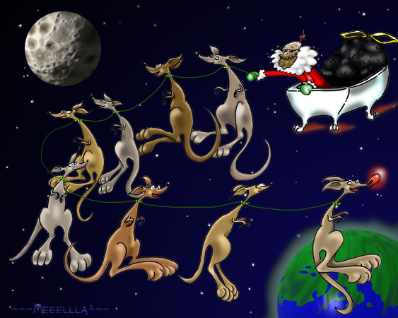



There is a little-known holiday that occurs every December.  The scholars here at Starmen.Net rediscovered this ancient holiday while searching some ancient ruins of Japan for some guy from M*A*S*H.  What they found on the ancient scriptures was a lot of nonsense.  Below is some of this nonsense, describing a yearly festival known as "EB No Matsuri", which can be translated as "Festival of EarthBound".  Of course, SM.Net Holiday Funfest entries may be related to EB No Matsuri (TBA).  In fact, we encourage such entries. So get to it! 

But, be forewarned, ye who read the following tale shalt forever become insane.

<U>The Tale of EB No Matsuri</U>

The "Annual Gift Man From the Moon" resides quietly on the moon, waiting patiently in his subterranean base until the night of December 19th. That night, while all the little EB insomniacs are busy talking/working on SM.Net, he uses his elf slaves to pack up magical bags of EB cartridges and flesh-eating virii.  After he has harnessed all the moon kangaroo to his bathtub, he escapes the gravitational pull of the moon and heads for Earth. 

At the lead of the magical kangaroo pack is Blinky, the red-nosed kangaroo who has a bit of an addiction for Hostess Twinkies. "On Humphrey, on Gilbert, on Lewis, on Milbin!  On Stuart, on Jackson, on Blinky, on Shupak!", cries Annual Gift Man, as he and his moon kangaroo soar through the night sky. 

 Click above to see more of the Annual Gift Man!

As Annual Gift Man and his bathtub enter Earth's atmosphere, the Magical Gift Shield appears around him and his moon kangaroo.  The Magical Gift Shield was a present from the moon people before he enslaved them centuries ago. 

At exactly midnight of Dec. 20, using temporal wormholes and a time-dilation device, Annual Gift Man lands on top of your house and climbs down the chimney.  If no chimney is available, he breaks into your house with a crowbar and a hacksaw.  Once he gains entry, he first checks to see if you left a plate of Strawberry Tofu out for him. If you didn't, he puts a few small pebbles in your cereal boxes. He then finds your room.  If you're not asleep by the time he gets there...well, if you're an insomniac, you get to dial 911 and report an intruder.  But, if you're a good little boy or girl, and are asleep, you'll get a copy of EarthBound underneath your pillow.  If you've been bad, or lied on your tax form, you get a petri dish of flesh-eating virii under your pillow. 

After visiting all the children of the world, it's time for Annual Gift Man to return to his home on the moon.  So, he connects his bathtub with the Tooth Fairy's flying toothbrush and the Easter Bunny's Magical Easter Basket and becomes Mega Annual Gift Moon Man.  Once he does this, he fights off all the evil of the world until all the children have awoken.  Sometimes, giant lizards from Japan try to steal copies of EarthBound from the children while they're sleeping, so Mega Annual Gift Moon Man uses his Gift Laser to blow them up. 

Once all the children have woken up and either found a copy of EB or a pile of flesh-eating fun under their pillow, Mega Annual Gift Moon Man becomes regular old Annual Gift Man and returns to the comfort of his moon couch.




The people at Starmen.Net have added to the folklore of EB no Matsuri over the years. Here is the mega-collection of all EB no Matsuri Holiday Funfest entries from 2001 to present.  

<u>Fan Art</u>  
<SUBMISSION id="16485" /> 
<SUBMISSION id="16488" /> 
<SUBMISSION id="8156" /> 
<SUBMISSION id="16396" /> 
<SUBMISSION id="16560" /> 
<SUBMISSION id="19658" /> 
<SUBMISSION id="16659" /> 
<SUBMISSION id="19779" /> 
<SUBMISSION id="19699" /> 
<SUBMISSION id="8811" /> 
<SUBMISSION id="8523" /> 
 

<u>Fan Music</u>  
<SUBMISSION id="16611" /> 
<SUBMISSION id="16675" /> 
<SUBMISSION id="8224" /> 
<SUBMISSION id="8225" /> 
<SUBMISSION id="8226" /> 
<SUBMISSION id="8227" /> 
 

<u>Fanfiction</u>  
<SUBMISSION id="8054" /> 
<SUBMISSION id="8194" /> 
 

<u>Flash Movies</u>  
 <a href="http://home.comcast.net/~squilburt/flash/FlightOfTheGiftMan.html">Flight of the Gift Man</a> - by <a href="http://forum.starmen.net/?t=usrinfo&id=38">Squilburt</a> 
 

<u>Videos</u>  
 <a href="http://video.google.com/videoplay?docid=-689672957864354146&q=reids+pants">EB No Matsuri</a> - by <a href="http://forum.starmen.net/?t=usrinfo&id=266">xfisjmg1</a> 
 

<u>Fan Games</u>  
<SUBMISSION id="16642" /> 
 

<u>Fan Comics</u>  
<SUBMISSION id="16480" /> 
 

<u>Poems and Songs</u>  
<SUBMISSION id="16473" /> 
<SUBMISSION id="8810" /> 
<SUBMISSION id="19744" /> 
 

<u>Flukes</u>  
<SUBMISSION id="7866" /> 
<SUBMISSION id="7867" /> 
<SUBMISSION id="7869" /> 
<SUBMISSION id="7870" /> 
<SUBMISSION id="8059" /> 
<SUBMISSION id="8067" /> 
<SUBMISSION id="8177" />


