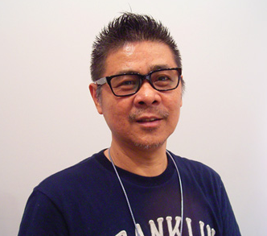
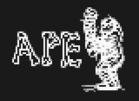



Like most popular video games, MOTHER began as nothing more as a seedling of an idea within the mind of an imaginative and committed individual. In this case, the individual in question is none other than the famous Shigesato Itoi. While in the United States, he is known solely for his work on the MOTHER series, his fame extends far past this in Japan. In his home country, Itoi (pictured) was already a celebrity before his work on his flagship video game series, and was a stranger to game development as a whole. Instead, his works consisted of his time in his copywriting career, making catchy slogans for companies. Despite this, he evidently had a time-consuming habit for playing Famicom games, and was particularly a fan of the Dragon Quest series. While playing that series and many others, Itoi often thought to himself what changes he would make if he was in charge of the game’s development. One of Itoi’s great ideas was to create an RPG with a modern setting. “RPGs in a medieval Europe setting are definitely flourishing these days,” Itoi stated in <a href="http://shmuplations.com/mother/">an interview.</a> “But I don’t know anything about medieval Europe.”
  
Itoi finally got his big chance when he went to visit the Nintendo headquarters in Kyoto. After introducing his ideas for his game to Miyamoto himself, Itoi was initially given a lukewarm reception at best from the Nintendo icon. Miyamoto insisted that Itoi would have to do much more than simply provide ideas, and that additional involvement from Itoi would be impossible due to his full time job. In response, Itoi lessened his workload, and the development of MOTHER began.




After the production team for MOTHER was formed, they began to meet regularly at Ichikawa, of the Chiba Prefecture. This particular location took its toll on Itoi, who had to take daily commutes to and from Tokyo in order to participate in development for the day. That’s about an hour drive! “It was a cycle of my driving to Ichikawa in the middle of the night, then heading back to Tokyo in the morning,” Itoi said in <a href="https://yomuka.wordpress.com/2013/08/18/earthbound-64-cancellation-interview-itoi-miyamoto-iwata/">an interview.</a> “I found it really exhausting, but at the same time I wanted it more and more.” Itoi proved to Miyamoto that he was more than someone with ideas and a pitch through his dedication and his work in writing the entirety of the game’s script. 

The development of MOTHER initially began with a team that had been formed by Nintendo in 1987. This group was known as Nintendo Tokyo Research & Development Products. However, this wasn’t the only team to work on MOTHER during its development. The president of Nintendo at the time, Hiroshi Yamauchi, thought rather well of Shigesato Itoi’s work on MOTHER, and suggested to him the idea of a company that would help support new talent within the game industry. Springing from the roots of this idea, Ape Inc. was born on March 1987 with Shigesato Itoi as its chief executive officer. Afterwards, Ape Inc. joined Nintendo Tokyo Research & Development Products in the production of MOTHER during its last few months of development.
  
	Evidently, during the final parts of production, Itoi began rushing his work in order to get the game pushed out into the market. One of the infamous results of this is the massive difficulty of the game’s last area, Mount Itoi. “When we got to fine-tuning the difficulty there,” Itoi stated in <a href="https://www.youtube.com/watch?v=lKpaKlatg5M#t=7m41s">an interview.</a>, “I was like, whatever!”




Of course, you can’t release a game without advertising! Some of MOTHER’s commercial affairs are still remembered quite well today, once again proving the talent of Itoi’s copywriting career. Itoi himself appeared in a <a href="https://www.youtube.com/watch?v=HEqWf9CQjWI&feature=youtu.be">promotional video</a> for the game, urging the players to play the game at a leisurely rate and not to rush through it. 

The most famous of MOTHER’s advertising is an iconic thirty-second <a href="https://www.youtube.com/watch?v=yQUN7QAnMp0">television commercial.</a> This commercial depicts the characters Ninten, Ana, and Lloyd being confronted by a gigantic robot before dispatching it with a psychic attack. Afterwards, the three children face down the source of the threats, Mount Itoi. The music playing in the commercial is a choir rendition of a song from the game, the Eight Melodies. During the advertisement, the narrator provides the following taglines for the game: “No crying until the ending” and “Guaranteed masterpiece”. Additionally, flyers were produced to advertise the game. One of these depicted the imagery of the three children facing Mount Itoi, just like in the commercial. Combine this instantly iconic image of the mountain covered with dark clouds with the celebrity status of Shigesato Itoi, and you had a video game that was prepared to sell handsomely. 
  
On July 27, 1989, MOTHER was finally released to the Japanese public after much anticipation. Alongside the game was released the MOTHER Encyclopedia, a guidebook with walkthrough information and all sorts of extra information about the game’s universe. To the pleasure of both Itoi and Nintendo, the game was massively successful, selling 150,000 copies and receiving positive critical reception as well. 




After the success of MOTHER in Japan, a localization of the game went into production to bring the popular RPG to the United States. At the time, RPGs in America did not receive the same bountiful popularity that they did in Japan, but were gradually gaining traction among the ranks of American gamers. MOTHER was to be another title to introduce a generation of players to the RPG genre. 

Underneath the lead of Nintendo of America’s now-famed localizer, Phil Sandhop, a localization team started their work on translating MOTHER and bringing it to the states. With the newly selected renaming for the game, <i>Earth Bound</i>, Sandhop (pictured) and his crew polished the game to fit both an American audience and Nintendo of America’s guidelines. References and depictions of smoking, gore, and sexuality were censored through the modification of text and graphics. Shoutouts to other works were reformed as to not infringe copyrights. A full guidebook was created for the English-speaking audience, dubbed the “Great Grandfather’s Diary” after a key item featured in the game. It appeared that everything was prepared for a release.
  
	However, it turned out that the localization was for naught. With the release of the Super Nintendo Entertainment System in North America on November 21, 1990, <i>Earth Bound</i> was already doomed to release on a now outdated console. Attempting to release and market a game such as <i>Earth Bound</i> for yesterday’s console would almost certainly be a risky plot, especially with the additional space needed on the cartridge for such a large game. Ultimately, <i>Earth Bound</i> was cancelled and never released, despite the fact that the game was finished and ready to be played. The game didn’t see an official release outside of Japan until 2015, on the Wii U Virtual Console, release by the title of <i>EarthBound Beginnings.</i>


