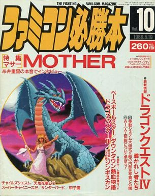



 

Interview in Famicom Hisshou Hon Vol. 10 – May 19, 1989, where Famicon Hisshou Hon sits down with Mother-series creator Shigesato Itoi three months prior to Mother's release in Japan.




<b>Famicom Hisshou Hon: First of all, this is the first time you’ve created a game, Itoi-san, is it not? And with Famicom’s mother company, Nintendo. Did you figure that if you were to make a game, you’d do it through Nintendo?</b>

<i>Shigesato Itoi: No, it’s not like that. Plans for MOTHER first took shape two years ago, but at that time all I was thinking about was whether I’d be able to have someone make a game for me. I called up a friend and asked if what I had in mind would make a good game. And then later on someone at Nintendo just so happened to call me in regards to some other work. I knew that was my big chance, so I brought them my own proposal as well. So it turned out that my making a Nintendo game was entirely coincidental. (laughs)</i>

 

<b>Hon: You’ve written some novels in the past, but I think an RPG is another kind of story. Was there a difference between writing a story through a game as opposed to a novel?</b>

<i>Itoi: Novels are stories written entirely in type, right? Games have written information with pictures attached, but even so, the weight of the words in games is way higher. So if you were to have a character exclaim, “Oh, my word!”, a novel would contain a page that demonstrates why that person is surprised. In a game, it doesn’t work like that. If you’ve got one simple phrase like “Oh, my word!” showing up, if you want to show that line effectively you’ve got to set the stage just right. That’s because making a game means having a great deal of restrictions.</i>

 

<b>Hon: So, a game-like restriction?</b>

<i>Itoi: Yeah. But it was because games had so many restrictions that I could reclaim the essence of storytelling that was already lost in novels. Like, okay, in games, you get surrounded by enemies and have to solve puzzles and such. You don’t need any kind of explanation because you first-handedly get excited, or angry, or whatever. We’re so glad we can do that—it’s an aspect unique to games. It allows us to intimately experience the emotions of the main character. When I say MOTHER is an RPG that draws you in even more than a book or a movie, that’s what I mean.</i>

 

<b>Hon: Outside of RPGs, you’re famous for being a huge fan of baseball and monopoly. Do you think you’ll turn these into Famicom games?</b>

<i>Itoi: I thought about it, and lately I’ve been thinking in particular about making a Famicom game for Monopoly. It’s just—there are a lot of instances where someone has a really great idea and does a really terrible job of expressing it, right? It’s either that or having to deal with people thinking I just copied someone.</i>

 

<b>Hon: So back to MOTHER, when making a drama as an RPG, I’m sure there are a lot of differences between medieval times and modern times.</b>

<i>Itoi: People who choose a modern drama are moved by modern human emotion. In other words, in the world of Medieval Europe, the hero goes out to fight battles to fulfill his allegiance to his king, and the king warmly embraces his hero. But stuff like that doesn’t exist in modern times, so adults are just going to ridicule children who are wandering around outside. They’d think the kid’s a runaway. So to put it differently, in a modern drama, when you start the game you’re immediately in the hole. Medieval stories start at zero and work their way up, but my game can only start at a negative point somewhere below zero. And whether you can understand that or not is what makes games entirely different.</i>

 

<b>Hon: So you’re saying MOTHER starts in the negative and works its way up to zero.</b>

<i>Itoi: Right. So around town there are a lot of guys that look down on the hero and are condescending to him. You start out with people asking “What did you do, you tyke!?” But even so, children grow up as children do. His irritation about that comes from the same place as the player controlling the game. That concept isn’t from the world of the game, but from a concept from another world.</i>

 

<b>Hon: I feel like there may have been some roadblocks in storywriting for a modern setting; was that the case?</b>

<i>Itoi: Yes, you’re absolutely right. You can’t make a game without adding some elements of mystery. So then I was able to think up Magicant and establish the game as a modern-day fantasy. Magicant is a place where magic still lives on, so I managed to fit all the absurdities in the game in that place. Without Magicant the game would have been incomplete. So I think it was because I came up with that place that MOTHER was a success.</i>

 

<b>Hon: But isn’t the presence of “a place where anything can happen” sort of a cop-out?</b>

<i>Itoi: You’d think that, right? But in the end you’ll see that it was more interesting with Magicant.  Having enemies come from outer space is a cop-out to begin with, anyway! (laughs)</i>

 

<b>Hon: Did you have any trouble with the weapons and items because of the modern setting?</b>

<i>Itoi: The weapons that a child would be able to carry are even more limited, so yeah. A baseball bat was pretty much all I could give him. But the mental image of him bashing his enemy with a baseball bat is pretty gruesome, you know? I don’t want to evoke images of actual fighting. It’s inevitably going to be contradictory to try and avoid the imagery of fighting since it’s technically a battle, anyway. And there are no ranks when it comes to using a bat. If I use level-ups of wooden bats, corked bats, metal bats and so on, it’s only going to get more gruesome. The metal bat seems particularly dangerous. (laughs)</i>

 

<b>Hon: Did you manage to come up with a solution?</b>

<i>Itoi: I did. It worked out through the power of words. So for example in the beginning you get a broken bat. Next is the normal bat, then the good bat, and the best bat. By giving the baseball bat ranks of broken/normal/good/best, the bat sort of loses its original meaning. You aren’t aiming to get a stronger bat; you’re just trying to get a “better thing”.</i>

 

<b>Hon: So you used the term bat and still managed to erase the bat itself.</b>

<i>Itoi: Right. I had the confidence that I was the only one who’d be able to pull off a technique like that. So, you know, it wasn’t just the conversation and names in the game that I poured my heart into; it was every last corner of the game. There are all sorts of enemies that show up in the battle scenes, right? Well, normally games are phrased to say, “OO was defeated.” But in MOTHER, if it was a zombie it says, “OO returned to the earth”, if it’s an animal it says, “OO became tame”, if it’s a robot, “OO shattered to pieces,” and if it’s a human, “OO returned to its senses.” I really paid a lot of attention to details like that, and that’s part of what demonstrates the kind of power I have.</i>

 

<b>Hon: When I saw the MOTHER title logo, I was struck by the picture of the earth placed over the word “mother”. It was so strong in evoking the idea that the earth is the mother of life. By any chance, is the theme of this game based on earth history?! What do you think?</b>

<i>Itoi: Ungh! I don’t know how to reply to that! (laughs)</i>

 

<b>Hon: I heard during your press conference that your inspiration for the game was 2001: A Space Odyssey.</b>

<i>Itoi: That’s 100% true. Without 2001, that logo design wouldn’t exist, and I wouldn’t have thought of the company APE.</i>

 

<b>Hon: It’s different with 2001, but I hear you’re a huge fan of Steven Spielberg, so I tried to think of how his movies would have affected MOTHER. First is Poltergeist—you used that for the opening of the game, right?</b>

<i>Itoi: Hmm, that’s the brunt of it. When I was zoning out and watching Poltergeist on video, I thought I could start it out like that. I knew I had to use that as the introduction to my story.</i>

 

<b>Hon: Close Encounters of the Third Kind. It talks about contact with extraterrestrials, but I thought there was some kind of secret with the way they used music. During your press conference, too, you said we couldn’t listen to the music because it was too crucial to the development to the game. It was the same kind of thing, wasn’t it?</b>

<i>Itoi: At this stage in development I can’t say exactly, but you’re about half right. But I think everyone figured that out.</i>

 

<b>Hon: There’s a Mad Truck among the enemies. I might be reading into this too much, but is that referring to the Spielberg movie <i>Duel?</i></b>

<i>Itoi: Ohhh, </i>Duel!!<i> No, I didn’t notice that. That was entirely by chance. (laughs) Y’know, this has nothing to do with movies, but I read a book called </i>Talisman.<i> And I felt like people really come up with some good stuff. In the novel there’s an otherworldly place like Magicant, and when you go there you have this doppelganger on the other side that sort of comes and goes between worlds. I thought that was interesting and I wanted to fit it into the game, but when I got in touch with Shinchosha about the rights, I found out Spielberg had already snatched up the rights for a movie version. (laughs)</i>

 

<b>Hon: Looks like you two were thinking the same thing.</b>

<i>Itoi: Yeah. And in Talisman there’s this guy called Wolf who can make you cry. In MOTHER there’s someone like that, except it can make you cry even more than that</i>

 

<b>Hon: So that’s where that claim comes from, that MOTHER is a game that makes you cry. Did you read Talisman after you made MOTHER?</b>

<i>Itoi: Yeah, after. I was a little worried at how many similarities there ended up being between the two, that people would think I just copied Talisman. But even if the two share similar ideas, I still want to cherish all the things I came up with all on my own, so I left it as is. In a way, there are some parts I utilized even better.  Even with a tear-jerking character like Wolfman, I made it in a game, so I’m not even working with literary ability here. But I’m using tactics with an outcome that will surprise people, so it’s interesting to compare both of them side-by-side. I’d like to explain it flat out, but half of it is spoilers so I can’t tell you. (laughs)</i>

 

<b>Hon: Then we’ll look forward to playing the game. By the way, what do you like in particular about Spielberg?</b>

<i>Itoi: His presence. You could say I’m not a fan of movies as much as I am of the director as a person. Even with Spielberg, when he makes a crappy movie it is seriously crappy. The movie *batteries not included that he helped produce was boring, too. But it’s amazing to take a single idea and turn it into an entire movie. To put it in game terms, it’s like using a disc system. Even if you make *batteries not included into a game, if you can rewrite it for 500 yen, that’s cheap, right? It’s kind of like doing that.</i>

 

<b>Hon: I’d like to turn the topic for a moment to the gaming system. The overworld map isn’t a birds-eye view like Dragon Warrior, for example, but a sort-of side view. Did you have a reason for that?</b>

<i>Itoi: I thought I didn’t need to make it that way. Then the programming staff told me they had a good idea, but they hadn’t been able to pull it off in the past. So I asked them if they could do it. And they said they should be able to. So they did it. There were a lot of other ideas aside from the scenes when moving between cities, too, thanks to the teamwork of the staff.</i>

 

<b>Hon: Is there an instant transportation in the game like Loula in Dragon Warrior?</b>

<i>Itoi: Of course. That’s another good thing. Well, MOTHER doesn’t have magic, it has PSI, so it’s teleportation, naturally. It’s super fun.</i>

 

<b>Hon: Are there neat graphics for that?</b>

<i>Itoi: It’s not that static. I mean, teleportation is the sole part of the game that works like an action game.</i>

 

<b>Hon: So you can fail to teleport?</b>

<i>Itoi: Yeah. (laughs) If you try to fail, you can. But that’s the fun part. When you start powering up for it, you have more and more of a chance to use advanced techniques to play around with it. I really want to hurry up and show everyone. If I rate my satisfaction with how the teleportation idea turned out from one to 100, it’d get 100 points.</i>

 

<b>Hon: We’re looking forward to it. Now one more thing. I wanted to ask you this more than anything, but there are a few robot enemies, right? Well, I don’t think that’s too strange considering it’s an alien attack, but in the first half of the game, the enemies aren’t monsters, but earthly things being controlled by aliens. Why don’t the aliens just pursue the attack themselves? That means the aliens would be featured as characters, but maybe the aliens wouldn’t have to land on the earth, and the hero could go off into space to fight instead. Just something I thought up.</b>

<i>Itoi: That’s interesting. (laughs) But you’re really close. That was one option among a few ideas I’d thought up.</i>

 

<b>Hon: If the story goes off into outer space, then judging from the title MOTHER, I’d be reminded of Spaceship Earth. Like moving the earth as a planet and chasing the aliens to their own planet.</b>

<i>Itoi: That’s a plausible option. I’m not going to go that far this time, but maybe we can use that for part two. I’ve mulled a lot of things over, and that’s one of the ideas in my head. It just might come to be. Man, I’m so glad I can talk about this one. (laughs) It’s fun whether it turns out that way or not.</i>

 

<b>Hon: Same here.  I’m looking all the more forward to the game after being able to hear about it from you. I heard some acquaintances of yours talking about how it’s a total given that an RPG you make is going to have a really interesting scenario, and how the problem is how the logistics with the game system will work out.</b>

<i>Itoi: Oh, man. You got me. Well, in my case, Miyamoto over at Nintendo helped out a great deal. He was uncertain for the longest time about making MOTHER into an RPG, but finally said one day, “Okay, Itoi, I get it. An RPG is the same thing as an action game anyway—just one extra form of media within the rest of Famicom media. The question is what you’re going to do with it.”</i>

 

<b>Hon: Even Koichi Sugiyama said, “The framework of RPGs isn’t going anywhere.” </b>

<i>Itoi: Right. Good gaming systems come to be a classic!</i>


