

 
<i>Mglobether?</i>

  
So where exactly does MOTHER get its title from? It’s not exactly an orthodox title for a video game series. Itoi’s placeholder title for the game, ESP1, seems more fit for a franchise of RPGs. Well, Itoi has revealed some of his reasons within his interviews. Motherhood is an important theme throughout the series, and it particularly shows within the first entry of this franchise. After all, it’s Maria’s motherly relationship to Giygas that allows for his defeat at the end of the game. Additionally, Itoi has said that the series was named after the John Lennon song, “Mother”. Itoi has always been known to be a bit fond of the Beatles. There’s also a bit of an association with the saying “Mother Earth” within the title. 

  

 
<i>Before the famous globe logo was settled upon, this was one of the options Nintendo was considering to use.</i>

  
The localization team didn’t think MOTHER would be a particularly marketable name outside of Japan, so they took it upon themselves to come up with an alternative. One of their first choices was “Space Bound”, but eventually the team settled on “Earth Bound”. The localized game famously never saw release on the NES, however, and the game fell into obscurity. The EarthBound name was used once more for MOTHER 2’s localization. Because of this, when the old “Earth Bound” NES ROM was provided to the general public by a group called Demiforce, they appended the word Zero to the title screen.

  

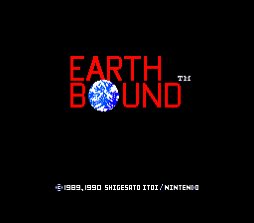 
 
<i>Despite being a wholly unofficial name, “EarthBound Zero” stuck. Many still use it.</i>

  

One might think that this would be the end for alternate titles to this game, but one would be wrong. After the success of EarthBound’s release on Virtual Console, Nintendo finally decided to bring the first entry of the MOTHER series overseas. The game was a surprise announcement during E3 2015, and it was coming to the Virtual Console underneath the name of EarthBound Beginnings. Despite this, the game’s title screen is unchanged from the original “Earth Bound”. It would have been neat to see Nintendo do a little graphical work on the old title screen, but at least the game saw an official release!

  

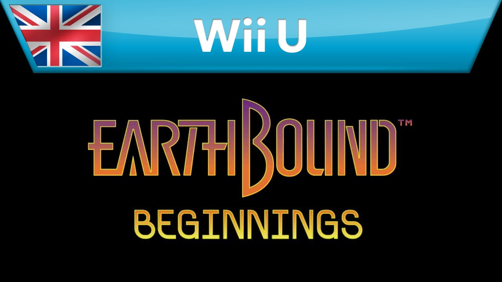
 
<i>I guess everyone begins at zero, so really, the titles are synonymous. Also, European release!</i>




Have you ever wondered how exactly Ninten wound up with him name? It doesn’t seem like a hard question -- it’s clearly a shortened version of Nintendo. However, it’s not quite as simple as that. After all, in the original game, there was no “Don’t Care” option and no default name. You had to name him yourself! That’s why many guides at the time simply referred to him as “Boku”, the Japanese for “Me”. The idea was that you named this young man after yourself. 
   
During the height of the game’s popularity, a novel based on the events of the book was written and released in Japan. Ninten hadn’t received an official name yet, so the author dubbed him as “Ken”. If you ever see someone refer to him as Ken, you’ll now know where that name is derived from.
  
However, some Nintendo guidebooks often used “Ninten” as a name for any nameable character in any sort of game. For some reason, while this didn’t stick around for other games, it just happened to stick for good ol’ “Boku”. Now, everyone knows him as Ninten!	
  

 
<i>Just what exactly is the name of this young lad? Whatever you like, really!</i>




Many of the town’s locations had different names in the original Japanese release of MOTHER. In fact, Itoi had named most towns after holidays. However, the localization team did not seem to find the charm in them. According to Phil Sandhop, the localization director:
   
	<i>"Itoi originally wrote them to sound friendly. I don't believe that towns named after holidays was friendly. Matter of fact I thought it sounded stupid and thought older players would really be turned off. I wanted it to be enjoyable for all ages."</i>
	
  

 
<i>Does this look like the face of mercy for holiday names?</i>
  
<b>Name Changes</b>
<table class="fixed" border="1">
    <col width="200px" />
    <col width="200px" />
  <tr>
    <th>Mothers’ Day</th>
    <th>Podunk</th>
  </tr>
  <tr>
    <th>Thanksgiving</th>
    <th>Merrysville</th>
  </tr>
  <tr>
    <th>Santa Claus Station</th>
    <th>Union Station</th>
  </tr>
  <tr>
    <th>Halloween</th>
    <th>Spookane</th>
  </tr>
  <tr>
    <th>Advent Desert</th>
    <th>Yucca Desert</th>
  </tr>
  <tr>
    <th>Easter</th>
    <th>Youngtown</th>
  </tr>
  <tr>
    <th>Valentine</th>
    <th>Ellay</th>
  </tr>
  <tr>
    <th>Holy Loly Mountain</th>
    <th>Mount Itoi</th>
  </tr>
</table>




Sometimes, you’re in a battle that just seems to drag on and on. You might think it’s going to last forever. But don’t worry. That’s actually impossible thanks to the game’s coding. If you somehow remain in a battle for two hundred and fifty-five turns, the battle will come to a close. You’ll receive a message that states “The battle lingers on.” Afterwards, you’re returned to the game’s overworld.
  

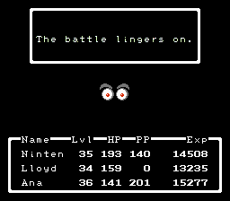
 
<i>Someone help me, he’s been staring at me for 255 turns now.</i>




Here’s a character that’s not talked about often. Particularly out of the way in Spookane is a woman who claims to be your assistant. She will offer to sell you a hint for a thousand dollars. Three of these hints are available for sale. However, you buy all three of her hints -- or decline her services even once -- she will vanish forever. 

  

 
<i>She disappears if you say no. Maybe she’s a ghost… Spookane is filled with many ghosts, after all.</i>




While it’s generally recommended to traverse Duncan’s Factory with Lloyd and then taking the train to Snowman to recruit Ana, it turns out that this isn’t an enforced strategy. In fact, a dedicated player can trudge through the enemy-ridden train tunnels and arrive to Snowman on foot. That means you can recruit Ana before even meeting Lloyd!
  

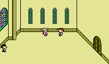
 
<i>Just be sure to remember to get Ana’s hat from Reindeer’s train station!
</i>




Hidden within the northeast regions of the Yucca Desert is a secret land mine. It only occupies a single tile, and can be quite difficult to find while dodging various random encounters. However, if someone triggers the land mine, it will explode in Ninten’s face. Shockingly, it doesn’t damage you. Shortly afterwards, the player will receive a congratulations signed from the game’s creator himself, Shigesato Itoi!

  

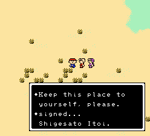
 
<i>Whoops... A signed letter sure beats getting blown to pieces, that’s for sure.
</i>




There’s a series of feminine robots within the game. In the English version of the game, their names are Nancy, Kelly, and Juana. However, their names are completely different in the Japanese game: Jane, Caroline, and Susie! What could possibly be the reason for these changes? Well, as it turns out, the three robots were renamed in honor of female staff members at Nintendo of America. 

  

 
<i>From left to right: Nancy, Kelly, and Juana.  Talk about a technological trifecta!
</i>




Do you wish you could bring a specific music track with you wherever you go while playing MOTHER? You might have an opportunity to do so with a certain glitch. When the music is supposed to change based on your location in the overworld, you’ll pass a “border” of sorts. By activating teleport, running through this border, and then failing to teleport, you can retain the music from the previous area!
  

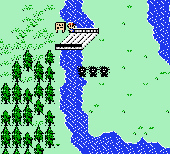
 
<i>For example, use Teleport to zip over this bridge from Youngtown and into the Swamp. Now you’ll hear the Youngtown music in the overworld.
</i>

  
That’s not the only music glitch in this game, however. At the beginning of the game, while the poltergeist is ravaging Ninten’s home, save the game using the phone downstairs. After defeating the doll, head outside and have an enemy beat Ninten unconscious. After the game over screen, Ninten will spawn back into his house. Although there’s no attack going on, the poltergeist music will be playing!



A number of map modifications were made during the localization of MOTHER. Most of these changes survived into the MOTHER 1+2 port as well. First off, these Magicant caverns were modified, eventually shifting their design into something much less labyrinthine.
  

 
 
<i>That’s a lot less encounters with floating eyes for you to deal with.
</i>

  

The layout of Spookane was tweaked in order to help the player find their way to the east side of town where all of its residents have fled to.

  

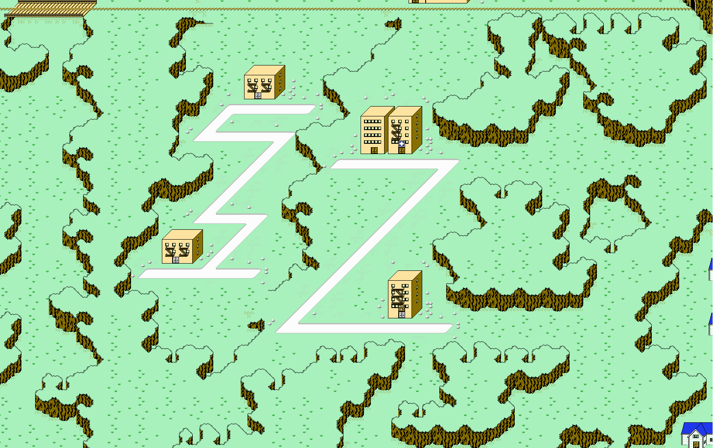 
 
<i>The roads do seem a bit inefficient in the original, don’t they?
</i>

  

The woods leading up to the base of Mount Itoi were simplified greatly, reducing the chance of the player getting lost on the way there.

  

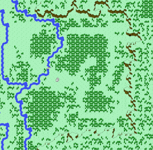 
 
<i>You can see that the original pathway was seemingly designed to confuse the player.   The newer setup practically guides you to the cave entrance.
</i>

  

Some interesting modifications were made to the room placements of Mount Itoi. In the original MOTHER, a cavern was located on the way to the peak that’s filled with abducted humans submerged in glass tubes. Additionally, the cavern entrance near the XX Stone took the player straight to the final boss. In the localized game and subsequent releases, the lower cavern was closed off entirely. Instead, a new pathway was added inside of the cavern entrance near the XX Stone. One of these paths takes you to the relocated room of abducted humans, and the other to the final boss. Interesting!

  

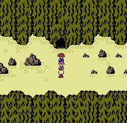 
 
<i>I guess you could say it’s an open and shut case? Haha!
</i>




Fun fact: Maria is actually the great-grandmother of all the party members! Well, that’s not true. But thanks to an oversight in the script, the XX Stone will always address the party member first in line. That means if Ninten is incapacitated, the XX Stone will welcome either Lloyd, Ana, or Teddy… and then proceed to tell them about their great-grandmother Maria. Oops! 

  

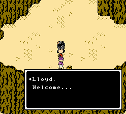 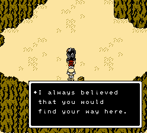 
 
<i>So Ninten is a distant cousin to both an inventor prodigy and a street thug? This newfound family connection might also be trouble for Ninten and Ana’s love endeavors...
</i>




Did you know that the location of the eighth melody is different in the original MOTHER and within subsequent releases? In the original MOTHER, Ninten and his friends were instantly warped to Maria upon collecting the first seven melodies. After singing them to the queen, she would remember the final melody on her own. After the game’s localization, it was changed: the eighth melody is now collected after checking the XX Stone, and the party must travel to Maria on their own.

  

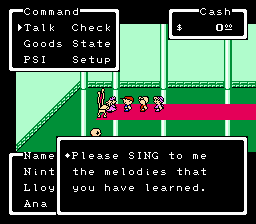
 
<i>Seven out of eight was close enough for Itoi the first time around, huh?</i>




Here’s a tidbit of uncommon knowledge: there’s a variety of different party combinations you can face off against the final boss as! With careful management and the occasional sequence breaking, you can square off against Giygas with nonstandard party members.

  

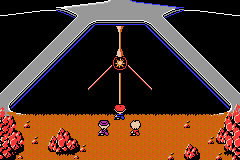
 
<i>Ninten, Ana, and Lloyd. Simply play through the game normally. Be sure to have Teddy be defeated by R7038. Alternatively, you could choose to never recruit Teddy in the first place.</i>

  

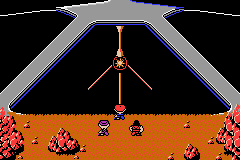
 
<i>Ninten, Ana, and Teddy. This setup is a little trickier. You must first traverse Mt. Itoi with Lloyd so he can repair the boat. After that, and the collection of EVE’s melody, you can simply go to the Live House and swap him out for Teddy, as Lloyd will no longer be necessary to complete the game.</i>

  

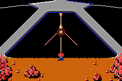
 
<i>Ninten only. What’s the catch here? As before, make sure you’ve repaired the boat already. Upon arrival at the healer’s cabin atop Mt. Itoi, both Ana and Teddy will break away from Ninten’s party. Before initiating the dance sequence with Ana, you can use the Onyx Hook to flee to Magicant and complete the game with Ninten alone.</i>

  

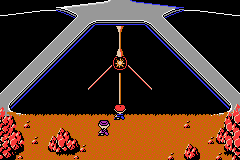
 
<i>Ninten and Ana. There’s a similar method to getting this setup as Ninten only. Just be sure you’ve done the boat repairs already. Initiate the R7038 battle, and then ignore Lloyd after Teddy is critically injured. Then proceed to Giygas!</i>

  

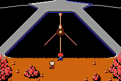
 
<i>Ninten and Lloyd. This is, by far, the most difficult ending to achieve. One must never recruit Ana to the party in the first place for this setup. That means it will also be impossible to join with Teddy for the entirety of the game. Unfortunately, there is no reward for this challenge.</i>




In the original Japanese release, after Giygas’s defeat, the game just ends right there. Your party members turn to face you, and the credits begin to roll behind them. That’s it. 
  

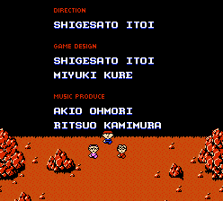
 
<i>All things considered, it’s almost a bit anticlimactic.</i>

  
Apparently, during the localization process, someone agreed with the sentiment that the game was ending much too quickly. A full-fledged sequence was added afterwards which shows what happens to our beloved protagonists after the end of the final battle. What a relief! The previous version really left us hanging!

  

 
<i>Who said that no news is good news? We’d like an unambiguous ending!</i>


