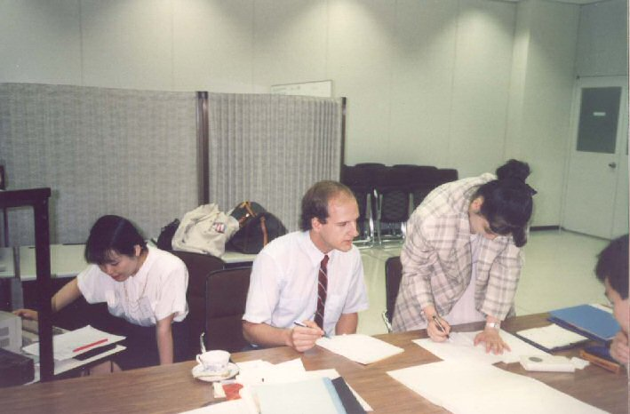
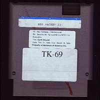
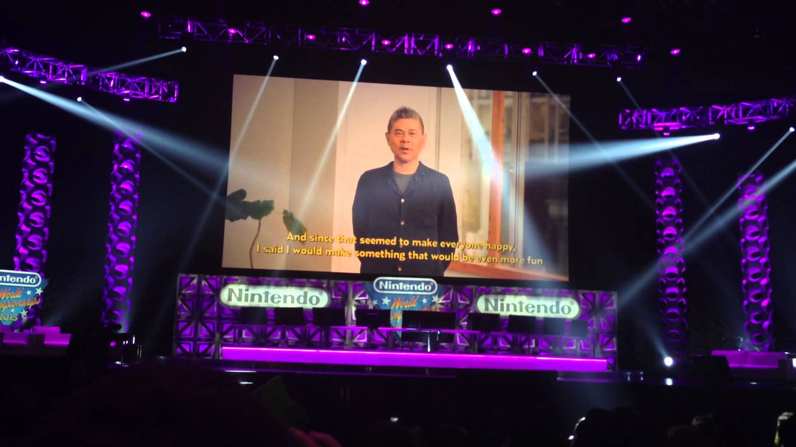


Make no mistake about it -- Shigesato Itoi’s debut project in the video game industry, MOTHER, was hugely popular in his home country. After all, in Japan, Itoi was already a popular celebrity with plenty of public exposure. Additionally, RPGs were bustling in Japan, with many titles in the turn-based genre being released on the Famicom for people of all ages to enjoy.  

For overseas markets, it was a different story. Shigesato Itoi was virtually unknown outside of Japan. RPGs hadn’t quite caught on yet with overseas audiences, either -- only a few games in the genre were released outside of Japan at the time. Despite this, Nintendo seemed steadfast in their belief that MOTHER would be a success in the North American market. After drumming up a localization team, headed by the experienced Phil Sandhop, the effort to bring MOTHER to the United States begun. Underneath the new moniker Earth Bound, the original vision of Itoi was tweaked to fit the Nintendo Entertainment System of the American market.
  
To adhere to Nintendo of America’s rules and for other reasons, changes were made. Cigarettes and blood were removed from enemy sprites. References to strip clubs were… stripped. Town names were shifted away from holidays to less childish alternatives. Things were gearing up to a spectacular release. A English guidebook was even created, called the “Great Grandfather’s Diary” after an important item from the game. Chronicling the first half of Ninten’s adventure, the guidebook would suddenly come to a halt, with the last pages of the book resembling torn papers -- leaving the player to figure out the end of the game themselves.
  
	Despite all the work poured into this hopeful project, the already doubtful circumstances that existed in the overseas markets were quickly doubled up upon. The newest Nintendo console, the Super Nintendo Entertainment System, was already released in the United States before the localization project was complete. Combined with the expensive cartridge that would be needed to store the massive game, Earth Bound was deemed unprofitable. The game was doomed to the shadows of locked Nintendo vaults for many years afterwards.




With the release of the localized MOTHER cancelled, it seemed overseas audiences would not get an opportunity to play the game. Even when EarthBound eventually released for the SNES in North America, many gamers were completely clueless to the fact that the game was a sequel. The only remains of Phil Sandhop’s work on MOTHER existed in the form of a small number of prototype cartridges. Some of these cartridges had escaped the hands of Nintendo, only existing as legendary relics, seemingly thrust into the obscurity of forgotten cardboard boxes abandoned in attics and basements. For many years, there was no sign of any of these prototypes. A hacking group known as Demiforce had resigned themselves to making a fan translation of MOTHER on their own instead.
  

And then, in 1998, a miracle happened. Out of the blue, a man appeared on a message board, claiming to own one of these mythical prototypes. What’s more, he was offering it for only one hundred dollars! It was purchased by a man named Kenny Brooks, who was now in possession of an incredibly rare “Holy Grail” item, one that most overseas MOTHER fans didn’t even know existed.

  

The hacking group, Demiforce, got in touch with Kenny Brooks shortly after the purchase. After some discussion, they came to the agreement to pay Kenny $400 to borrow the cartridge for a short period of time. The Demiforce community pooled together to money, and upon receiving the cartridge, they quickly dumped the ROM and prepared it for Internet distribution. There were a couple of fights to get the game files to cooperate, including an accidental triggering of the anti-piracy features of the game, but eventually, everything was sorted out and ready to go. After modifying the title screen to say EarthBound Zero to prevent confusion with the already existing EarthBound on the SNES, Demiforce released the ROM to the world of computer emulation, and the localization work of Phil Sandhop saw the light of day for the first time.
  
	There were doubts at first. Some accused Demiforce of merely trying to pass off a fan translation as a long-forgotten official localization. But as time passed on, the EarthBound Zero ROM was accepted as the Nintendo of America’s abandoned translation of the game. Even now, this ROM is the one widely circulated throughout the Internet, and EarthBound Zero has stuck as a largely accepted title for the game. In this way, Demiforce has attached itself to the game itself, making it an important part of its history.




After the previous success of EarthBound’s release on North American and European Virtual Console, most of the series’s following had already resigned themselves to a victorious rest. It seemed that having one MOTHER game available in the West was already worth celebrating. But on June 16, 2015, a surprise announcement was made that took the MOTHER fans attending and watching the Nintendo World Championships by storm. On the big screen in a dark conference room, the visage of Shigesato Itoi appeared on screen, announcing that the first MOTHER game was finally receiving an official release outside of Japan.
  

This recorded message from Itoi included some heartfelt words on what the game meant to him, why it was finally being released, and a sincere thanks to his fanbase before cutting away to the first trailer to the game, now dubbed EarthBound Beginnings in overseas markets. Shortly after the event, the NES classic became available on the Nintendo eShop. 
  
	The Virtual Console version of the game is identical to the abandoned prototype left behind by Phil Sandhop and his team. Despite the game’s rebranding, the title screen still says Earth Bound in all capital letters. Fortunately, no confusion seemed to arise from this detail. It seemed that everyone was busy celebrating the final release of this game to really care too much about it. Twenty-six years after MOTHER was released in Japan, it was finally reborn as EarthBound Beginnings -- perhaps one of the longest running journeys to foreign markets in all of video gaming history.


