
Make no mistakes about it -- the story of the MOTHER series is one that is continued in between game to game, from sequel to sequel. However, the continuity of the MOTHER series is not one that makes itself obvious at first glance. After all, each title in the series begins with a never-before-seen protagonist and a seemingly new setting. Where, then, are the chains that hold these games together as a singular, cohesive story? The answer can be found within the antagonists, common enemies, and creative concepts that appear throughout multiple games within the series that fuse the series together.

  

Due to the nature of this topic, there will be several spoilers in the text that follows.




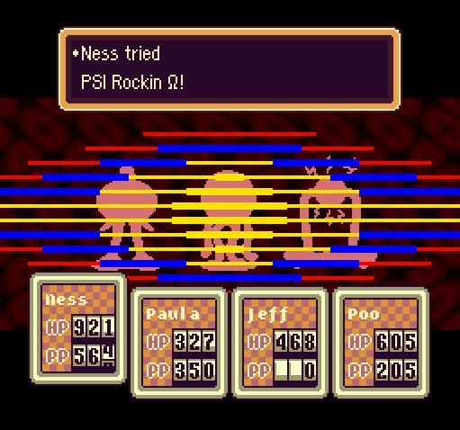

PSI is a mysterious psychic force that allows for the manipulation of mental energy. Its users are not limited to the human race -- in fact, many different species and beings are seen harnessing this power to their advantage. Not everyone is able to tap into this psychic force on their own. The ability to use PSI may be passed on by genetics to some degree, as it is first mentioned as being studied by the great-grandfather of the first MOTHER’s protagonist, Ninten. We do know that certain individuals can be taught to use PSI, or have it awakened inside of them: this is evidenced by Lucas’s learning of this skill during MOTHER 3 by the Magypsy Ionia.

  

	What we do know is that PSI is an important talent that helps drive forward the stories of each of the MOTHER games. In each installment in the series, the protagonists -- Ninten, Ness, and Lucas, in MOTHER 1, 2, and 3 respectively -- both acquire more training with their psychic abilities over time, along with many of their companions as well. Of course, many of the foes that each of these heroes faces possess the same PSI that they do. In conclusion, PSI is an important part of the world that the series has established, immediately making connections between the three games.




Giygas is an antagonist of multiple appearances within the MOTHER series, and his siege against the planet Earth provides valuable insight to the continuity of the story. However, many who play the second installment of this franchise may not realize that Giygas truly debuted in the first MOTHER title. In the localized version of the first MOTHER, EarthBound Beginnings, his name was localized as Giegue, from the Japanese ギーグ (Gīgu, or as it is romanized, Gyiyg). 
  

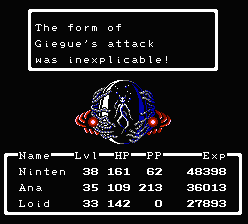

During that game, Giygas found himself pitted against the first protagonist, Ninten. This young boy battles against many of Giygas’s troops, such as the mechanical Starmen or the tentacled, octopus-like Mooks. As the story progresses, Ninten learns of the human mother who raised Giygas, Maria, and the lullaby that she used to sing to him as an infant. Ninten and his friends eventually defeated Giygas by singing to him the song after collecting the eight melodies that composed the song. At the end of the game, Giygas swears his revenge as he and his mothership rocket back into the void of space.

  

	While the localized version of MOTHER 2, EarthBound, never truly alludes to Giygas’s appearance as being revenge due to prior events, the Japanese MOTHER 2 makes this fact quite clear. In fact, “Gyiyg Strikes Back” (ギーグの逆襲) is the subtitle of the game, appearing on the opening screen of the game and alongside the MOTHER 2 logo. 

  

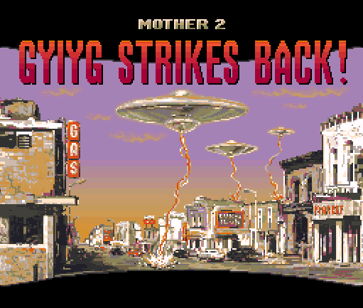&nbsp;&nbsp;&nbsp;&nbsp;&nbsp;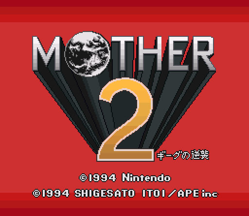

  

	
	

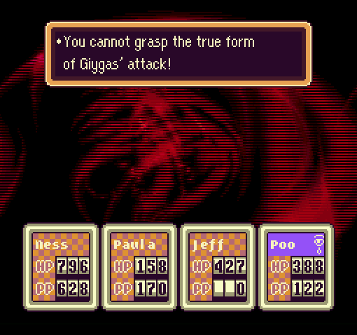

Before the events of MOTHER 2, Giygas uses a prophesying device known as the Apple of Enlightenment to peer into his future, only to learn that a boy named Ness and three of his friends are destined to defeat him once and for all. Giygas panics, and ensures this will not happen by taking over the Earth and shrouding most of the universe in darkness. However, a time travelling insect named Buzz Buzz goes ten years into the past to warn the young Ness about the rising of Giygas, allowing him to gather his friends so they can defeat Giygas once and for all. They must fight his troops along the way, which often times contain of the same Starmen and Mooks that Ninten fought against in the first MOTHER.

  

	Giygas is one of the most explicit links between two separate games within this series, although varying localizations of his name have caused confusion as to whether he was the same entity as Giegue in the past. Fortunately, we are far past this point, and can ensure Giygas’s looming presence within both MOTHER 1 and MOTHER 2. 




Whereas Giygas bridged the gap between MOTHER 1 and 2, Porky Minch is the major connection between MOTHER 2 and 3. His descent into villainy is one must play two games in order to fully witness.

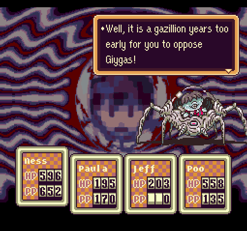

	In the localized version of MOTHER 2, EarthBound, his name is localized as Pokey, from the Japanese ポーキー (Pōkī). Starting off as nothing more than a next-door neighbor and a nuisance to Ness, Porky gradually finds himself sliding down a slope of corruption. First, he participates in the twisted cult of Happy Happyism; next, he assists in a plot involving the takeover of the city of Fourside. By the end of the game, however, Porky has become Giygas’s second-in-command. Both of them have hidden themselves thousands of years into the past. However, Giygas’s power has grown so great, that it destroyed the alien’s body, causing his consciousness to be stored within a device called the Devil’s Machine in order to keep Giygas from losing sanity and destroying the universe. Porky betrays Giygas’s trust and deactivates this machine in a final effort to destroy Ness and his friends. When they manage to destroy Giygas through the power of prayer, Porky monologues one last time, promising Ness that he will simply take the time-travelling technology gifted to him by Giygas and create a new plan in another time. He then vanishes from the scene.

  

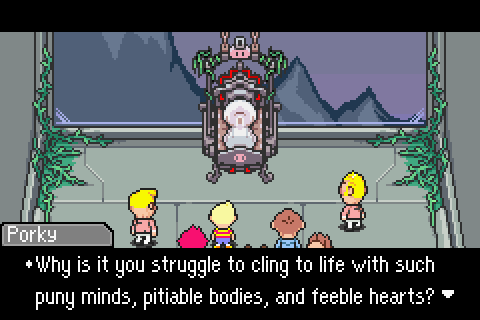

	Porky makes good on his promise during the events of MOTHER 3, in which he finds himself far into an unknown time on the last protected place on Earth, the Nowhere Islands. By this point, Porky’s desecration and abuse of time travel has given him immortality, but at the price of locking him out from time traveling again. Having created a personal army from people he had snatched from different times, he institutes a Pigmask Army and begins to abuse the Nowhere Island’s landscapes and creatures as he sees fit. Porky’s immortality has caused him to become incredibly bored, and he wishes for everything to be destroyed except for himself. Because of this, Porky takes great interest in awakening the Dark Dragon, which will allow him to eradicate existence. The only way this can be done is to pull the Seven Needles keeping the dragon asleep. Lucas, the protagonist of MOTHER 3, is the one who rises up to stop this threat.

  

	Ignoring Porky, MOTHER 2 and 3 are almost completely unrelated games. This continues to display the method in which Itoi has attached his series together with the resurgence of past antagonists.





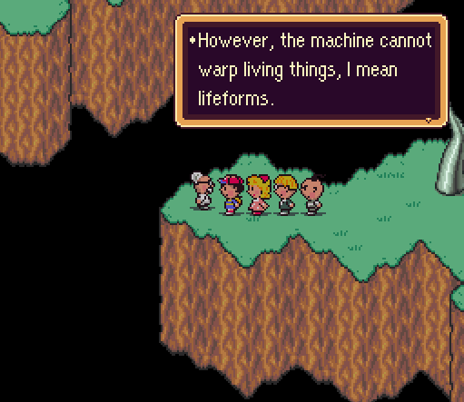

Dr. Andonuts first appeared in MOTHER 2 as the father of one of Ness’s party members, Jeff. Throughout the game, Dr. Andonut provides invaluable help through his brilliant inventions. One of these creations is the Phase Distorter, which allows Ness and his friends to travel through time when both Giygas and Porky were hiding far into the past. 

  

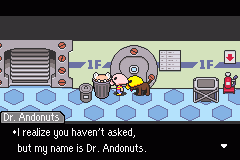

In MOTHER 3, while most of the individuals that Porky has snatched from other points in time are nameless individuals we do not recognize from the past, Dr. Andonuts is an exception. It seems Porky has swiped away Dr. Andonuts to make him use his genius ideas for Porky’s nefarious purposes. He is found forcibly working in the Chimera Labs on the Nowhere Islands, in which animals are spliced apart and reassembled into monstrous fusions of their previous selves.





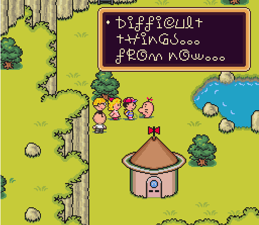

These lovable mascots of the MOTHER series first appeared in MOTHER 2, in which they lived in a place called Saturn Valley north of the town of Threed. Ness and his friends rescued these creatures from the tyranny of one of Giygas’s minions, a living vomit pile named Master Belch. In return, the Mr. Saturns give Ness’s party a magical tea that causes them to hear encouraging words from some anonymous voice. Later on, they assist Dr. Andonuts in his creation of the Phase Distorter.

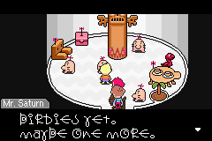

	In MOTHER 3, the Mr. Saturns have taken residence in another Saturn Valley located upon the Nowhere Islands. During the events of the game, Porky’s Pigmasks wreak havoc in Saturn Valley and torture the Mr. Saturns in an attempt to make them reveal the location of one of the Seven Needles. When Lucas and his friends chase off these captors, the Mr. Saturns are incredibly thankful. They perform many helpful tasks for the party, such as building themselves up as ladders and giving Lucas’s party the same magical tea from the previous game. 





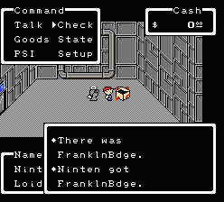

This iconic item provides a strong tie between the all three of the MOTHER games. In the first MOTHER, the item’s description states that it was named after Ben Franklin, who wore it during his experiments with lightning to avoid being shocked by electricity. Despite this description, the two Franklin Badges in this game do not reflect PK Thunder, but rather the instant death move, PK Beam γ. 

  

	In MOTHER 2, the Franklin Badge becomes true to its original description, and now reflects electricity attacks. Paula, one of Ness’s party members, gives Ness this item so he can face the lightning-wielding Mr. Carpainter without being instantly knocked out.

  

	In MOTHER 3, Lucas earns an odd, seemingly useless item called the Courage Badge as a gift from his father. Later on, however, the helpful Mr. Saturn people polish and restore the damaged gift, revealing it to be none other than the Franklin Badge. This helps Lucas avoid the dangerous lightning from one of Porky’s generals, the Masked Man.

	In a similar way, you can expect other items to pop up in more than one installment of the series. Be on the lookout for Cups of LifeNoodles, Strawberry Tofu, and other less important items that can be seen regularly throughout the series.





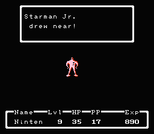&nbsp;&nbsp;&nbsp;&nbsp;&nbsp;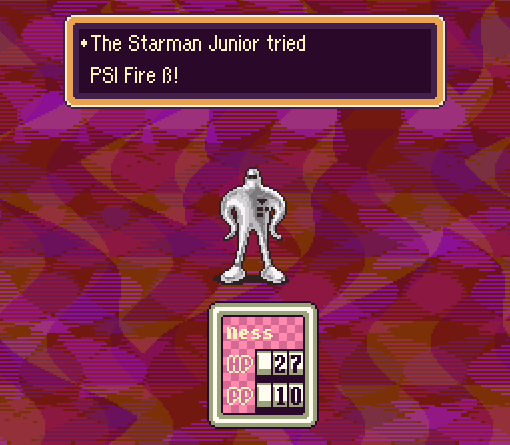

  

Despite each protagonist being different in each game, they each occasionally find themselves facing the same sorts of enemy types. While there is a vast array of similar enemy spawns between games, there are a few explicit returns of past minor foes. These include:

  

<ul>
  <li type="square">Varieties of Starmen </li>
  <li type="square">Varieties of Mooks </li>
  <li type="square">Varieties of Octobots </li>
  <li type="square">Atomic Power Robots </li>
  <li type="square">Varieties of Ramblin' Mushrooms </li>
  <li type="square">Varieties of Violent Roaches </li>
  <li type="square">Mr. Batties </li>
  <li type="square">Arachnids! </li>
  <li type="square">Titanies </li>
  <li type="square">Putrid Moldymen </li>
  <li type="square">Zombie Dogs </li>
</ul>

 
	These and others are found in multiple games. However, these are only reappearances of enemies by name alone; a player may find themselves fighting an enemy that vastly reminds them of one from a previous or future game in the series without it being exactly the same. This just goes to show how the creatures and people fought in each of the MOTHER games also assists in connecting the series.




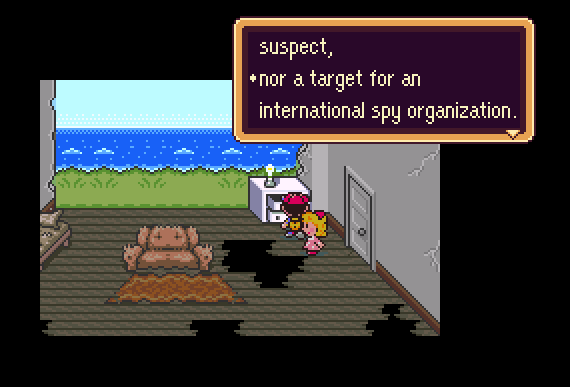 &nbsp;&nbsp;&nbsp;&nbsp;&nbsp;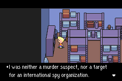

  

In both MOTHER 2 and 3, a magazine can be found, which contains a story titled “My Secret Life, Chapter 3”. This story tells of a man who gets caught speeding by the police. As an excuse, he lies about his wife’s obesity, saying she is preparing to give birth instead.

  

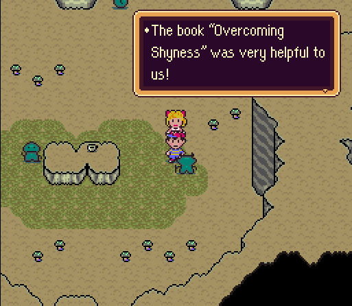&nbsp;&nbsp;&nbsp;&nbsp;&nbsp;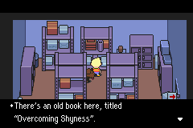

  

	In both MOTHER 2 and 3, a book titled “Overcoming Shyness” can be found. In MOTHER 2, this was a key item used to help a village of creatures known as Tendas so they would talk to Ness and his friends. In MOTHER 3, it is only a passing detail on a shelf.

  

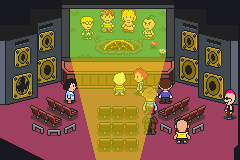

  

	In MOTHER 3, at a movie theatre in New Pork City, a film featuring events from MOTHER 2 is being displayed, showing various scenes from the adventure Ness and his friends had.

  

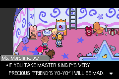

  

	In MOTHER 3, at a toy room in Thunder Tower, an item known only as the “Friend’s Yo-Yo” is heavily guarded by Porky’s robotic maid, Lil’ Miss Marshmallow. This yo-yo is implied to have belonged to Ness, and seems to be of great value to Porky.




Now that you’ve seen the characters and objects that bring the games together, you may be wondering what thematic connections there are to be made. 

  

	In each of these games, a young boy leaves home with his newly discovered psychic abilities in order to face a threat that is much larger than himself. Along the way, he meets unforgettable friends who possess talents that match his own. With his new partners, they grow strong enough to drive off the antagonistic force and return the world to peace.

  
	We see how the innocence of children triumphs over seemingly unbeatable evils. Despite the efforts that antagonists may make in order to take over the world, the pure nature of normal children with abnormal abilities always reigns in victory over those who threaten the Earth.

  

	Finally, the importance of motherhood is explored. We are reminded that even the most evil or misguided of characters once possessed a mother, and will always have this human weakness to them. We see that when one returns home, the mother is always there to cook a refreshing meal for their child and to alleviate their homesickness. We see that the mother is one of the most important things one can be. After all, MOTHER is the name of the franchise.

  

	In conclusion, the manner in which the MOTHER series is connected is not entirely subtle, but it not blatant either. This creates a system in which each game can stand alone as a memorable experience, but rewards those who have played other games by continuing to build upon the world Itoi has created.

