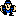


<table width="100%" cellpadding="0" border="1">
  <tr>
    <td bgcolor="white">

</td>
    <td valign="top">
      <u><b>Possessed Pillow:</b></u>
        
There is an unused pillow sprite found in the game's data and it functions as an enemy. Its stats are the same as the Lamp enemy, with the slight difference of having two points less of health.</td>
  </tr>
 <tr>
    <td bgcolor="white">

</td>
    <td valign="top">
      <u><b>Pippi:</b></u>
        
Pippi also has an unsed enemy sprite, though she never appeared as a foe in the final game. Her stats are jumbled, have an oddly high amount of PP with the others being pitifully low.</td>
  </tr>
  <tr>
    <td bgcolor="white">
     
</td>
    <td valign="top">
      <u><b>Guitarless Man:</b></u>
        
There is one unused NPC sprite found in the game's data. It's a variant of the Guitar Man sprite, this one featuring the same design, but with no guitar.</td>
  </tr>
</table>

