

<a href="knight.png" title="Armor">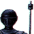</a>

<a href="barbot.png" title="Barbot">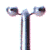</a>
<a href="bbgang.png" title="BB Gang">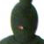</a>

<a href="bigwoodo.png" title="Big Woodoh">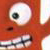</a>

<a href="cougar.png" title="Cougar">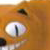</a>

<a href="hippie.png" title="Hippie">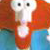</a>

<a href="lilsaucer.png" title="Li'l Saucer">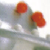</a>

<a href="clay_house.jpg" title="Ninten and his Dog">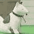</a>

<a href="rope.png" title="Rope">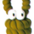</a>

<a href="train.png" title="Train">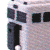</a>




<a href="Ninten_conceptart.png" title="Early Ninten Concept Art">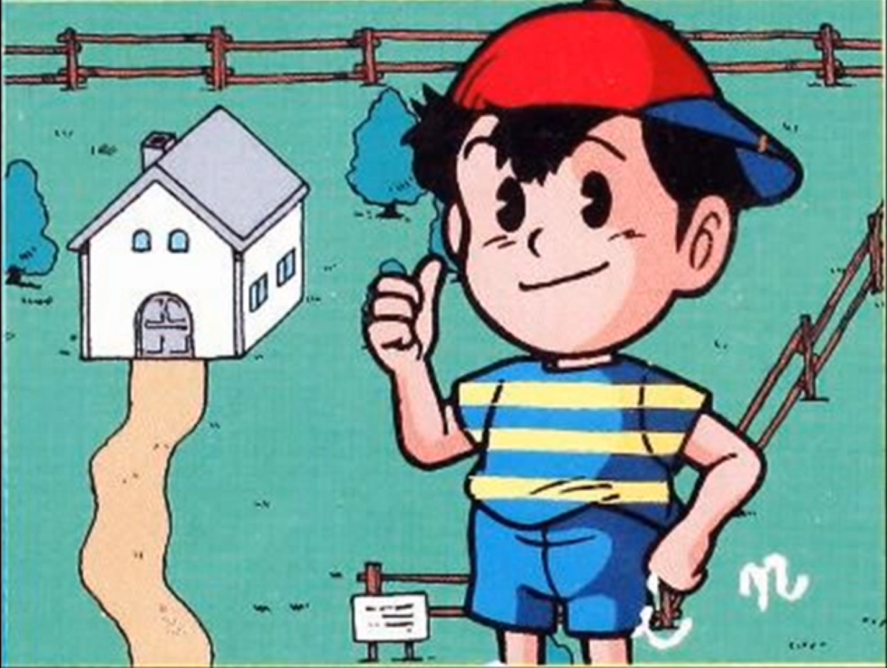</a>

  
If you have knowledge of where piece was first released, let us know on the forums!



<a href="map.jpg" title="Holy Loly National Park">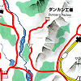</a> 
A map from Holy Loly National Park, taken directly from the Mother Encyclopedia.

