
<a href="ana.png" title="Ana">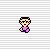</a>
<a href="ana(dead).png" title="Ana (Dead)">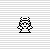</a>
<a href="anamom.png" title="Ana's Mom">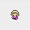</a>
<a href="baldman.png" title="Bald Man">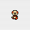</a>
<a href="bbgang.png" title="BB Gang">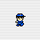</a>
<a href="blonddude.png" title="Blond Dude">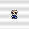</a>

<a href="blondlady.png" title="Blond Lady">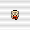</a>
<a href="blondman.png" title="Blond Man">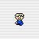</a>
<a href="blondpigtailgirl.png" title="Blond Pigtail Girl">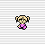</a>
<a href="blondponytailgirl.png" title="Blond Ponytail Girl">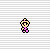</a>
<a href="blondwoman.png" title="Blond Woman">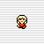</a>
<a href="bluecapboy.png" title="Blue Cap Boy">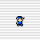</a>
<a href="bluehairedchild.png" title="Blue Haired Child">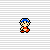</a>
<a href="bluehatmagicantboy.png" title="Blue Magicant Boy">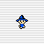</a>

<a href="bluemagicantman.png" title="Blue Magicant Man">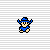</a>
<a href="bluepigtailgirl.png" title="Blue Pigtail Girl">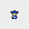</a>
<a href="blueretainer.png" title="Blue Retainer">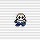</a>
<a href="castleguard.png" title="Castle Guard">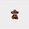</a>
<a href="cheeringbluecapboy.png" title="Cheering Blue Cap Boy">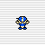</a>
<a href="cheeringbluechild.png" title="Cheering Blue Child">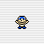</a>
<a href="cheeringpinkgirl.png" title="Cheering Pink Girl">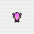</a>
<a href="cheeringredcapboy.png" title="Cheering Red Cap Boy">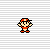</a>
<a href="cheeringredgirl.png" title="Cheering Red Girl">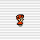</a>
<a href="coinvendor.png" title="Coin Vendor">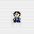</a>
<a href="coolguyeb0.png" title="Cool Guy (EB0 Ver.)">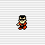</a>

<a href="dirtymaneb0.png" title="Dirty Man (EB0 Ver.)">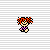</a>
<a href="dirtymanm1.png" title="Dirty Man (Mother Ver.)">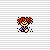</a>
<a href="disguisedstarman.png" title="Disguised Starman">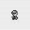</a>
<a href="doctor.png" title="Doctor">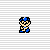</a>
<a href="eve.png" title="EVE">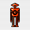</a>
<a href="fastfoodgirl.png" title="Fast Food Girl">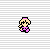</a>
<a href="fatguy.png" title="Fat Guy">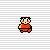</a>
<a href="fatwoman.png" title="Fat Woman">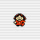</a>
<a href="flyingman.png" title="Flying Man">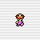</a>
<a href="forgottenman.png" title="Forgotten Man">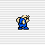</a>
<a href="glasseslady.png" title="Glasses Lady">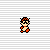</a>
<a href="glasseswomaneb0.png" title="Glasses Woman (EB0 Ver.)">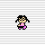</a>
<a href="glasseswomanm1.png" title="Glasses Woman (Mother Ver.)">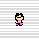</a>
<a href="guitarman.png" title="Guitar Man">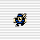</a>
<a href="healer.png" title="Healer">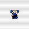</a>
<a href="helpfuloldman.png" title="Helpful Old Man">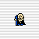</a>
<a href="hippie.png" title="Hippie">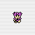</a>
<a href="janitor.png" title="Janitor">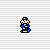</a>
<a href="lloyd.png" title="Lloyd">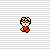</a>

<a href="mayor.png" title="Mayor">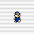</a>
<a href="mimmie.png" title="Mimmie">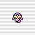</a>
<a href="minnie.png" title="Minnie">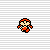</a>
<a href="ninteneb0.png" title="Ninten (EB0 Ver.)">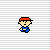</a>

<a href="ninten(dead).png" title="Ninten (Dead)">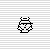</a>
<a href="nintensmomeb0.png" title="Ninten's Mom (EB0 Ver.)">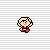</a>
























<b>Unused NPC</b>  

  
<b>Unused: Enemies</b>  








<table1 />
<a href="http://starmen.net/mother1/images/game/eb0sprites.zip">A bunch of character sprites</a> 
<a href="http://starmen.net/mother1/images/game/m1sprite.zip">A bunch of sprites</a>

<table2 />
submitted by EvilGiegue 
submitted by Eggy

<table3 />

