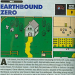
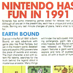
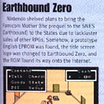
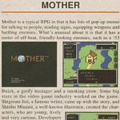
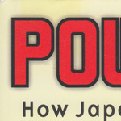
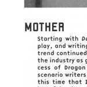
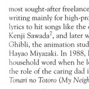
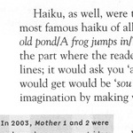






In Chapter 4 of this book, it goes into the influential RPG's in the early gaming era, such as Dragon Quest and Final Fantasy. Itoi and Mother are discussed for about three pages, but it also mentions Mother 2, Mother 3, and even Mother 1+2 briefly.   


