
Welcome to the game that started it all, EarthBound Zero. Prepare for a modern-day quest full of mystery, drama, and romance. 
 

<a href="story.png" title="Story">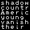</a>



Located within rural America is Podunk, a puny town with a corrupt mayor, ambitious to win the next election. Ninten and Pippi trace their origins here, and you'll start your adventure in these backwoods. Be sure to visit the conveniently located Canary Village, the creepy graveyard and its tombs, and the gigantic zoo featuring an animal-controlling alien bent on killing you. 
 
<a href="musicbox.png" title="Kick the Baby Doll">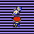</a>

<a href="hippie.png" title="Hippy Battle">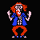</a>
<a href="cemeterychild.gif" title="Lost Child">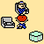</a>
<a href="church.png" title="Graveyard Church">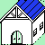</a>

<a href="braveninten.gif" title="Brave Ninten">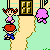</a>
<a href="zoo.png" title="Zoo Advertising">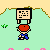</a>
<a href="eek.gif" title="EEK EEK!">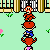</a>
<a href="nintenzoo.gif" title="An Empty Zoo">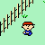</a>

<a href="canaryvillage.png" title="Canary Village">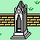</a>
<a href="important.gif" title="Missing Importance">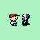</a>
<a href="helpfulfuzz.png" title="Police Advice">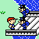</a>
<a href="podunkswamp.gif" title="Wetlands of Podunk">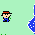</a>
<a href="wondergirl.gif" title="Wonder Girl">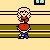</a>
<a href="nohunting.gif" title="No Hunting">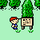</a>



A magical pink land full of wonder and children wearing cute outfits, Magicant is the home of a mysterious, yet beautiful queen. Surrounding her castle are the fields that are home to a rare species of tree that is known to explode, but don't let that stop you from visiting Merrysville and its nearby factories. After all, why miss the chance to fight hundreds of blood-thirsty robots? 
 
<a href="xxstone.png" title="Mysterious XX Pillar">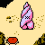</a>
<a href="wheretogo.png" title="Where's the...">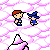</a>
<a href="outsideworld.gif" title="A World Outside">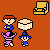</a>

<a href="fountain.png" title="Magical Fountain">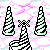</a>
<a href="raebyddet.gif" title="Raeb Yddet">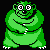</a>
<a href="queenmarycastle.png" title="Queen Mary's Castle">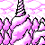</a>

<a href="weirdguy.png" title="Who's He Again?">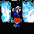</a>
<a href="mortician.gif" title="Phone a Mortician">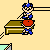</a>
<a href="loidthief.png" title="Loid's Larcenous Ways">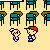</a>
<a href="messy.png" title="Science Gone Wrong">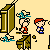</a>
<a href="guarddog.png" title="Factory's Guard Dog">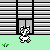</a>




Although you don't need to enter Reindeer, you should give a visit to the town named for Santa Claus's favorite animal. If you're really in need for more of the Christmas theme, then stop by the arctic wonderland of Winters, home of the legendary Bigfoot. If that's not enough for you on your journeys, Spookane will deliver as the spirits welcome you violently to their home. 
 

<a href="gotosnowman.gif" title="Going to Snowman">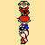</a>
<a href="wolfattack.gif" title="Flee or Die">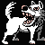</a>

<a href="anafind.png" title="Ana's Prediction">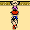</a>
<a href="winter.png" title="Snowman">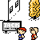</a>
<a href="mislaytriangle.gif" title="The Mislay Triangle">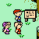</a>
<a href="garglestrong.gif" title="How to Gargle">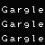</a>
<a href="mansion.png" title="Rosemary's Mansion">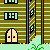</a>
<a href="rosemarys.png" title="Haunted House">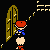</a>
<a href="armorfight.gif" title="Fighting Armor">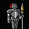</a>



Welcome to the scorching hot warzone desert, a headquarters for alien activity. Roaming the sandy passes are the stock of Starmen, the brutal force of Gabilans, and more. However, that should not prevent you from listening to the musical sensations of the singing cactus. The desert's not all fun, though, for it contains a titanium titan who refuses to let you visit a cave full of lying monkeys. 
 
<a href="desert.png" title="Yucca Desert">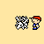</a>
<a href="gabilantwins.png" title="Gabilan Battle">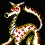</a>
<a href="planedude.png" title="Pilot's Business">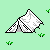</a>
<a href="planeride.png" title="Plane Ride!">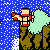</a>
<a href="cactus.gif" title="A Very Important Cactus">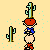</a>
<a href="tankin.png" title="Riding in a Tank">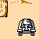</a>
<a href="r7037.png" title="Robo Battle">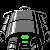</a>
<a href="cavomonkey.gif" title="The Monkey Caves">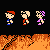</a>
<a href="shh.png" title="Quiet Monkey">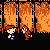</a>
<a href="doragonfaito.gif" title="Mythical Monster">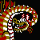</a>
<a href="psibaby.png" title="Baby's PSI">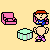</a>

<a href="nothreat.png" title="Is That a Threat?">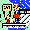</a>
<a href="reddosnake.gif" title="Rare Red Snake">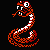</a>



Welcome to the final&eacute; of the game! Or should I say, welcome to your death! I hope you enjoy multiple mazes, countless confusions, angry aliens, and restless robots, for that is what you're about to experience. However, it's all about saving the world right? As such, prepare to encounter an overzealous overlord with apparent invincibility! Have fun! 
 
<a href="loidsdad.png" title="Loid's Father">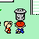</a>
<a href="mookbattle.gif" title="Mook Battle">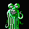</a>


