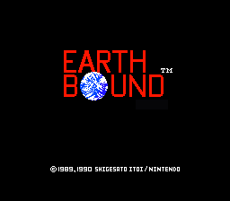
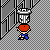
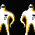
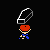
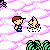
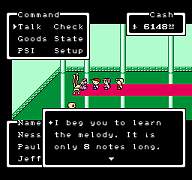



	
	<table>
		<tr>
			<td class="label">Title:</td>
			<td>EarthBound Beginnings (US) MOTHER (JP)</td>
		</tr>
		<tr>
			<td class="label">System:</td>
			<td>NES (US) Famicom (JP) Wii U</td>
		</tr>
		<tr>
			<td class="label">Genre:</td>
			<td>RPG</td>
		</tr>
		<tr>
			<td class="label">Release:</td>
			<td>July 27, 1989 (JP)</td>
		</tr>
		<tr>
			<td class="label">VC Release:</td>
			<td>June 15, 2015 (JP) June 14, 2015 (US/EU)</td>
		</tr>
		<tr>
			<td class="label">Rating:</td>
			<td>T (ESRB, VC)</td>
		</tr>
		<tr>
			<td class="label">Price:</td>
			<td>¥6500 (JP) $6.99 (US, VC)</td>
		</tr>
		<tr>
			<td class="label">Publisher:</td>
			<td>Nintendo</td>
		</tr>
		<tr>
			<td class="label">Developer:</td>
			<td>APE / Nintendo</td>
		</tr>
		<tr>
			<td class="label">Slogan:</td>
			<td>"No crying until the end." (JP)</td>
		</tr>

	</table>

 

    

<em>In the early 1900's, a dark shadow covered a small country town in rural America. At that time, a young married couple vanished mysteriously from their home.</em>

With those cryptic words begins MOTHER, <a href="http://starmen.net/mother2">EarthBound</a>'s moodier, more verbose, less scrutable older brother. In 1989 strange things begin happening to a boy named Ninten, who realizes he and his family are more involved in what appears to be an alien invasion than he could possibly have realized.

What follows is a cross-country adventure through the desert, the big city, ominous Mt. Itoi, and a dream world called Magicant. Ninten, a stand-in for the player, learns about friendship, and love, and—well, and singing, while also uncovering the true story of the mysterious disappearance of his grandparents and the strange vendetta of the alien Giegue.

It's famously a slog through random encounters and 1980s gameplay mechanics, but those EarthBound fans with the courage to get past the Podunk graveyard will be rewarded with a surprisingly complex story, an enormous, non-linear world to explore, and a look at characters and concepts that would later be refined or repurposed for the 1994 release of MOTHER's sequel.

A few highlights from the game:
<ul>
 <li>being attacked by your own lamp</li>
 <li>fighting against an alien who controls the minds of zoo animals</li>
 <li>meeting a cat who swims on the ground</li>
 <li>discovering a new ally in a trash can</li>
 <li>having people sneeze on you to give you colds</li>
 <li>hijacking an army-surplus tank in the desert and destroying a giant robot to reach a cave full of monkeys.</li>
</ul>
  
Released for Nintendo's Famicom in 1989, MOTHER's novel setting—a Japanese conception of modern America, not a Japanese conception of medieval Europe—wasn't all that set it apart. Its creator and author, <a href="http://starmen.net/credits/shigesatoitoi.php">Shigesato Itoi</a>, was an industry outsider, a famous copywriter and professional dilettante. Its musical direction was spearheaded by <a href="http://starmen.net/credits/keiichisuzuki.php">Keiichi Suzuki</a>, founder of an extremely experimental rock band called <a href="http://www.youtube.com/watch?v=pldpl5Zf_J4">Moonriders</a>. Its cute, simplistic characters were designed by the artist <a href="http://starmen.net/credits/shinbominami.php">Shinbo Minami</a>. 
 
Itoi's minimalist quirkiness, stylized humor, and spare sentimentality resonated immediately with Japan's RPG-hungry gamers, and MOTHER sold over 400,000 copies in its initial release. 
 
An English localization began immediately, with firm plans for a <a href="http - //starmen.net/mother1/images/publication/eb0preview.jpg">September 1991 release</a>. An 80-page instruction manual/player's guide was produced. The game's odd soundtrack, orchestrated and performed by Suzuki and a band of unknown British singers, was prepped for release. Things… worked out a little differently.  

 



Here are a few important links that MOTHER fans might find interesting and/or helpful. 
<ul>
 <li><a href="/mother1/easypatch">EarthBound Zero Easy Patch</a> - Makes the game a lot easier for those who don't enjoy level-grinding.</li>

 <li><a href="http://www.1101.com/MOTHER/MOTHER.html">Shigesato Itoi interviews, etc.</a> - Lots of info here—if you can read Japanese.</li>

<li><a href="/credits/nes.md">MOTHER / EarthBound Zero credits</a> - Learn more about the people behind the game!</li>

<li><a href="/merchandise">MOTHER / EarthBound Zero merchandise</a> - All the swag you can't buy in America.</li>

<li><a href="http://walkthrough.starmen.net/earthbound0/">Starmen.Net EarthBound Zero Walkthrough</a> - The definitive EarthBound Zero walkthrough!</li>

<li><a href="http://www.lostlevels.org/200407/200407-earthbound.shtml">Lost Levels Online</a> - The history of EarthBound Zero in the US.</li>

</ul>



<table1 />
Section maintainer: 
<table2 />
<a href="https://forum.starmen.net/members/CerealQueen">CerealQueen</a> 
<table3 />

