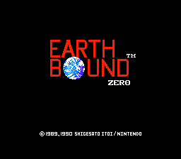
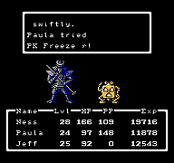



	
	<table>
		<tr>
			<td class="label">Title:</td>
			<td>EarthBound (US) MOTHER (JP)</td>
		</tr>
		<tr>
			<td class="label">System:</td>
			<td>NES (US) Famicom (JP)</td>
		</tr>
		<tr>
			<td class="label">Genre:</td>
			<td>RPG</td>
		</tr>
		<tr>
			<td class="label">Release:</td>
			<td>No Official US Release July 27, 1989 (JP)</td>
		</tr>
		<tr>
			<td class="label">Price:</td>
			<td>¥6500 (JP)</td>
		</tr>
		<tr>
			<td class="label">Publisher:</td>
			<td>Nintendo</td>
		</tr>
		<tr>
			<td class="label">Slogan:</td>
			<td>"No crying until the ending." (JP)</td>
		</tr>

	</table>

 

    

MOTHER (also known as EarthBound, EarthBound 0, or EarthBound Zero) is an original RPG that takes place in rural America in the 1980's. This RPG was groundbreaking in that it broke the mold of dungeons, swords, and dragons. Medieval weapons were replaced by yo-yo's and frying pans. The classic dragons, dark elves, and other demons were replaced with possessed cars, crazed hippies, and many other off-the-wall enemies. 
 
The story, however, is a classic. When strange, ghostly things begin to happen, a boy named Ninten sets out to investigate. He quickly finds that he has psychic abilities and a mysterious past. He is joined by several friends who aid him in his final goal, which is to defeat the vengeful alien known as Giegue. However, to defeat Giegue and to discover an ancient family secret, he must recover eight mysterious melodies with superb power.
  
A few highlights from the game: 
<ul>
 <li>being attacked by your own lamp</li>
 <li>fighting against an alien who controls zoo animals</li>
 <li>meeting a cat who swims on the ground</li>
 <li>finding one of your allies in a trash can</li>
 <li>having people sneeze on you to give you colds</li>
 <li>riding around in an army tank in the desert and destroying a giant robot to reach a cave full of monkeys</li>
</ul>
  
In Japan, where it was released in the late 1980's for the Nintendo Famicom system, MOTHER was hugely successful. It sold around 400,000 copies and has spawned dozens of strategy guides, comic books, soundtracks and more. 
 
MOTHER has four main characters: Ninten, Lloyd, Ana, and Teddy. The first three resemble characters in MOTHER 2 (EarthBound) for the SNES, and lots of theories about the connection between the two games have been presented over the course of time. 
 
The gameplay on the overworld is similar to that of Final Fantasy. However, rather than seeing only the first character in your party while exploring the overworld, you see every character in your party following the main character, even if they're dead. However, battle gameplay is similar to Dragon Quest, for you see the enemies from a first-person perspective. 
 
While wandering around in the overworld, you will randomly be drawn into battles with enemies. The enemy encounter rate is extremely high and as such this is considered to be far more difficult than its sequel, <a href="http://starmen.net/mother2/">EarthBound</a>. When you are in the battle sequence, you can perform many actions, such as attacking your opponent, staying on guard, using a PSI power, and fleeing. Because the game's enemy encounter rate is very high, the probability of fleeing is higher than that of EarthBound. 
 
Nintendo translated the game to English, but never released it. In 1998, a group of ROM translators discovered an auction of a prototype of the "EarthBound" cartridge. They contacted the individual who had acquired the game, and made an agreement to "borrow" the game for $400 so they could dump the cartridge to a ROM file. A ROM hacker/translator named demi performed the dump and subsequent hack, and edited the game's title screen to read "EarthBound Zero" (to avoid confusion with MOTHER 2, whose English name was "EarthBound"). 
 

Due to legal reasons, we do not have the EarthBound Zero ROM on Starmen.Net. However, we have a <a href="http://starmen.net/vote/vote.php?id=17876">patch of the game</a> that is helpful to those who are struggling.

 




	
	<table>
		<tr>
			<td class="label">Title:</td>
			<td>EarthBound (US) MOTHER (JP)</td>
		</tr>
		<tr>
			<td class="label">System:</td>
			<td>NES (US) Famicom (JP)</td>
		</tr>
		<tr>
			<td class="label">Genre:</td>
			<td>RPG</td>
		</tr>
		<tr>
			<td class="label">Release:</td>
			<td>No Official US Release July 27, 1989 (JP)</td>
		</tr>
		<tr>
			<td class="label">Price:</td>
			<td>¥6500 (JP)</td>
		</tr>
		<tr>
			<td class="label">Publisher:</td>
			<td>Nintendo</td>
		</tr>
		<tr>
			<td class="label">Slogan:</td>
			<td>"No crying until the end." (JP)</td>
		</tr>

	</table>

 

    

<em>In the early 1900's, a dark shadow covered a small country town in rural America. At that time, a young married couple vanished mysteriously from their home.</em>

With those cryptic words begins MOTHER, <a href="http://starmen.net/mother2">EarthBound</a>'s moodier, more verbose, less scrutable older brother. In 1989 strange things begin happening to a boy named Ninten, who realizes he and his family are more involved in what appears to be an alien invasion than he could possibly have realized.

What follows is a cross-country adventure through the desert, the big city, ominous Mt. Itoi, and a dream world called Magicant. Ninten, a stand-in for the player, learns about friendship, and love, and—well, and singing, while also uncovering the true story of the mysterious disappearance of his grandparents and the strange vendetta of the alien Giegue.

It's famously a slog through random encounters and 1980s gameplay mechanics, but those EarthBound fans with the courage to get past the Podunk graveyard will be rewarded with a surprisingly complex story, an enormous, non-linear world to explore, and a look at characters and concepts that would later be refined or repurposed for the 1994 release of MOTHER's sequel.

A few highlights from the game:
<ul>
 <li>being attacked by your own lamp</li>
 <li>fighting against an alien who controls the minds of zoo animals</li>
 <li>meeting a cat who swims on the ground</li>
 <li>discovering a new ally in a trash can</li>
 <li>having people sneeze on you to give you colds</li>
 <li>hijacking an army-surplus tank in the desert and destroying a giant robot to reach a cave full of monkeys.</li>
</ul>
  
Released for Nintendo's Famicom in 1989, MOTHER's novel setting—a Japanese conception of modern America, not a Japanese conception of medieval Europe—wasn't all that set it apart. Its creator and author, <a href="http://starmen.net/credits/shigesatoitoi.php">Shigesato Itoi</a>, was an industry outsider, a famous copywriter and professional dilettante. Its musical direction was spearheaded by <a href="http://starmen.net/credits/keiichisuzuki.php">Keiichi Suzuki</a>, founder of an extremely experimental rock band called <a href="http://www.youtube.com/watch?v=pldpl5Zf_J4">Moonriders</a>. Its cute, simple-looking characters were designed by the artist <a href="http://starmen.net/credits/shinbominami.php">Shinbo Minami</a>. 
 
Itoi's minimalist quirkiness, stylized humor, and spare sentimentality resonated immediately with Japan's RPG-hungry gamers, and MOTHER sold over 400,000 copies in its initial release. 
 
An English localization began immediately, with firm plans for a <a href="http - //starmen.net/mother1/images/publication/eb0preview.jpg">September 1991 release</a>. An 80-page instruction-manual-<em>cum</em>-player's-guide was produced. The game's odd soundtrack, orchestrated and performed by Suzuki and a band of unknown British singers, was prepped for release. Things… worked out a little differently.  

 

