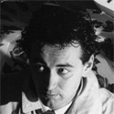
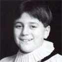


It's one of the weirdest pieces of MOTHER merchandise ever released, and it's available on CD and cassette. It features a 14 year-old would-be pop star, a Canadian metal singer, and a British boys' choir. It's the MOTHER Original Soundtrack, and for some time we knew almost nothing about the people who had made it, who themselves probably still have no idea we're listening to it. 

MENU





Catherine Warwick

Jeb Million

Louis Philippe

Jeremy Budd

Production Staff

 

A 14-year-old from London, <strong>Catherine Warwick</strong>'s singing career begins and ends with two obscure performances in 1989. On August 21 the soundtrack to a popular videogame was released in Japan, never to be localized. Just a few weeks later, that September, she performed two very strange dance-pop songs for a little-heard seven-inch single called <em>Marine Boy</em>.

<strong>Jeb Million</strong>, who performs "The Paradise Line", came to the United Kingdom in the late 1970s as lead singer of a heavy metal band by the reflexive name of Blazer Blazer, who, according to <a href="http://nwobhm.info/nwobhm/index.php?option=com_content&task=view&id=296&Itemid=42">a contemporary review</a>, "[breathed] more fire and thunder than a pack of basilisks, but tap the hulk of the beast and the hollow clang can be heard a mile off." Back then he was known, considerably less euphoniously, as Ged Milne.

After Blazer Blazer and then the Broadway Brats failed to break through in the metal world, Jeb Million hooked up with the Stock-Aitken-Waterman production company, an assembly line that produced Euro-tinged dance-pop, including, most famously, Bananarama and Rick Astley. His own trip down that road, 1986's "<a href="http://www.youtube.com/watch?v=oO32n1Hsihg">Second Time Around</a>", proved unsuccessful, and by the time he lay down the vocals for "The Paradise Line" he was well on his way to MOTHER Original Soundtrack-approved obscurity.

<strong>Louis Phillippe</strong>, perhaps the most famous of the MOTHER singers, is a French pop singer who found lasting popularity in England and Japan. Also a "BBC correspondent, football journalist, chef and wine buff", according to his <a href="http://www.louisphilippe.co.uk/faq.html#work">official website</a>, he's released 16 albums, and spent an afternoon in 1989 collaborating with Keiichi Suzuki on a song, "Flying Man", that hadn't actually been in MOTHER.

<strong>Jeremy Holland-Smith</strong> and <strong>Jeremy Budd</strong> were boy soloists in <a href="http://www.stpauls.co.uk/Worship-Music/The-Cathedral-Choir">St. Paul's Cathedral Choir</a>, which has toured throughout Europe and Asia. Holland-Smith, born in 1977, is now an accomplished composer and music director. Budd was featured as a soloist on <a href="http://www.boysoloist.com/artist.asp?VID=294">numerous recordings of hymns and classical music</a> and has continued singing into adulthood, though "All That I Needed (Was You)" is presumably the only rock song he's ever performed. 

One thing's clear from the performers on the MOTHER Original Soundtrack: To Japan, one English voice seems just about as good as any other...




<ol><li><strong><a href="songs/pollyana.php">Polyanna (I Believe In You)</a></strong> is a bright, melodic pop arrangement of the overworld song, featuring <a href="personnel/catherinewarwick.php">Catherine Warwick</a> on lead vocals and Keiichi Suzuki singing backup. And a synth-harpsichord(?) solo that makes me think Suzuki has listened to more than a few Brian Wilson compositions in his day.</li>
<li>Warwick returns for <a href="songs/beinfriends.php">Bein' Friends</a>, an adaptation of the song that plays when Ninten has a friend in his party. Fittingly, she shares lead vocals with <a href="personnel/jeremyhollandsmith.php">Jeremy Holland-Smith</a>, who does a call-and-response with her on the chorus. Just don't ask me who's singing during that strange, heavy breakdown section at the end.</li>
<li><a href="personnel/jebmillion.php">Jeb Million</a> takes over for a rocking, surprisingly dense take on <strong><a href="songs/paradiseline.php">The Paradise Line</a></strong> theme. Listen for all the buried guitar, vocal, and keys flourishes—listen, also, for the King Edward School Choir Boys, who inexplicably take over the bridge ahead of that big guitar solo.</li>
<li>The first instrumental on the disc is the theme from <strong><a href="songs/magicant.php">Magicant</a></strong>, a <a hrf="http://starmen.net/credits/hirokazutanaka.php">Hip Tanaka</a> original. Keiichi Suzuki interprets the song with some appropriately spacey synthesizers and unnerving tempo work.</li>
<li>Warwick makes her last appearance on <strong><a href="songs/wisdomoftheworld.php">Wisdom of the World</a></strong>, Queen Mary's dolorous theme. This is the one of two songs on the album Keiichi Suzuki didn't arrange—the lushly orchestrated strings were the work of one David Bedford.</li>
<li>For <strong><a href="songs/flyingman.php">Flying Man</a></strong>, a song that wouldn't actually appear in a MOTHER game until 1994, Keiichi Suzuki teamed up with <a href="personnel/louisphilippe">Louis Philippe</a>. The wild backing track already recorded in Tokyo, at Peter Gabriel's studios near Bath Philippe played some guitar and with Suzuki improvised that Brian Wilsonian vocal coda.</li>
<li>The <strong><a href="songs/snowman.php">Snowman</a></strong> theme, the album's second instrumental, was another Hip Tanaka track. For the soundtrack Suzuki earned a music credit by introducing the piece's meditative bridge section. This also features the album's only credit for <a href="http://en.wikipedia.org/wiki/Bouzouki">Bouzouki</a>, which was played by Hitoshi Watanabe.</li>
<li>No track confused early EarthBound fans quite like <strong><a href="songs/allthatineededwasyou.php">All That I Needed (Was You)</a></strong>, which had some early Earthbound.Netters convinced it was performed in Japanese by a woman named Jermy Buddy. In fact it's performed by <a href="personnel/jeremybudd.php">Jeremy Budd</a>, a soloist in the St. Paul's Cathedral Choir. Credit for those off-kilter guitar solos goes to soundtrack mainstay Chester Camen, who did most of the guitar work on the album.</li>
<li>The last instrumental on the album, <strong><a href="songs/fallinloveand.php">Fallin' Love, And</a></strong>, is the only song on the album for which Keiichi Suzuki receives no credit at all. This fluid, startling take on the Love Dance theme was arranged by Takeshi Saitoh, who presumably did much of the string work.</li>
<li>The choral take on <strong><a href="songs/eightmelodies.php">Eight Melodies</a></strong>, featured in MOTHER's <a href="http://starmen.net/mother1/videos/">TV commercial</a>, is performed by St. Paul's Cathedral Choir, from which Jeremy Holland-Smith and Jeremy Budd were both drawn.</li>
<li>Finally, <strong><a href="songs/worldofmother.php">The World of MOTHER</a></strong> collects much of the actual music from the Famicom original. Original pressings of the disc featured a 16-minute montage; the rerelease, currently in print, adds five minutes to the running time.</li>
</ol>



The soundtrack story doesn't quite end with its release in Japan. According to localization producer Phil Sandhop, in his 2004 interview with Lost Levels, even the <em>soundtrack</em>, bizarre as it was, was part of the oft-delayed Earth Bound localization project:

<blockquote>Even the game's soundtrack was planned for some sort of US release. "During preparations for launch, NOA Legal looked at it and it probably would have been made available in the states, although NOA wasn't going to market it."</blockquote>

When Earth Bound Zero reached the internet in January, 1998, the soundtrack became one of the rarer and more mysterious items the young American fanbase had discovered. (EarthBound.Net's first EB0 expert, EBounding, <a href="http://hijola.fobby.net/ebounding/sound/index.html">ripped the songs into Real Audio format</a>, which was as close as most fans got to it.) Out of print at the time, people daring enough to brave that younger internet's Japanese import shops usually had to special order it.

The situation finally changed in 2004, when the soundtrack was remastered and rereleased to commemorate the 2003 release of <a href="http://starmen.net/mother12/">MOTHER 1+2</a>, the Game Boy Advance compilation that prefigured the eventual release of <a href="http://starmen.net/mother3">MOTHER 3</a>. 

The new version of the soundtrack, which is <a href="http://starmen.net/merchandise/music/m1cd.php">still available</a>, features an additional seven minutes of original game music in the "World of MOTHER" track, and a "Smiles and Tears" demo originally recorded for an unreleased MOTHER 2 orchestral soundtrack. The most mysterious get in MOTHER swag history is finally available to everybody with $30 and an intense desire to hear a boy treble sing an angular new-wave torch song.

Which leaves the completionists among us the chance to move on to the exceedingly rare <a href="http://starmen.net/merchandise/music/m1ct.php">cassette release</a>...


