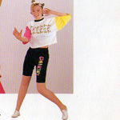
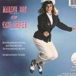



The star of the <em>MOTHER Original Soundtrack</em> is really the songs, or the game. If you insist on a human star, it's probably composer Keiichi Suzuki, lead singer of Moonriders, which has to be worth something.

But after the game and the composer there's Catherine Warwick, an aspiring 14-year-old singer from London who sang three songs on the orchestrated soundtrack. Warwick was, relatively speaking, all over the place. Not only does she appear on the back of the liner notes—thanks to which we know, weirdly, that she was born in Westminster Hospital—she also shows up in this flier advertising the soundtrack that was included with every copy of MOTHER (translation courtesy kenisu3000.)

The soundtrack was her first professional singing gig, and so far as two generations of EarthBound fans can tell it was her second-to-last. Soon after the MOTHER soundtrack was released in Japan, in September, 1989, a 7" single was released out of a tiny label in London called "Runway 1." (If you have any questions about the long-term viability of this label, this single was FLITE 001. There was no FLITE 002.)

It was called <em>Marine Boy</em>, and to be honest it's not very good. But for longtime MOTHER Soundtrack fans who never expected to hear from the album's singing star again it's definitely worth tracking down.
 

Ms. Warwick's current whereabouts are unknown, despite 10 solid years of fanbase Googling (which is not a euphemism for anything.) You might ask yourself: Why would a 14-year-old with such a lovely singing voice fall totally off the radar after five songs? Clearly you haven't heard "Marine Boy", but I can offer one satisfying answer to that question: She was constantly being made to do awkward things in photographs.

  

    
    
<small>Oh, I didn't see you there! I was just wearing this fun-themed outfit and putting my hair up! But you'll have to talk a little louder!</small>

  

<small>Oh, I didn't see you there! I was just jumping on this trampoline in my sailor's suit!</small>

<small>Oh, I didn't see you there! I was just going to prom with this huge Japanese adult!</small>

 

