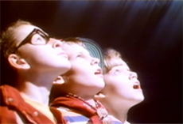
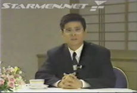
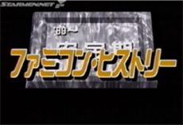
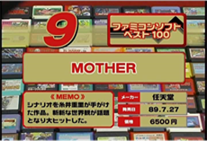
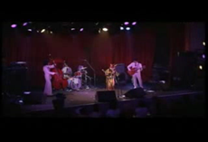
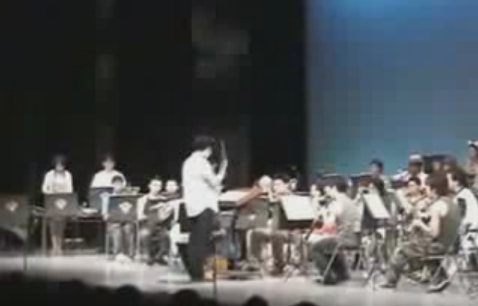
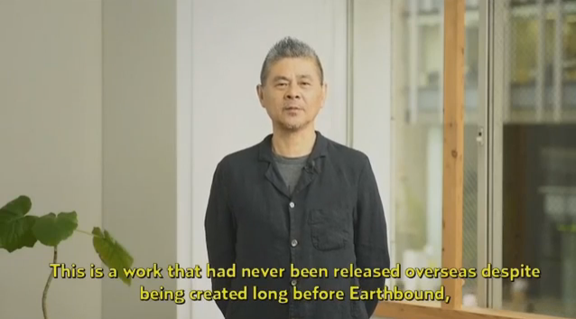
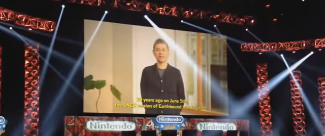
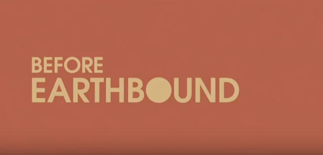


<ul class="pics">

<li>

<h3>MOTHER Commercial</h3>

This is the original Japanese commercial for MOTHER. The game's three main heroes face off against R7308XX on the summit of Mt. Itoi. Remember, <i>no crying until the ending.</i>

<a href="http://www.youtube.com/watch?v=yQUN7QAnMp0">View streaming video</a> <a href="m1com_subbed.avi">Download the AVI</a> (9.4MB, 0:29)

</li>

<li>

<h3>MOTHER Preview (Subtitled)</h3>

This video was made as a preview for Itoi's upcoming video game, MOTHER. He asks that game players pace themselves when playing, and he wants them to explore the game world on their own.

<a href="http://www.youtube.com/watch?v=HEqWf9CQjWI">View streaming video</a> <a href="itoitalk2sub.avi">Download the AVI</a> (12.1MB, 1:47)

</li>

<li>

<h3>Famicom History Snippet</h3>

This small video is an excerpt from a larger video about the history of the Famicom in Japan. Game makers from outside the main Famicom industry, like Shigesato Itoi, began to make games for the system.

<a href="http://www.youtube.com/watch?v=VDn9-nVwZb0">View streaming video</a> <a href="famhist89sub.avi">Download the AVI</a> (3.9MB, 0:18)

</li>

<li>

<h3>Famitsu's Top 100 Famicom Games List</h3>

This little video depicts Famitsu's Top 100 Famicom games. As it turned out, MOTHER was the ninth on this list.

<a href="http://youtube.com/watch?v=OrnFBxXV2gY">View streaming video</a> <a href="MOTHER_FamitsuTop100.avi">Download the AVI</a> (24.4MB, 0:56)

</li>

<li>

<h3>Eight Melodies by SAKEROCK</h3>

SAKEROCK is a Japanese band known for making new-age classical music. The band members, being fans of MOTHER, got permission from their friend Shigesato Itoi to perform the Eight Melodies.

<a href="http://www.youtube.com/watch?v=CuacLGHoGgk">View streaming video</a> <a href="8melodies.avi">Download the AVI</a> (11.3MB, 3:59)

</li>

<li>

<h3>EarthBound Zero Orchestrated Music</h3>

From the so-called "Famicom Band" that did a bunch of orchestrated Famicom/NES music way back when.

<a href="https://www.youtube.com/watch?v=LImAwVjMSBg&app=desktop">View streaming video</a> <a href="EarthBound Zero Orchestrated Music.mp4">Download the MP4</a> (5.10MB, 1:59)

</li>

<li>

<h3>Earthbound Beginnings Announced</h3>

On June 14th, 2015, Nintendo held the first Nintendo World Championships. When they were going through which games would be appearing, an announcement was made. This is that announcement.

<a href="https://www.youtube.com/watch?v=ro6lAASH55w">View streaming video</a> <a href="Earthbound Beginnings is Announced.mp4">Download the MP4</a> (5.65MB, 2:11)

</li>

<li>

<h3>Audience Reaction to EBB's Announcement</h3>

This is a video of the audience's reaction when Earthbound Beginning's was announced to be on the Wii U's Virtual Console at the Nintendo World Champion's in 2015.

</li>

<li>

<h3>Official Earthbound Beginnings Trailer</h3>

The official Earthbound Beginnings Virtual Console trailer.

<a href="https://www.youtube.com/watch?v=urnzhp3vmNs">View streaming video</a> <a href="Official Earthbound Beginnings Trailer.mp4">Download the MP4</a> (4.44MB, 1:54)

</li>

</ul>

