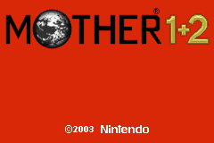



	
	<table>
		<tr>
			<td class="label">Title:</td>
			<td>MOTHER 1+2 (JP)</td>
		</tr>
		<tr>
			<td class="label">System:</td>
			<td>Game Boy Advance</td>
		</tr>
		<tr>
			<td class="label">Genre:</td>
			<td>RPG</td>
		</tr>
		<tr>
			<td class="label">Release:</td>
			<td>June 20, 2003 (JP)</td>
		</tr>
		<tr>
			<td class="label">Rating:</td>
			<td>All Ages (JP)</td>
		</tr>
		<tr>
			<td class="label">Price:</td>
			<td>¥5040 (JP)</td>
		</tr>
		<tr>
			<td class="label">Publisher:</td>
			<td>Nintendo</td>
		</tr>
		<tr>
			<td class="label">Developer:</td>
			<td>HAL Laboratories / APE</td>
		</tr>
		<tr>
			<td class="label">Slogan:</td>
			<td>"Kids, grownups, and even young women! All over again!" (JP)</td>
		</tr>
	</table>

MOTHER 1+2 is a compilation consisting of MOTHER (EarthBound Zero) and MOTHER 2 (EarthBound) that was released in Japan for Nintendo's Game Boy Advance during the summer of 2003. There was much speculation about a possible English release following the original announcement, but it never came to be. 
 
The games themselves are, for the most part, unaltered versions of the originals. Graphical changes had to be made to accommodate the Game Boy Advance's smaller screen size, and the sound in each game is not up to the originals' high standards, but nothing major was added or removed. (MOTHER, however, plays more like an upgraded, Japanese version of Earth Bound than it does the Japanese original. For more information on that, check out the <a href="diff">differences page</a>.) 
 
<b><i>For information about how to import MOTHER 1+2, check out <a href="/merchandise/carts/m12cart.php">our merchandise page</a>.</i></b> 
 
For further information about the two games, check the games' individual sections on Starmen.Net:

<ul>
	<li><a href="/mother1">MOTHER 1 / EarthBound 0 Section</a></li>

	<li><a href="/mother2">MOTHER 2 / EarthBound Section</a></li>
</ul>



<UL>
<LI><A HREF="http://www.nintendo.co.jp/n08/a2uj/index.html">MOTHER 1+2 Official Webpage</A></LI>
<LI><A HREF="http://www.1101.com/MOTHER/MOTHER.html">Shigesato Itoi's Mother Webpage</A></LI>
<LI><A HREF="http://starmen.net/merchandise">MOTHER 1+2 merchandise</A></LI> - Lots of cool stuff!
</UL>



 <B>Updated June 2007:</B>
 <UL>
    <LI>Tons of new videos! Check them out <a href="videos">here</a>!</LI>
 </UL>




<table1 />
Section maintainer:
<table2 />
<a href="http://forum.starmen.net/members/NorthofOnett">NorthofOnett</a>
<table3 />

